# 背景
> 这篇文章实际写于去年，最近整理资料被翻了出来，因此整理下发到博客上凑数😁。

因工作需要，需要获取PDB中的数据，PDB数据可以使用微软提供的DIA SDK来获取，DIA SDK随Visual Studio一并安装在VS的安装目录下，以VS2012的目录结构示例如下，

```bash
D:\VS2012\DIA SDK
├─bin
│  ├─amd64
│  └─arm
├─idl
├─include
├─lib
│  ├─amd64
│  └─arm
└─Samples
    └─DIA2Dump
```

其中`include`目录与`lib`目录分别包含了DIA SDK的头文件与lib库，在使用DIA SDK开发程序时，需要引入相应的头文件和lib库。而在`Sample`目录下有一个示例程序`DIA2Dump`，该程序非常详细的展示了DIA SDK的使用方法。

通过参考该示例程序的代码学习了DIA SDK的使用，顺便进行一番总结，以免后续遗忘。

# 使用

## 程序基本结构
DIA SDK使用的基本流程是：

1.	调用CoInitialize初始化COM库。
2.	创建IDiaDataSource对象。
3.	调用IDiaDataSource::loadDataFromPdb打开pdb文件。
4.	调用IDiaDataSource::openSession打开session。
5.	调用IDiaSession::get_globalScope获取符号。
6.	调用IDiaEnum函数对符号进行枚举和分析。
7.	调用CoUninitialize函数反初始化COM库。

下面以一个基本例子进行说明:

```C++
int main()
{
    IDiaDataSource *pSource = NULL;
    // 初始化
    HRESULT hr = CoInitialize(NULL);
    // 创建IDiaDataSource对象
    hr = CoCreateInstance( CLSID_DiaSource,  
                           NULL,  
                           CLSCTX_INPROC_SERVER,  
                           __uuidof( IDiaDataSource ),  
                           (void **) &pSource);  

    if (FAILED(hr))  
    {  
        printf("Could not CoCreate CLSID_DiaSource. Register msdia80.dll.\n" );  
    }  

    // 打开pdb文件
    wchar_t *wszFilename = L"MyPdbParser.pdb";
    if (FAILED( pSource->loadDataFromPdb( wszFilename )))  
    {  
        if ( FAILED( pSource->loadDataForExe( wszFilename, NULL, NULL ) ) )  
        {  
            printf("loadDataFromPdb/Exe error");
        }  
    }  

    // 打开session
    IDiaSession *pSession = NULL;
    if (FAILED(pSource->openSession(&pSession)))
    {  
        printf("openSession error");
    }

    // 获取全局符号
    IDiaSymbol *pGlobal = NULL;
    pSession->get_globalScope(&pGlobal);

    // 根据全局符号解析数据
    ParsePdb(pGlobal);
    
    // 释放资源及反初始化
    if(pGlobal)
    {
        pGlobal->Release();
        pGlobal = NULL;
    }

    if(pSession)
    {
        pSession->Release();
        pSession = NULL;
    }

    CoUninitialize();
    return 0;
}
```

DIA SDK使用的基本框架如上代码所示，核心在于解析PDB文件获取想要的内容，这部分逻辑即上述代码中`ParsePdb`函数的内容。下面是ParsePdb函数的代码，其主要获取了该程序自身的pdb信息。

```C++
void ParsePdb(IDiaSymbol *pGlobal)
{
    file = fopen("test.txt", "w");
    IDiaEnumSymbols *pEnumSymbols = NULL;
    IDiaSymbol *pSymbol = NULL;
    ULONG celt = 1;

    pGlobal->findChildren(SymTagPublicSymbol, NULL, nsNone, &pEnumSymbols);
    while(SUCCEEDED(pEnumSymbols->Next(1, &pSymbol, &celt)) && (celt == 1))
    {
        BSTR SymName = NULL;
        pSymbol->get_name(&SymName);

        BSTR SymUndecoratedName = NULL;
        pSymbol->get_undecoratedName(&SymUndecoratedName);

        DWORD address = 0;
        pSymbol->get_relativeVirtualAddress(&address);

        fwprintf(file, L"Symbol Name: %s  \nUndecoratedName:%s  \naddress:%x\n\n", SymName, SymUndecoratedName, address);

        if(pSymbol)
        {
            pSymbol->Release();
            pSymbol = NULL;
        }   
    }

    if(pEnumSymbols)
    {
        pEnumSymbols->Release();
        pEnumSymbols = NULL;
    }

    fclose(file);
}
```
运行上述函数，上述函数会将公共符号的名字，未修饰的名字，相对地址都输出出来，结果如下：

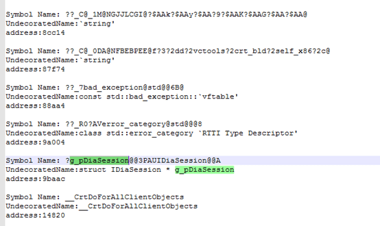

其中包含有全局变量的信息，如上图中的g_pDiaSession变量，在程序中为：

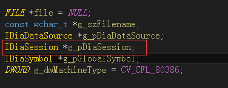

接下来详细的说明该如何解析获取PDB文件中的各种数据信息。

## 前置知识

从上面的例子中，可以看到代码的关键在于`PGlobal->findChildren`和`PEnumSymbols->Next`函数，`findChildren`函数用来查找所有符合条件的子符号，其原型如下（省略了this指针），更详细的可参考[MSDN](https://docs.microsoft.com/en-us/visualstudio/debugger/debug-interface-access/idiasession-findchildren?view=vs-2019)。

```C++
HRESULT IDiaSession::findChildren(
    enum SymTagEnum symtag,     
    LPCOLESTR name,
    DWORD compareFlags,
    IDiaEnumSymbols **ppResult
)
```
- 参数 SymTagEnum，用来指定枚举的子符号是哪种类型的符号；
- 参数name，用来指定子符号的名称；
- 参数compareFlags，用来指定符号名称匹配的方式；
- 参数ppResult，返回一个包含子符号列表的IDiaEnumSymbols对象

在程序中，有各种不同类型的字段，如函数、全局变量、静态变量、类、枚举等。获取这些符号都需要调用findChildren函数，为了获取这些不同类型的信息就需要给findChildren函数传递不同的SymTagEnum参数，该参数是个枚举，说明如下(详细的说明参见[MSDN](https://msdn.microsoft.com/zh-cn/library/bkedss5f(v=vs.110).aspx) ）：

```C++
enum SymTagEnum { 
   SymTagNull,
   SymTagExe,
   SymTagCompiland,
   SymTagCompilandDetails,
   SymTagCompilandEnv,
   SymTagFunction,        //< 5，函数
   SymTagBlock,
   SymTagData,            //< 7， 静态数据，常量，参数和各种变量
   SymTagAnnotation,
   SymTagLabel,
   SymTagPublicSymbol,    //< 10，公共符号
   SymTagUDT,             //< 11,自定义类型
   SymTagEnum,
   SymTagFunctionType,    //< 13 函数类型
   SymTagPointerType,     //< 14，指针类型
   SymTagArrayType, 
   SymTagBaseType,        //< 16，基础类型，如int、char等
   SymTagTypedef,         //< 17，通过typedef定义的类型别名
   SymTagBaseClass,       //< 18，基类
   SymTagFriend,
   SymTagFunctionArgType, //< 20，函数参数
   SymTagFuncDebugStart, 
   SymTagFuncDebugEnd,
   SymTagUsingNamespace,  //< 23，命名空间
   SymTagVTableShape,
   SymTagVTable,          //< 25，指向类或接口的虚拟方法表的指针
   SymTagCustom,
   SymTagThunk,           //< 27，Thunk代码
   SymTagCustomType,
   SymTagManagedType,
   SymTagDimension,
  SymTagCallSite,
  SymTagMax
};
```

`Next`函数是`IDiaEnumSymbols`类的方法，用来遍历查找到的所有符合条件的子符号，函数原型如下，详细参见[MSDN](https://docs.microsoft.com/en-us/visualstudio/debugger/debug-interface-access/idiaenumsymbols-next?view=vs-2019)。

```C++
HRESULT IDiaEnumSymbols::Next(
    ULONG celt,
    IDiaSymbol **rgelt,
    ULONG *pceltFetched
);
```

- 参数celt，指定从枚举器中检索celt数量的符号；
- 参数rgelt，一个数组，用来存储检索到的celt数量的符号；
- 参数pceltFetched，返回实际检索到的符号的数量。

一般来说设置celt为1，这样每次从枚举器中获取一个符号。

在了解了`IDiaSession::findChildren`和`IDiaEnumSymbols::Next`函数的含义及参数后，接下来给出获取函数，类，以及枚举等数据类型的代码示例。

## 获取函数信息
获取函数信息的代码如下（为了精简，省略了资源释放相关的代码）：

```C++
// 打印函数的参数信息
void PrintFuncArgType(IDiaSymbol *pTypeSymbol)
{
    IDiaEnumSymbols *pEnumSymbols = NULL;
    IDiaSymbol *pArgSymbol = NULL;
    ULONG celt = 1;

    // 查找类型符号的所有子符号
    pTypeSymbol->findChildren(SymTagNull, NULL, nsNone, &pEnumSymbols);
    while(SUCCEEDED(pEnumSymbols->Next(1, &pArgSymbol, &celt)) && (celt == 1))
    {
        // 获取参数符号的类型符号
        IDiaSymbol *pArgTypeSymbol;
        pArgSymbol->get_type(&pArgTypeSymbol);
   
        // 获取类型符号的符号tag
        DWORD dArgSymTag;
        pArgTypeSymbol->get_symTag(&dArgSymTag);
        if(dArgSymTag == SymTagBaseType)    /// 这里只打印出基本类型的符号
        {
            DWORD dArgType;
            pArgTypeSymbol->get_baseType(&dArgType);
            ULONGLONG dLength;
            pArgTypeSymbol->get_length(&dLength);
            fwprintf(g_pFile,L"type:%d length:%lld\n", dArgType, dLength);
        }
    }
}

// 打印函数的信息
void PrintFunctionInfo(IDiaSymbol *pFuncSymbol)
{
    DWORD dwTag = SymTagNull;
    BSTR bstrName = NULL;
    BSTR bstrUdName = NULL;
    DWORD dwRVA = 0;

    pFuncSymbol->get_name(&bstrName);	//< 获取函数的名称
    fwprintf(g_pFile, L"Func Name:%s\n", bstrName);

    pFuncSymbol->get_undecoratedName(&bstrUdName);   //< 获取未修饰的函数名称
    fwprintf(g_pFile, L"Func UndecoratedName:%s\n", bstrUdName?bstrUdName:L"");

    pFuncSymbol->get_symTag(&dwTag);		//< 获取符号的tag信息
    fwprintf(g_pFile, L"Func Tag:%d\n", dwTag);

    pFuncSymbol->get_relativeVirtualAddress(&dwRVA);    //< 获取函数的偏移地址
    fwprintf(g_pFile, L"Func Address:%x\n", dwRVA);

    // 获取函数的返回值符号
    IDiaSymbol *pTypeSymbol;
    pFuncSymbol->get_type(&pTypeSymbol);

    IDiaSymbol *pRetSymbol;
    pTypeSymbol->get_type(&pRetSymbol);

    // 获取返回值类型（这里只是简单获取一下，详细的获取类型方式参见Dia2Dump demo中的PrintType函数）
    DWORD dSymTag;
    pRetSymbol->get_symTag(&dSymTag);
    if(dSymTag == SymTagBaseType)  /// 如果返回值类型是基本类型
    {
        /// 获取基本类型ID
        DWORD dTypeId;
        pRetSymbol->get_baseType(&dTypeId);

        // 获取基本类型长度
        ULONGLONG dLength;
        pRetSymbol->get_length(&dLength);
        fwprintf(g_pFile,L"ret type:%d %lld \n", dTypeId, dLength);
    }
    
    // 打印参数类型
    PrintFuncArgType(pTypeSymbol);
    fwprintf(g_pFile,L"\n");
}

// 解析函数
void ParseFunction(IDiaSymbol *pGlobal)
{
    IDiaEnumSymbols *pEnumSymbols = NULL;
    IDiaSymbol *pSymbol = NULL;
    ULONG celt = 1;

    // 这里传入的tag是SymTagFunction，表明获取所有的函数信息
    pGlobal->findChildren(SymTagFunction, NULL, nsNone, &pEnumSymbols);
    // 开始进行遍历
    while(SUCCEEDED(pEnumSymbols->Next(1, &pSymbol, &celt)) && (celt == 1))
    {
        PrintFunctionInfo(pSymbol);
    }
}
```
上述程序的执行结果为：

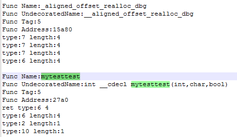

其中mytestest函数为测试函数，专门供解析函数解析的，mytesttest函数的原型为：

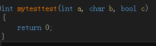

上述代码打印了`mytesttest`函数的基本信息，包括函数名、函数偏移、返回值类型以及参数的类型。

在代码中使用了`get_baseType`函数可以获取了基本类型变量的类型ID，其定义可见[MSDN](https://docs.microsoft.com/en-us/visualstudio/debugger/debug-interface-access/idiasymbol-get-basetype?view=vs-2019)，ID值的含义可以参考[MSDN](https://docs.microsoft.com/en-us/visualstudio/debugger/debug-interface-access/basictype?view=vs-2019)上的`BasicType` 枚举。代码中打印参数类型时，只是打印了基本类型，而对于复杂的类型没有打印，完全详细的类型打印可参考dia2dump中的`PrintType`函数。

在上面的例子中，获取函数名以及地址等信息倒是很容易，但是获取返回值类型以及参数类型时则较为复杂，关键在于要理清函数返回值类型符号以及参数符号与函数符号之间的关系。

首先一个函数对应一个`SymTagFunction`类型的符号，通过该符号可以获取函数的名称、地址等信息。

之后通过`get_type `方法获取函数符号的类型符号，其定义可见[MSDN](https://docs.microsoft.com/en-us/visualstudio/debugger/debug-interface-access/idiasymbol-get-type?view=vs-2019)，假设获取的类型符号是`pTypeSymbol`，那么再获取该类型符号的类型符号，获取到的便是返回值的类型符号`pRetSymbol`，可以调用`pRetSymbol`的方法获取返回值的类型信息。

之后查找`pTypeSymbol`符号的所有子符号，这些便是参数符号了，之后根据各个参数符号获取其对应的参数类型符号`pArgTypeSymbol`，再根据`pArgTypeSymbol`获取参数的类型信息。

上面的例子代码是从DIA SDK的例子代码中抠出来的，自己根据代码做了一番理解，可以看到整个解析过程是非常的绕，不清楚是否是自己理解的有问题😥。

## 获取类信息

对于类来说，要获取的内容分为这三方面：

1.	类成员函数。
2.	类成员变量。
3.	父类信息。

下面分别在代码中获取这三方面的信息。

```C++
void GetClassInfo(IDiaSymbol *pGlobal, wchar_t *wcClassName)
{
    BOOL bRet = FALSE;
    IDiaEnumSymbols *pEnumSymbols = NULL;
    IDiaSymbol *pClassSymbol = NULL;
    ULONG celt = 1;

    // 这里的tag为SymTagUDT，是指是用户定义类型 （结构、 类或联合）
    // 获取名称为wcClassName参数指定的类的信息
    pGlobal->findChildren(SymTagUDT, wcClassName, nsNone, &pEnumSymbols);
    while(SUCCEEDED(pEnumSymbols->Next(1, &pClassSymbol, &celt)) && (celt == 1))
    {
        BSTR bstrName = NULL;
        IDiaEnumSymbols *pMemberEnumSymbol;
        IDiaSymbol *pMemberSymbol;

        pClassSymbol->get_name(&bstrName);
        fwprintf(g_pFile, L"Class Name:%s\n", bstrName);

        // 获取类符号的所有子符号
        pClassSymbol->findChildren(SymTagNull, NULL, nsNone, &pMemberEnumSymbol);
        while(SUCCEEDED(pMemberEnumSymbol->Next(1, &pMemberSymbol, &celt)) && (celt == 1))
        {
            DWORD dSymTag = 0;
            
            pMemberSymbol->get_symTag(&dSymTag);
            pMemberSymbol->get_name(&bstrName);
            // SymTagBaseClass指示的符号是用户定义类型的基类
            if(dSymTag == SymTagBaseClass)
            {
                fwprintf(g_pFile, L"====================Base Class Start===================\n");
                GetClassMember(pGlobal, bstrName);
                fwprintf(g_pFile, L"====================Base Class End===================\n");
            }
            // SymTagData指示的符号是数据，这里指成员变量
            else if(dSymTag == SymTagData)
            {
                LONG offset = 0;
                pMemberSymbol->get_offset(&offset);
                fwprintf(g_pFile, L"Class Member Name:%s offset:%x\n", bstrName, offset);
            }
            // SymTagFunction指示的符号是函数，这里指成员函数
            else if(dSymTag == SymTagFunction)
            {
                DWORD offset = 0;
                pMemberSymbol->get_relativeVirtualAddress(&offset);
                fwprintf(g_pFile, L"Class Func Name:%s offset:%x\n", bstrName, offset);
            }
            else
            {
                printf("tag is:%d\n", dSymTag);
            }
        }

        fwprintf(g_pFile, L"\n");
    }
}
```
使用的测试类如下：

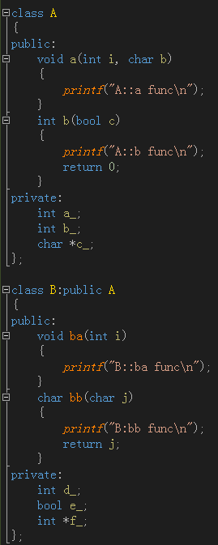

以类B的名字作为参数运行的结果为：

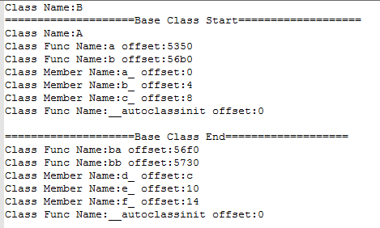

通过类的名称以及`SymTagUDT`即可获取该类的符号，之后遍历该类符号的所有子符号，便能够拿到该类的父类符号、成员变量符号、成员函数符号。

上面的程序只获取了父类、成员变量、成员函数的基本信息，并未获取更为详细的内容，若想获取函数的详细信息，可以用上一小节获取函数信息的代码进行获取，而类成员变量的类型信息也可举一反三获取。

## 获取枚举信息

对于枚举来说，获取的就是枚举项的名称和对应的值，在下面的例子中分别获取这两个值。

```C++
void GetEnumInfo(IDiaSymbol *pGlobal)
{
    IDiaEnumSymbols *pEnumSymbols = NULL;
    IDiaSymbol *pSymbol = NULL;
    ULONG celt = 1;

    // 注意这里的tag为SymTagEnum，表示是枚举
    pGlobal->findChildren(SymTagEnum, NULL, nsNone, &pEnumSymbols);
    while(SUCCEEDED(pEnumSymbols->Next(1, &pSymbol, &celt)) && (celt == 1))
    {
        BSTR bstrName = NULL;
        pSymbol->get_name(&bstrName);
        fwprintf(g_pFile, L"Enum Name:%s\n", bstrName);

        IDiaEnumSymbols *pEnumMemberEnumSymbols = NULL;
        IDiaSymbol *pEnumMemberSymbol = NULL;
        pSymbol->findChildren(SymTagNull, NULL, nsNone, &pEnumMemberEnumSymbols);
        while(SUCCEEDED(pEnumMemberEnumSymbols->Next(1, &pEnumMemberSymbol, &celt)) && (celt == 1))
        {
            VARIANT val = {VT_EMPTY};
            pEnumMemberSymbol->get_name(&bstrName);
            pEnumMemberSymbol->get_value(&val);
            DWORD dwValue = 0;

            switch (val.vt) {
            case VT_UI1:
            case VT_I1:
                dwValue = val.bVal;
                break;
            case VT_I2:
            case VT_UI2:
            case VT_BOOL:
                dwValue = val.iVal;
                break;
            case VT_I4:
            case VT_UI4:
            case VT_INT:
            case VT_UINT:
            case VT_ERROR:
                dwValue = val.lVal;
                break;
            }
           
            fwprintf(g_pFile, L"\t+ %s %d\n", bstrName, dwValue);
        }

        fwprintf(g_pFile, L"\n");
    }
}
```

为了获取枚举项，需要在`findChildren`函数中使用`SymTagEnum`参数。

在获取枚举值时，调用了`get_value `函数，其定义可见[MSDN](https://docs.microsoft.com/en-us/visualstudio/debugger/debug-interface-access/idiasymbol-get-value?view=vs-2019)，通过该函数会获取一个`VARIANT`类型的对象，该对象包含了具体的值。

假设获取的枚举定义如下,

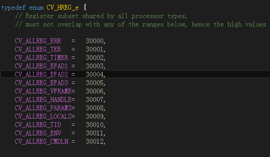


那么程序运行的结果是，

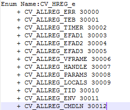

## 获取常量、全局变量以及静态变量的信息

```C++
void GetValueInfo(IDiaSymbol *pGlobal)
{
    IDiaEnumSymbols *pEnumSymbols = NULL;
    IDiaSymbol *pSymbol = NULL;
    ULONG celt = 1;

    // 这里的tag为SymTagData，说明是数据
    pGlobal->findChildren(SymTagData, NULL, nsNone, &pEnumSymbols);
    while(SUCCEEDED(pEnumSymbols->Next(1, &pSymbol, &celt)) && (celt == 1))
    {
        BSTR bstrName = NULL;
        VARIANT val = {VT_EMPTY};
        pSymbol->get_name(&bstrName);
        DWORD offset = 0;
        pSymbol->get_relativeVirtualAddress(&offset);
        pSymbol->get_value(&val);
        
        DWORD dwValue = 0;
        switch (val.vt) {
        case VT_UI1:
        case VT_I1:
            dwValue = val.bVal;
            break;
        case VT_I2:
        case VT_UI2:
        case VT_BOOL:
            dwValue = val.iVal;
            break;
        case VT_I4:
        case VT_UI4:
        case VT_INT:
        case VT_UINT:
        case VT_ERROR:
            dwValue = val.lVal;
            break;
        }

        fwprintf(g_pFile, L"name: %s  address:%x  value: %d\n\n", bstrName, offset, dwValue);
    }
}
```

在上述例子中，注意findChildren函数中使用的是SymTagData参数。程序中的全局变量、静态变量、常量的信息如下：

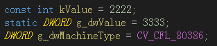

程序运行后的结果为：

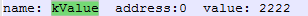

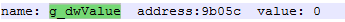

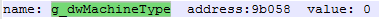

代码比较简单，不再赘述。

### 静态变量获取的注意事项

在上述例子中的静态变量实际上是全局的静态变量，但日常使用中，还会将静态变量放在函数中，一般是作为单例模式的用法。在这种情况下，使用上述方法就不能保证可以获取静态变量的偏移地址了。

拿下面的代码来说，通过上面获取全局变量的方式是无法拿到静态变量的偏移地址的。

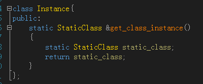

研究了上面的这种情况，发现其实是可以拿到静态变量的地址的，获取方式也比较简单，其实际上是一个函数的成员变量，首先获取对应函数的符号信息，然后再根据函数的符号信息继续获取该函数的其他信息，其中就包括该函数的静态变量符号信息。

主要代码如下，

```c++
void PrintFunctionInfo(IDiaSymbol *pFuncSymbol)
{
    DWORD dwTag = SymTagNull;
    BSTR bstrName = NULL;
    BSTR bstrUdName = NULL;
    DWORD dwRVA = 0;

    // 输出函数的基本信息
    pFuncSymbol->get_name(&bstrName);
    fwprintf(g_pFile, L"Func Name:%s\n", bstrName);
    // 如果函数是：Instance::get_class_instance
    if(wcscmp(bstrName, L"Instance::get_class_instance") == 0)
    {
        IDiaEnumSymbols *pEnumChildren;
        // 获取该函数的所有数据子符号
        if (SUCCEEDED(pFuncSymbol->findChildren(SymTagData, NULL, nsNone, &pEnumChildren))) 
        {
            IDiaSymbol *pChild;
            ULONG celt = 0;
            while (SUCCEEDED(pEnumChildren->Next(1, &pChild, &celt)) && (celt == 1)) 
            {
                // 打印数据，PrintData函数见DIASDK的Sample程序
                // 这里便会打印出static_class静态变量的名字、地址偏移等信息
                PrintData(pChild, 3);
            }
        }
    }
}
```

以上述的`get_class_instance`函数为例，首先获取该函数的符号，在上述代码中也就是参数传递进来的`pFuncSymbol`，之后调用`findChildren`函数，tag参数为` SymTagData`，以获取其所有的数据类符号，这自然包括该函数所属的静态变量符号。

在拿到静态变量的符号后，通过使用DIASDK Sample程序中的`PrintData`函数，可以将静态变量的详细信息拿到，包括地址、名字等。

# 总结

通过上面的几个例子可以看到使用DIA SDK解析pdb文件还是有点复杂的，关键是要理清要获取的数据属于哪种类型以及数据相关信息是怎样与数据符号相关联的，这点还是要参考DIA SDK中Sample程序的代码。