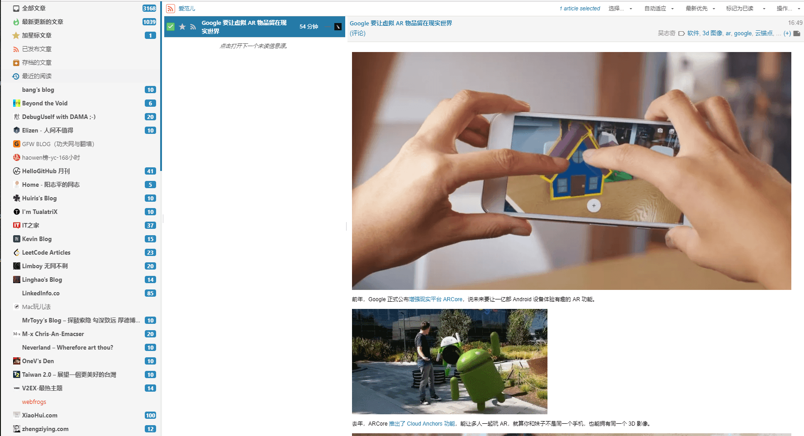

所谓rss，维基百科对其的定义是：

> RSS(简易信息聚合)，是一种消息来源格式规范，用以聚合经常发布更新数据的网站，例如博客文章、新闻、音频或视频的网摘。RSS文件（或称做摘要、网络摘要、或频更新，提供到频道）包含全文或是节录的文字，再加上发布者所订阅之网摘数据和授权的元数据。

按我的理解，rss就是一种方便用来聚合文章、新闻、音频等内容的输出标准。比如某个博客或资讯网站通过rss输出了他的文章，之后你就可以通过支持rss聚合的软件来订阅文章以及新闻。

记忆中最早对rss有概念是从知乎上余弦的[回答](https://www.zhihu.com/question/23073812/answer/23558963)中看到的，他还推荐了[深蓝阅读器](http://bluereader.org/)。当时结合其他的资料算是对rss有了基本的了解，但当时并未使用rss，主要还是通过知乎、新闻软件了解各类资讯。

工作后，厌倦了刷知乎，而同时想看的东西又比较多，不想每个平台都安装相应的软件，因此找到了[氢应用](https://coolapk.com/apk/pub.hydrogen.android)，这是一个很轻量且没有广告的资讯聚合软件，看IT之家、少数派、知乎日报等资讯很方便，用了一年多。但时间长了后，有一点不太满意，有时太忙可能一天多才会上去看一下，而像IT之家的文章又比较多，就没办法确定哪些文章是看过的，哪些还没有，只能凭借记忆有个大概的印象。因此也就希望在软件层面能区分哪些是已读的，哪些是未读，而这个功能似乎是rss类客户端的标配，因此这又让我想起了rss。

一般有两种方法订阅rss，

1. 本地订阅，即直接在本地客户端中订阅rss链接。
2. 通过rss服务商订阅rss链接。

这两种方式中一般推荐第2种。本地订阅的话，如果软件长时间没有运行，就很可能抓取不及时，从而漏掉一些内容，另一方面由于是本地抓取，就只能够在一个设备阅读，如果想同时在多个设备上阅读就比较麻烦。而使用rss服务商的话，由rss服务商的服务器定时对内容进行抓取，基本上不会漏抓，同时用户也可在多个设备上同时登录阅读，且阅读状态同步，大大提升了使用rss的体验。

rss服务商有很多，在这篇少数派的[2018 年主流 RSS 服务选哪家？Feedly、Inoreader 和 NewsBlur 全面横评](https://sspai.com/post/44420)中有大概的介绍。

先前在Android下，用的是Inoreader免费版，除了偶尔连接不太好之外，其他方面基本满足需求。

后来换了iPhone，发现在apple store中找不到Inoreader，顿时懵逼了（后来明白是国区下架了，可在美区下载）。当时恰好看到Reeder 3限免，就下载了Reeder 3，使用Reeder 3登录Inoreader后发现Inoreader竟然在文章中内嵌广告（使用安卓官方应用时没发现），这点实在不能忍。看了几个rss服务商，发现如果只使用免费版本的话会有各种的不方便，又不愿意直接付钱，因此又开始了折腾之路，希望找一个比较满意的解决方案。

之后阅读了这几篇文章，

1. [如何搭建属于自己的 RSS 服务，高效精准获取信息](https://sspai.com/post/41302)
2. [另一篇）Tiny Tiny RSS 教程](https://sspai.com/post/42787)
3. [用 Miniflux 自建轻便好用的 RSS 服务](https://zoomyale.com/2018/miniflux_rss)
4. [Tiny Tiny RSS - 专属于你的RSS服务](https://yorkchou.com/tt-rss.html)
5. [Tiny Tiny RSS - 搭建RSS服务并适配Fever（新手向）](https://tstrs.me/1451.html)
6. [我有特别的 RSS 使用技巧](https://diygod.me/ohmyrss/)

通过这几篇文章了解了Tiny Tiny Rss和Miniflux。由于自己本来就有服务器用作他用，因此在此基础上再搭建一个rss服务也没有什么问题和成本。

Tiny Tiny Rss（简称ttrss）和Miniflux这两个rss服务均搭建尝试了下，在功能的完善程度上自己更加的喜欢ttrss。Miniflux是由Go编写的，自己一直比较喜欢Go实现的工具，但在体验一番后，发现不太满足自己的需求。首先Miniflux的全文抓取做的不是太好，像是通过类似爬虫的手段直接将html给抓取了下来，排版比较乱，而ttrss则可以与mercury结合，抓取全文的排版更加符合阅读习惯。另外MiniFlux不能使用规则过滤，而自己恰好有这个需求。基于这两个原因，因此最终选择了ttrss。

服务端使用ttrss，配合mercury抓取全文，借助fever插件供手机端的Reeder使用，目前已经使用了快1年了，ttrss运行的很稳定，自己是非常的满意。目前服务只有自己一个人在使用，如果有谁也想体验使用，可以联系我，我将免费提供使用😁。

上一张自己ttrss的界面（刚刚订阅了好多源，还没看😂，当然rss源不宜过多，所以后面还需要再精简）

在rss服务端完善之后，还有两个问题要考虑，从哪获取想要的rss源？除了iPhone的Reeder外，还有哪些比较好用的客户端？

对于rss源，目前很多网站是不再提供rss源了，猜测主要是两方面原因导致的，一方面是避免被某些人的非法爬虫抓取，另一方面是网站会因为rss失去较多有效的流量，导致广告等收入的下降。

对于不提供rss源的网站，可以去[RSSHub](https://docs.rsshub.app/)上获取，RSSHub 是一个轻量、易于扩展的 RSS 生成器, 可以给任何奇奇怪怪的内容生成 RSS 订阅源。自己也是从这上面订阅了很多源，不过由于官方RSSHub被某些网站反爬严重（比如知乎），因此自己也可在自己的服务器上自行搭建，由于对自己影响不大，因此自己也就没有自行搭建了。

除了RSSHub本身外，其也提供了RSSHub Radar浏览器插件，用于主动探测发现某些网站的订阅源，如果自己发现某个网站不错，但却找不到订阅源，通过RSSHub Radar说不定可以帮你探测到对应的订阅源。

自己在手机上一直在使用免费的Reeder 3，一直都很满意，但还是想找找有没有更好的客户端。经过一番搜索，在iPhone下除了rss服务商自己提供的客户端外，比较有名就这几个了。

1. UnRead，支持ttrss，但需要订阅付费，否则限制每天阅读文章的数量。
2. lire，由于不支持自建的ttrss，因此未详细了解。
3. Fiery Feeds，支持ttrss，订阅付费可以使用高级功能，比如全文抓取等，免费版可满足基本使用需求。
4. Reeder 4，Reeder3的更新版本，支持ttrss，一次性付费。

上面4个应用，除了lire外，其他3个自己都有使用过，可能自己习惯了Reeder3的操作习惯，因此在使用其他几个软件时，无论是界面还是操作都感到很不习惯，因此最终还是决定继续使用自己的Reeder3。当然Reeder3也存在不足的地方，比如某些rss源在其他客户端上的排版要比Reeder3上好。

除了IOS，也稍微了解了下Android下的rss客户端，如果自己哪天换回了Android，也可以直接找到可替换的客户端。

1. Tiny Tiny Rss，ttrss的官方应用，需要收费（有免费的版本，需要仔细寻找）。
2. FeedMe，支持ttrss，免费无广告，配置项很多，可以配置以符合自己的操作习惯，算是稍微比较满意的一个客户端。
3. News+，通过插件可支持ttrss，简单尝试后也比较满意。
4. Press，支持ttrss，免费，但多年前已经不维护了，因此后续能否使用还是个问题。
5. Palabre，通过插件可支持ttrss，免费，付费可使用高级功能。
6. Newsfold，不支持ttrss，免费有广告且使用有限制。
7. gReader，不支持ttrss，其他未了解。
8. Readably，支持ttrss，免费版功能有限制。

整体看了下Android下的第三方rss客户端，感觉体验都不如iPhone下的，这也是自己一直纠结的一个点，万一哪天重新换回Android，该咋使用自己的ttrss嘞😥？期待Android尽快有一个比较完美的第三方ttrss软件。

当前对自己的这套rss解决方案是非常满意的，而现在唯一的问题就是自己的使用习惯问题了，从上面的图中可以看到我订阅了很多rss源，有超过3000篇文章未读😅，这说明自己现在已经存在“订阅癖“的问题了。订阅一时爽，阅读火葬场，看到什么感兴趣的东西都想订阅一下，然而最终却完全看不过来。还是应当想清楚自己使用rss的目的是什么？是为了满足自己的哪些需求才使用rss的？回归rss的本质，不要舍本遂末，忘了自己最本质的需求。