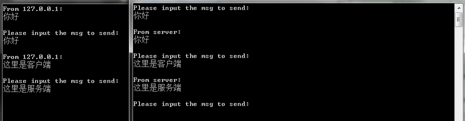

很早之前就对网络编程很感兴趣，但那时候水平不到家，始终无法入门，这学期在实验室的项目中又重新接触windows下的网络编程，也写了些代码，特意总结一下。

试着回想了下当初无法入门网络编程的原因，一方面是因为网络编程的API比较多（对当时的我来说），另一方面也确实感觉网络编程很难，一些概念不是清楚。如今就来说说现在的理解。

在网络编程中，最常见的也就是C/S模型，即客户端/服务端模型，服务端用来提供服务，而客户端用来连接服务端获取相应的服务。

联系一下现实生活。假如我们需要就某一件事情咨询一下服务公司，那么当我们打电话咨询的时候，我们就是客户端，而服务公司的服务人员则是服务端。

考虑一下咨询的细节，假设现在我们是客户方，我们现在要向服务方咨询一些事情。那么我们首先要有一个电话，当然，我们也要有一个电话号码，只有有了电话号码，我们才能使用电信公司的通讯业务。虽然我们需要电话号码，但是我们拨打电话的时候并不需要知道我们自身的电话号码，我们只需要服务方的电话号码就可以了，这样我们也就能联系上服务方。

现在假设我们是服务方，我们为客户提供咨询服务。那么我们首先也需要一个电话，用来接听客户的疑问。然后我们需要有一个电话号码，这个电话号码和我们的电话绑定到一起，当客户拨打这个电话号码的时候，我们就会从我们的电话中获取到客户来电，从而给客户提供相应的服务。

而在网络编程中，细节和上述打电话的细节差不多。

网络编程中的“电话”是一种称为套接字（socket）的东西，通过它，我们才可以发起通讯或是接收通讯。

网络编程中的“电话号码”是IP地址加上端口号。IP地址是互联网协议中规定的统一的一种标识计算机在互联网中的身份标识。这里的端口号是一种逻辑上的端口号，通过端口号的不同来分辨不同的服务。毕竟计算机不像电话一样只提供“打电话”一个服务，而是提供很多服务。而为了区别这些不同的服务，所以就有了逻辑上的端口号。通过IP地址和端口号的组合就有了“电话号码”。


下面讲解下编程需要的API和数据结构。

### 创建一个“电话”，也就是socket

```C
SOCKET socket (
    int af,           //address family的缩写，表示使用的是哪一种类型的网络地址
    int type,         //设置传输类型，tcp是SOCK_STREAM,udp是SOCK_DGRAM
    int protocol      //设置传输协议，tcp是IPPRROTO_TCP,udp是IPPROTO_UDP
);
```

函数调用成功后就会返回一个可用的socket变量。

### “电话号码”的定义

```C
struct sockaddr_in{
    short              sin_family;   //Address family (must be AF_INET).
    unsigned short     sin_port;     //这个参数用来设置端口号
    struct   in_addr   sin_addr;     //这个参数设置IP地址
    char               sin_zero[8];  //这个不用管   Padding to make structure the same size as SOCKADDR.
};
```

### 其他的一些函数  

```C
//该函数用来“拨打电话”，即连接服务端
int connect (
    SOCKET s,                             //socket变量                   
    const struct sockaddr FAR*  name,     //对方的地址，是一个指向sockaddr结构体的指针
    int namelen                           //地址的长度                     
);

//该函数用来绑定服务端的套接字和地址，相当于将电话和电话号码绑定
int bind (
    SOCKET s,                            //要绑定的socket
    const struct sockaddr FAR*  name,    //要绑定的地址
    int namelen                          //地址的大小
);

//该函数用来“监听电话”
int listen (
    SOCKET s,    //绑定的套接字
    int backlog  //连接请求队列的最大长度
);

//该函数用来"接听电话“
SOCKET accept (
    SOCKET s,                   //正在监听的socket     
    struct sockaddr FAR* addr,  //一个指向sockaddr结构体的指针，用来获取对方的地址
    int FAR* addrlen            //指向上述地址长度的整形变量的指针
);

//该函数用来初始化套接字库，网络编程都需要先调用这个函数
int WSAStartup (
    WORD wVersionRequested,  //套接字库的版本，一般使用MAKEWORD(2,2)宏指定
    LPWSADATA lpWSAData      //指向WSADATA结构体的指针，用来获取windows sockets的具体信息
);

//该函数用来终止套接字库的使用
int  WSACleanup (void);

//该函数用来关闭一个套接字
int closesocket (
    SOCKET s  //要关闭的套接字
);

//该函数用来发送消息
int send (
    SOCKET s,                 //要发送消息的socket    
    const char FAR * buf,     //指向存放消息缓冲区的指针
    int len,                  //发送消息的长度
    int flags                 //指明发送方法
);

//该函数用来接收消息
int recv (
    SOCKET s,       //接收消息的socket
    char FAR* buf,  //接收消息的缓冲区的指针
    int len,        //缓冲区的长度
    int flags       //接收消息的方式
);
```

接下来是一个客户端和服务端的例子。（操作系统 win7 专业版，编译软件  VC6.0）

### 客户端

```C
#include <WinSock2.h>  
#include <stdio.h>
#pragma comment(lib,"ws2_32.lib")

int main(){
    //定义需要的变量
    int err=0;
    WSADATA wsaData;
    SOCKADDR_IN addrServer;
    char sendBuf[1024];
    char recvBuf[1024];
    
    //初始化套接字库
    err=WSAStartup(MAKEWORD(2,2),&wsaData);

    if(err!=0){
        return -1;
    }

    //创建socket，相当于有了“电话”
    SOCKET sockClient=socket(AF_INET,SOCK_STREAM,0);

    //给sockaddr_in结构赋值，相当于添加“电话号码”
    addrServer.sin_addr.S_un.S_addr=inet_addr("127.0.0.1");    //对方的IP地址，需要使用inet_addr函数将传入的点分十进制的IP地址转换成适合u_long型数值
    addrServer.sin_family=AF_INET;                             //指定协议类型
    addrServer.sin_port=htons(5000);                           //指定端口

    //连接服务端，相当于“拨打电话”
    if(SOCKET_ERROR==connect(sockClient,(SOCKADDR*)&addrServer,sizeof(SOCKADDR))){
        printf("connect error!\n");
        return -1;
    }
    
    memset(sendBuf,0,sizeof(sendBuf));
    memset(recvBuf,0,sizeof(recvBuf));

    while(1){    
        //输入要发送的消息
        printf("Please input the msg to send:\n");
        gets(sendBuf);
        //发送消息
        send(sockClient,sendBuf,strlen(sendBuf)+1,0);
        printf("\n");
        //接收来自服务端的消息
        recv(sockClient,recvBuf,sizeof(recvBuf),0);
        printf("From server:\n%s\n\n",recvBuf);
    
    }
    
    //关闭套接字和终止套接字库的使用
    closesocket(sockClient);
    WSACleanup();
    return 0;
}
```

### 服务端

```C
#include <stdio.h>
#include <winsock2.h>
#pragma comment(lib,"ws2_32.lib")


int main(){
    //定义需要使用的变量
    WSADATA wsaData;

    SOCKET sockListen,sockConn;
    SOCKADDR_IN ListenAddr,ConnAddr;

    char recvBuf[1024];
    char sendBuf[1024];
    
    //初始化套接字库
    WSAStartup(MAKEWORD(2,2),&wsaData);

    //创建监听socket，相当于“创建电话”
    sockListen=socket(AF_INET,SOCK_STREAM,0);

    if(sockListen==INVALID_SOCKET){
        printf("socket failed\n");
    }

    //给监听的sockaddr_in结构体赋值，相当于“购买电话卡”
    ListenAddr.sin_addr.S_un.S_addr=INADDR_ANY;  //如果对IP地址不关心的话，可以设置为INADDR_ANY
    ListenAddr.sin_family=AF_INET;
    ListenAddr.sin_port=htons(5000);

    //绑定socket和地址，相当于“将电话卡插入电话”
    if(SOCKET_ERROR==bind(sockListen,(SOCKADDR*)&ListenAddr,sizeof(SOCKADDR))){

        printf("bind is error with %d\n",WSAGetLastError());
    }

    //开始监听，相当于“电话开机”
    if(SOCKET_ERROR==listen(sockListen,5)){

        printf("listen is error with %d\n",WSAGetLastError());
    }
    
    int socklen=sizeof(ConnAddr);

    memset(recvBuf,0,sizeof(recvBuf));
    memset(sendBuf,0,sizeof(sendBuf));

    //接收连接，相当于“按下接听键”，然后获取到对方的socket，使用对方的socket进行通讯
    sockConn=accept(sockListen,(SOCKADDR*)&ConnAddr,&socklen);

    while(1){

        //获取对方的消息
        recv(sockConn,recvBuf,sizeof(recvBuf),0);
        printf("From %s:\n%s\n\n",inet_ntoa(ConnAddr.sin_addr),recvBuf);
        
        //输入要发送的消息
        printf("Please input the msg to send:\n");
        gets(sendBuf);
        //发送消息
        send(sockConn,sendBuf,strlen(sendBuf)+1,0);
        printf("\n");
    }

    //关闭套接字和终止套接字库的使用
    closesocket(sockConn);
    closesocket(sockListen);
    WSACleanup();
    return 0;
}
```

### 运行时的截图如下



上述的服务端代码只能一次接受一个客户端，然后就不能使用了，为了使服务端可以接收多个连接，下面修改一下代码。

### 修改后的服务端代码

```C
#include <stdio.h>
#include <winsock2.h>
#pragma comment(lib,"ws2_32.lib")

//定义一个线程函数
DWORD WINAPI ClientThread(LPVOID lpParam);

int main(){
    //定义需要使用的变量
    WSADATA wsaData;

    SOCKET sockListen,sockConn;
    SOCKADDR_IN ListenAddr,ConnAddr;
    
    //初始化套接字库
    WSAStartup(MAKEWORD(2,2),&wsaData);

    //创建监听socket，相当于“创建电话”
    sockListen=socket(AF_INET,SOCK_STREAM,0);

    if(sockListen==INVALID_SOCKET){
        printf("socket failed\n");
    }

    //给监听的sockaddr_in结构体赋值，相当于“购买电话卡”
    ListenAddr.sin_addr.S_un.S_addr=INADDR_ANY;  //如果对ip地址不关心的话，可设置为 INADDR_ANY
    ListenAddr.sin_family=AF_INET;
    ListenAddr.sin_port=htons(5000);

    //绑定socket和地址，相当于“将电话卡插入电话”
    if(SOCKET_ERROR==bind(sockListen,(SOCKADDR*)&ListenAddr,sizeof(SOCKADDR))){

        printf("bind is error with %d\n",WSAGetLastError());
    }

    //开始监听，相当于“电话开机”
    if(SOCKET_ERROR==listen(sockListen,5)){

        printf("listen is error with %d\n",WSAGetLastError());
    }
    
    int socklen=sizeof(ConnAddr);

    while(1){
        //接收连接，相当于“按下接听键”
        sockConn=accept(sockListen,(SOCKADDR*)&ConnAddr,&socklen);
        //每接收一个链接，就创建一个线程来处理相应的消息
        CreateThread(NULL,0,ClientThread,(LPVOID)sockConn,NULL,NULL);
    }

    //关闭套接字和终止套接字库的使用
    closesocket(sockListen);
    WSACleanup();
    return 0;
}

//线程函数，用来处理单独客户端的消息
DWORD WINAPI ClientThread(LPVOID lpParam){
    SOCKET ss=(SOCKET)lpParam;
    int retVal;
    char recvBuf[1024];
    char sendBuf[]="收到消息";

    memset(recvBuf,0,sizeof(recvBuf));

    while(1){
        //接收消息
        retVal=recv(ss,recvBuf,sizeof(recvBuf),0);
        //判断客户端是否关闭连接
        if(SOCKET_ERROR==retVal){
            printf("recv failed !\n");
            break;
        }
        printf("%s\n",recvBuf);

        //这里发送的信息固定成“收到消息”了
        send(ss,sendBuf,sizeof(sendBuf),0);
    }
    closesocket(ss);
    return 0;
}
```
