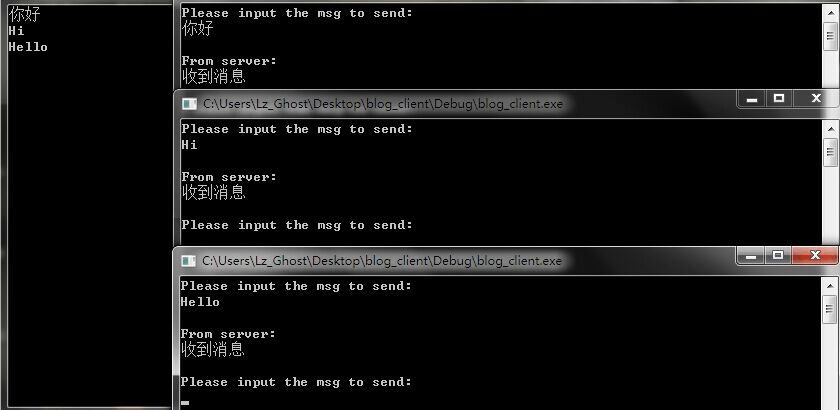
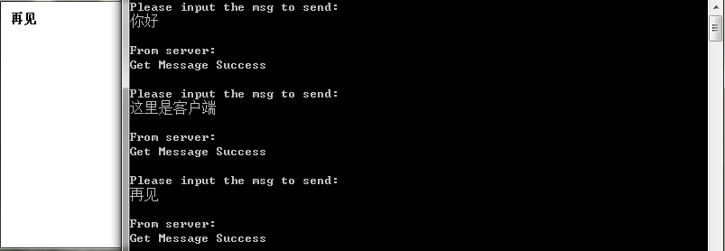

一般来说，学网络编程最好还是在Linux下学习，尤其推荐《Unix网络编程 卷一》这本书，但是由于整个项目是在windows下进行的，所以目前学习网络编程的都是基于windows的。windows之所以不适合学习网络编程，我认为一个很重要的原因就是东西太多太杂，而且大多用处不大。windows下面的网络模型差不多有七种，我学习其中的六种，上一篇博文算是最简单的第一种。这一篇来记录下第二种网络模型的学习。

这次的网络模型是WSAAsyncSelect模型，我们称之为WSA消息模型，之所以称它为消息模型，是因为这种网络模型是基于windows消息机制的。这种模型是Select模型（就这个模型我没学）的异步版本。在Select模型中，select函数有一个参数设置阻塞时间，在阻塞时间内，函数一直等待不返回，直到超过阻塞时间或是有一个或多个套接字满足可读或可写的要求才返回。而WSA消息模型是非阻塞的，当WSAAsyncSelect函数注册好网络事件后直接返回，而当有连接发送消息到来时，程序就会收到注册的消息，并调用recv函数来接收消息。下面说下程序的实现细节。

首先说明一下，这种模型是基于消息的，也就是说程序要有消息循环，而在windows下，有消息循环的程序也就要数窗口程序了，因此要使用这种模型进行网络编程，就要先创建一个窗口，然后再基于消息进行通讯。

窗口程序有一个消息队列，每当有什么消息时，操作系统就会把相应的消息加入到这个队列中，窗口程序的消息循环处理函数不断的从这个队列中获取消息，根据消息的类型进行相应的操作。而这种网络模型就是使用WSAAsyncSelect函数注册一个我们自定义的消息，把这个消息和网络事件绑定起来，当消息循环处理函数获取到我们这个自定义的消息时，就表示有网络事件到来了。接下来，就是判断这个网络事件具体是哪类事件，是可读？可写？还是什么，然后根据具体的事件去进行不同的处理。

下面来看下WSAAsyncSelect函数的定义

```C
int WSAAsyncSelect(
    SOCKET s,      //需要事件通知的套接字
    HWND   hWnd,   //当网络事件发生时接收消息的窗口句柄
    u_int  wMsg,   //当网络事件发生时窗口收到的消息
    long   lEvent  //应用程序感兴趣的网络事件集合
)
```

当这个函数调用时，会自动的将套接字设置成非阻塞的（socket函数创建的套接字默认是阻塞的）。

对于参数四可选的值有：（来自MSDN）

```
Value                          Meaning 
FD_READ                        想要接收可读的通知
FD_WRITE                       想要接收可写的通知
FD_OOB                         想要接收带外数据到来的通知
FD_ACCEPT                      想要接收有到来连接的通知
FD_CONNECT                     想要接收一次连接完成或多点jion操作完成的通知
FD_CLOSE                       想要接收套接字关闭的通知
FD_QOS                         想要接收套接字服务质量发生变化的通知
FD_GROUP_QOS                   想要接收套接字组服务质量发生变化的通知
FD_ROUTING_INTERFACE_CHANGE    想要在指定方向上，与路由接口发生变化的通知
FD_ADDRESS_LIST_CHANGE         想要接收针对套接字的协议家族，本地地址列表发生变化的通知 
```

根据需要选择需要的事件，当需要关注多个事件时，对多个事件按位或（OR）操作，假设我们希望关注可读，连接关闭还有连接完成的网络事件时，可这样使用函数：(假定套接字是s，窗口句柄是hwnd，自定义的消息是WM_SOCKET）

    WSAAsyncSelect(s,hwnd,WM_SOCKET,FD_CONNECT | FD_READ | FD_CLOSE);

下面说一下发生上述常见网络事件的条件（来自《精通windows sockets 网络开发》）

**FD_READ事件**

在下面的情况下，发生FD_READ网络事件。

- 当调用WSAAsyncSelect()函数时，如果当前有可读数据时。
- 当数据到达并且没有发送FD_READ网络事件时。
- 调用recv()或者recvfrom()函数后，如果仍然有可读数据时。

**FD_WRITE事件**

在下面的情况下，发生FD_WRITE网络事件。

- 当调用WSAAsyncSelect()函数时，如果调用能够发送数据时。
- 调用connect()或者accept()函数后，当链接已经建立时。
- 调用send()或者sendto()函数，返回WSAEWOULDBLOCKE错误后，再次调用send()或者sendto()函数可能成功时。

**FD_ACCEPT事件**

在下面的情况下，发生FD_ACCEPT网络事件。

- 当调用WSAAsyncSelect()函数时，如果当前有连接请求需要接受时。
- 当连接请求到达，还没有发送FD_ACCEPT网络事件时。
- 调用accept()函数后，如果还用另外连接请求需要接受时。

**FD_CONNECT事件**

在下面的情况下，发生FD_CONNECT网络事件。

- 当调用WSAAsyncSelect()函数，如果当前一个连接已经建立时。
- 当调用connect()函数后，建立连接完成时。
- 当调用WSAJoinLeaf()函数后，加入操作完成时。
- 在面向连接的非阻塞套接字上，调用connect()、WSAConnect()或者WSAJoinLeaf()函数后，尝试连接完成时。此时应用程序应该检查错误代码，确定连接是否成功。

**FD_CLOSE事件**

FD_CLOSE事件仅对面向连接的套接字有效，在下面的情况下发送FD_CLOSE事件。

- 当调用WSAAsyncSelect()函数时，套接字连接关闭时。
- 对方执行了从容关闭后，没有数据可读时，如果数据已经到达并等待读取，FD_CLOSE事件不会被发送，直到所有的数据都被接收。
- 调用shutdown()函数执行从容，对方应答FIN后，此时如果没有数据可读时。
- 当对方结束了连接，并且lParam包含WSAECONNRESET错误时。

下面是服务程序代码，客户端代码和上一篇的客户端相同：（环境：win7   VC6.0）

```C
#include <winsock2.h>
#include <stdio.h>
#pragma comment(lib,"ws2_32.lib")

//定义我们自己的SOCKET消息
#define WM_SOCKET WM_USER+1001


//窗口回调函数
LRESULT CALLBACK WinProc(HWND hwnd,UINT uMsg,WPARAM,LPARAM);

int WINAPI WinMain(HINSTANCE hInstance,HINSTANCE hPrevInstance,LPSTR lpCmdLine,int nShowCmd){
    
    //创建窗口，这里就不多说了
    WNDCLASS wc;
    wc.cbClsExtra=0;
    wc.cbWndExtra=0;
    wc.hbrBackground=(HBRUSH)GetStockObject(WHITE_BRUSH);
    wc.hCursor=LoadCursor(hInstance,IDC_ARROW);
    wc.hIcon=LoadIcon(hInstance,IDI_EXCLAMATION);
    wc.hInstance=hInstance;
    wc.lpfnWndProc=WinProc;
    wc.lpszClassName="My_Class";
    wc.lpszMenuName=NULL;
    wc.style=CS_HREDRAW | CS_VREDRAW;

    RegisterClass(&wc);
    HWND hwnd=CreateWindow("My_Class","WSA消息",WS_SYSMENU,300,300,300,300,NULL,NULL,hInstance,NULL);

    ShowWindow(hwnd,nShowCmd);
    UpdateWindow(hwnd);
    
    //初始化套接字
    WSADATA wsaData;
    WSAStartup(MAKEWORD(2,2),&wsaData);
    
    //创建套接字
    SOCKET s=socket(AF_INET,SOCK_STREAM,0);
    SOCKADDR_IN local;
    local.sin_addr.S_un.S_addr=INADDR_ANY;
    local.sin_family=AF_INET;
    local.sin_port=htons(5000);
    
    //绑定监听
    bind(s,(SOCKADDR*)&local,sizeof(SOCKADDR));
    listen(s,5);
    
    //将监听套接字和自定义的消息进行绑定，并关注连接到来消息
    WSAAsyncSelect(s,hwnd,WM_SOCKET,FD_ACCEPT);
    
    //消息循环
    MSG msg;
    while(GetMessage(&msg,0,0,0)){
        TranslateMessage(&msg);
        DispatchMessage(&msg);
    }

    closesocket(s);
    WSACleanup();
    return msg.wParam;
}

//回调函数
LRESULT CALLBACK WinProc(HWND hwnd,UINT uMsg,WPARAM wParam,LPARAM lParam){
    
    //判断消息类型
    switch(uMsg){
    
    //我们自定义的SOCKET消息
    case WM_SOCKET:
        {
            //wParam参数是套接字句柄
            SOCKET ss=wParam;
            
            //lParam的高字节为可能出现的错误代码，这里使用WSAGETSELECTERROR宏进行判断
            if(WSAGETSELECTERROR(lParam)){
                closesocket(ss);
                return 0;
            }
            
            //不是错误代码，然后使用WSAGETSELECTEVENT宏判断发生的网络事件
            switch(WSAGETSELECTEVENT(lParam)){
            
            //ACCEPT网络事件
            case FD_ACCEPT:
                {
                    SOCKADDR_IN client;
                    int client_len=sizeof(SOCKADDR);
                    SOCKET sClient=accept(ss,(SOCKADDR*)&client,&client_len);
                    //错误处理
                    if(sClient==INVALID_SOCKET){
                        MessageBox(hwnd,"accept fun is error","Error",MB_OK);
                    }
                    //将接收的套接字继续与窗口关联起来，并关注可读与关闭套接字事件
                    WSAAsyncSelect(sClient,hwnd,WM_SOCKET,FD_READ | FD_CLOSE);
                }
                break;

            //读取消息
            case FD_READ:
                {
                    char recvbuf[1024]={0};

                    //接收消息
                    int cRecv=recv(ss,recvbuf,1024,0);
                        
                    //错误处理
                    if((cRecv==SOCKET_ERROR && WSAGetLastError()==WSAECONNRESET) || cRecv==0){
                        
                        MessageBox(hwnd,"recv fun is error","Error",MB_OK);
                        closesocket(ss);

                    }
                    //没有发生错误
                    else if(cRecv>0){
                        
                        char blank[1024];
                        memset(blank,' ',sizeof(blank));
                        //获取设备环境句柄
                        HDC dc=GetDC(hwnd);
                        //这步是将之前写在窗口上的数据给清空，因对windows绘图不熟悉，这里方法比较拙略
                        TextOut(dc,10,10,blank,1023);
                        //在窗口上写入获取到的消息
                        TextOut(dc,10,10,recvbuf,strlen(recvbuf));
                        //释放设备环境句柄
                        ReleaseDC(hwnd,dc);
                        //向客户端发送消息表示我们获取到了消息
                        char sendbuf[]="Get Message Success";
                        int issend=send(ss,sendbuf,sizeof(sendbuf),0);
                        //判断是否发送消息错误
                        if(issend==SOCKET_ERROR || issend<0){
                            MessageBox(hwnd,"Send Message Error","Error",MB_OK);
                        }
                    } 
                }
                break;

            //套接字关闭
            case FD_CLOSE:
                {
                    //关闭套接字
                    closesocket(ss);
                    break;
                }
            }
            break;
        }

        //窗口关闭消息
        case WM_CLOSE:
            {
                DestroyWindow(hwnd);
            }
            break;

        //窗口销毁消息
        case WM_DESTROY:
            {
                PostQuitMessage(0);
            }
            break;
        default:
            return DefWindowProc(hwnd,uMsg,wParam,lParam);
        }
        return 0;
}
```

下面是运行截图：





最后说下这种模型的优势与不足（来自《精通windows sockets网络开发》）

**优势**

该模型的使用方便了在基于消息的windows环境下开发套接字应用程序。开发人员可以像处理其他消息一样对网络事件消息进行处理。
  
该模型为确保接收所有数据提供了很好的机制。通过注册FD_CLOSE网络事件，从容关闭服务器与客户端的连接保证了数据全部接收。

**不足**

该模型局限在于，它基于windows的消息机制，必须在应用程序中创建窗口。当然，在开发中可以根据具体情况确定是否显示该窗口。

由于调用WSAAsyncSelect()函数后，自动将套接字设置为非阻塞状态。当应用程序为接收到网络事件调用相应的函数时，未必能成功返回。这无疑增加了开发人员使用该模型的难度。

最后补充一下，在遇到的服务器中，Serv-U FTP服务器中用到了这种模型。