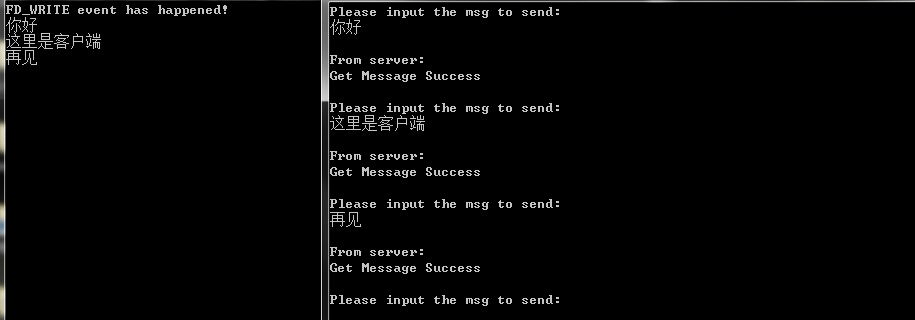

上一篇文章总结了WSA消息模型的学习，总体来说就是将网络事件与自定义的消息绑定起来，在消息循环中像处理平常的消息事件一样去处理网络事件。这一篇总结下WSA事件模型的学习。整体来说WSA事件模型和WSA消息模型非常相似。首先，他们都是异步的，其次，他们都是将网络事件与某一对象绑定起来，当有网络事件发生时，通过这一对象通知程序进行处理。在WSA消息中，这个对象是自定义的消息，而在WSA事件模型中，这个对象是事件。这也是把这种模型称之为WSA事件模型的原因。

在WSA事件模型中，要使用WSAEventSelect()函数创建一个事件，并把创建的事件和相应的套接字进行网络事件注册。注册完后，当有连接到来或是操作系统已经把数据准备好时，就以事件的形式通知应用程序。应用程序接收到这个事件后，根据事件的类型，进行不同的处理。

在这种模型中需要用到的主要函数是 WSAEventSelect(),WSACreateEvent(),WSAResetEvent(),WSAWaitForMultipleEvents(),WSAEnumNetworkEvents。相较之前几种模型的API数量，这次的有点多，也略显麻烦。

下面看下WSAEventSelect()函数的定义。

```C
int WSAEventSelect (
  SOCKET s,               //套接字
  WSAEVENT hEventObject,  //事件对象句柄
  long lNetworkEvents     //应用程序感兴趣的网络事件集合
);
```
这个函数调用后会自动设置套接字为非阻塞状态，要是想把套接字重新设置成阻塞状态，需要将lNetworkEvents参数设为0，并重新调用 WSAEventSelect()函数。

对于第三个参数的类型，在上一篇博客中已经写了，这里复制过来。

对于参数三可选的值有：（来自MSDN）

```
Value                          Meaning 
FD_READ                        想要接收可读的通知
FD_WRITE                       想要接收可写的通知
FD_OOB                         想要接收带外数据到来的通知
FD_ACCEPT                      想要接收有到来连接的通知
FD_CONNECT                     想要接收一次连接完成或多点jion操作完成的通知
FD_CLOSE                       想要接收套接字关闭的通知
FD_QOS                         想要接收套接字服务质量发生变化的通知
FD_GROUP_QOS                   想要接收套接字组服务质量发生变化的通知
FD_ROUTING_INTERFACE_CHANGE    想要在指定方向上，与路由接口发生变化的通知
FD_ADDRESS_LIST_CHANGE         想要接收针对套接字的协议家族，本地地址列表发生变化的通知 
```

对于上述函数的第二参数事件句柄需要由函数 WSACreateEvent() 创建。该函数的定义为：

```C
WSAEVENT  WSACreateEvent(void);
```
该函数调用成功后就会返回相应的事件句柄，如果错误就会返回WSA_INVALID_EVENT。

对于WSA事件，它有两种工作状态和两种工作模式。两种工作状态分别是“有信号的”和“无信号的”，两种工作模式分别是“人工重置”和“自动重置”。这个函数创建的事件的初始属性是，人工重置，而且是无信号的。

在使用WSAEventSelect()函数绑定事件和套接字后，当有希望接收的网络事件到来的时候，绑定的事件就会由无信号状态转变成有信号状态。这时候应用程序就可以根据这点来处理相应的网络事件，当处理完相应的网络事件后，因为默认是人工重置，所以需要手动将该事件设置成无信号状态。

设置事件从有信号状态到有信号状态的函数是WSAResetEvent()函数。定义如下：

```C
BOOL WSAResetEvent(
  WSAEVENT hEvent  
);
```

函数调用成功后返回真，调用失败返回假。

当程序要关闭时，需要关闭事件对象，以释放相应的资源。关闭事件的函数是WSACloseEvent()，定义如下：

```C
BOOL WSACloseEvent(
  WSAEVENT hEvent   
);
```

调用成功后返回真，失败返回假。

对于上述的当事件从无信号状态转变为有信号状态时，应用程序会得知这一变化，并进行相应的处理。这里应用程序是通过函数 WSAWaitForMultipleEvents() 函数得知的。该函数定义如下：

```C
DWORD WSAWaitForMultipleEvents(
  DWORD cEvents,                  //等待事件句柄的数量，最少为1个，最多是64个，这也是这种模型的限制。
  const WSAEVENT FAR *lphEvents,  //指向等待事件集合的指针，该参数和上一个参数构成了事件数组。
  BOOL fWaitAll,                  //是否等待所有事件都为有信号状态时才返回
  DWORD dwTimeOUT,                //设置超时时间，时间单位是毫秒。如果设置为WSA_INFINITE，就表示无限等待，直到满足fWaitAll的条件
  BOOL fAlertable                 //这个参数说明当完成例程在系统队列中排队等待执行时，该函数是否返回。这个参数主要用于重叠IO模型，这里设置为FALSE
);
```

一般情况下，在这么多事件中，我们是当一个事件从无信号变为有信号状态时，就让该函数返回，然后我们就需要知道是哪一个事件从无信号状态变为有信号状态了。这一点可以通过函数的返回值来判断，具体方法是 返回值减去WSA\_WAIT\_EVENT\_0所得的值就是有信号事件在数组中对应的下标。而WSA\_WAIT\_EVENT\_0这个宏的代表的值是0。

而如果函数超时了，就会返回WSA\_WAIT\_TIMEOUT

而如果函数调用失败，就会返回 WSA\_WAIT\_FAILED

到现在，API介绍的差不多了，仔细想一下，会发现还有一点不对，就是当事件从无信号状态变为有信号状态的时候，我们知道是某个连接发生了相应网络事件，但是我们从哪里得知发生的具体网络事件是什么呢？

这里就需要 WSAEnumNetworkEvents() 函数。定义如下：

```C
int WSAEnumNetworkEvents (
  SOCKET s,                           //发生网络事件的套接字句柄
  WSAEVENT hEventObject,              //被重置的事件对象（可选），若该参数有值，则会把相应的事件对象从有信号状态设置成无信号状态
  LPWSANETWORKEVENTS lpNetworkEvents  //一个指向WSANETWORKEVENTS结构体的指针，这个结构体包含了具体的网络事件和相关的错误代码。
);
```
调用成功返回0，失败返回 SOCKETS_ERROR

下面是 WSANETWORKEVENTS 结构体的定义：

```C
typedef struct _WSANETWORKEVENTS {
   long lNetworkEvents;             //发生的具体网络事件，可能是多个网络事件的组合
   int iErrorCode[FD_MAX_EVENTS];   //包含网络事件错误代码的数组
} WSANETWORKEVENTS, FAR * LPWSANETWORKEVENTS;
```
若需要检查相应的网络事件是否发生错误，需要用网络事件错误标识符对iErrorCode数组进行索引。标识符的名称为响应的网络事件后加上"_BIT"，比如FD_READ网络事件的错误标识符就是FD_READ_BIT。 

上述讲解了该模型需要的API，下面看代码实例。(win7,VC6.0)
客户端代码同文章一

```C
#include <stdio.h>
#include <winsock2.h>

#pragma comment(lib,"ws2_32.lib")

int main(){

    //初始化套接字
    WSADATA wsaData;
    WSAStartup(MAKEWORD(2,2),&wsaData);

    SOCKET sListen=socket(AF_INET,SOCK_STREAM,0);
    SOCKADDR_IN cAddr;
    cAddr.sin_addr.S_un.S_addr=INADDR_ANY;
    cAddr.sin_port=htons(5000);
    cAddr.sin_family=AF_INET;

    //绑定监听
    bind(sListen,(SOCKADDR*)&cAddr,sizeof(SOCKADDR));
    listen(sListen,5);

    //创建事件对象
    WSAEVENT Event=WSACreateEvent();

    //为监听套接字注册网络事件，同时将事件对象与网络事件关联起来
    if(SOCKET_ERROR==WSAEventSelect(sListen,Event,FD_ACCEPT | FD_CLOSE)){
        printf("WSAEventSelect error with code is:%d\n",WSAGetLastError());
        return 0;
    }

    //事件的总共数量
    int EventSum=0;
    //创建SOCKET和EVENT数组，这里WSA_MAXIMUM_WAIT_EVENTS宏代表64，所以这种模型每个线程最多只能管理64个套接字
    WSAEVENT arrayEvent[WSA_MAXIMUM_WAIT_EVENTS];
    SOCKET arraySocket[WSA_MAXIMUM_WAIT_EVENTS];

    //将创建的事件对象和与之绑定的套接字分别添加进相应的数组
    arrayEvent[EventSum]=Event;
    arraySocket[EventSum]=sListen;
    EventSum++;

    while(1){
        
        //该函数等待网络事件的发生
        int dwIndex=WSAWaitForMultipleEvents(EventSum,arrayEvent,false,WSA_INFINITE,FALSE);
        
        //判断是否发生错误
        if(dwIndex==WSA_WAIT_FAILED){
            printf("WSAWaitForMultipleEvents failed\n");
            continue;
        }

        //根据函数返回的值获取相关的SOCKET和EVENT
        WSAEVENT nowEvent=arrayEvent[dwIndex-WSA_WAIT_EVENT_0];
        SOCKET nowSocket=arraySocket[dwIndex-WSA_WAIT_EVENT_0];
        
        //创建WSANETWORKEVENTS结构
        WSANETWORKEVENTS networkEvents;

        //调用WSAEnumNetworkEvents函数获取发生在该套接字上的具体网络事件，
        //并且设置第二个参数为当前事件对象，该函数会自动将事件对象重置为无信号状态
        if(0==WSAEnumNetworkEvents(nowSocket,nowEvent,&networkEvents)){
            
            //FD_ACCEPT事件，将lNetworkEvents变量与FD_ACCEPT进行位与操作，如果真，则表示发生了FD_ACCEPT网络事件
            if(networkEvents.lNetworkEvents & FD_ACCEPT){
                
                //创建相关变量获取客户端套接字
                SOCKADDR_IN acceptAddr;
                int accept_len=sizeof(SOCKADDR);
                SOCKET sAccept;

                //接收客户端套接字
                sAccept=accept(nowSocket,(SOCKADDR*)&acceptAddr,&accept_len);

                //将该套接字注册，并设置网络事件为可读与关闭以及可写
                arraySocket[EventSum]=sAccept;
                arrayEvent[EventSum]=WSACreateEvent();
                WSAEventSelect(sAccept,arrayEvent[EventSum],FD_READ | FD_CLOSE | FD_WRITE);
                //将总体事件对象个数加一
                EventSum++;
            }

            //FD_READ网络事件，判断方法与FD_ACCEPT网络事件相同
            else if(networkEvents.lNetworkEvents & FD_READ){
                
                char recvBuf[1024];
                char sendBuf[]="Get Message Success";
                recv(arraySocket[dwIndex-WSA_WAIT_EVENT_0],recvBuf,sizeof(recvBuf),0);
                printf("%s\n",recvBuf);
                send(arraySocket[dwIndex-WSA_WAIT_EVENT_0],sendBuf,strlen(sendBuf)+1,0);
                
            }

            //FD_CLOSE网络事件，判断方法和上述相同
            else if(networkEvents.lNetworkEvents & FD_CLOSE){
                printf("A socket is closing\n");

                //关闭相关套接字
                closesocket(arraySocket[dwIndex-WSA_WAIT_EVENT_0]);

                //关闭相关的事件对象
                WSACloseEvent(arrayEvent[dwIndex-WSA_WAIT_EVENT_0]);

                //将被关闭的套接字和被关闭的事件对象从数组中移除
                for(int i=dwIndex-WSA_WAIT_EVENT_0;i<EventSum-1;i++){
                    arraySocket[i]=arraySocket[i+1];
                    arrayEvent[i]=arrayEvent[i+1];
                }

                //事件总数量减一
                EventSum--;
            }

            //FD_WRITE网络事件
            else if(networkEvents.lNetworkEvents & FD_WRITE){
                printf("FD_WRITE event has happened!\n");
            }
        }
    }

    closesocket(sListen);
    WSACleanup();
    return 0;
}

```

运行截图如下：




