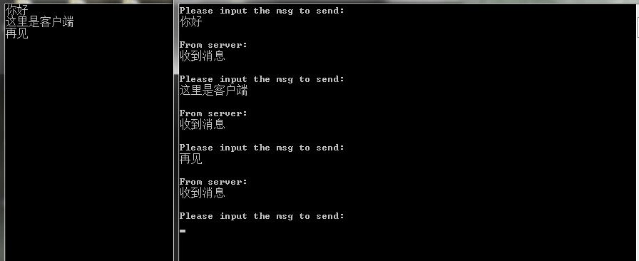

上一篇文章总结了重叠IO之事件通知模型的学习，这篇文章总结下重叠IO之完成例程的学习。

重叠IO之完成例程其实和重叠IO之事件通知模型差不多，关键就在于WSARecv()函数最后的那个参数。

下面再看下这个函数的定义：

```C
int WSARecv (
  SOCKET s,                                               //要接收消息的套接字
  LPWSABUF lpBuffers,                                     //指向WSABUF结构体数组的指针，用来接收数据
  DWORD dwBufferCount,                                    //lpBuffers数组中成员的数量
  LPDWORD lpNumberOfBytesRecvd,                           //如果接收完成，所接收数据的字节数量
  LPDWORD lpFlags,                                        //标志位
  LPWSAOVERLAPPED lpOverlapped,                           //指向WSAOVERLAPPED结构体的指针
  LPWSAOVERLAPPED_COMPLETION_ROUTINE lpCompletionROUTINE  //完成例程
);
```
第二个参数的要求是一个指向WSABUF数组的指针，这也就表示WSARecv()函数允许有多个缓冲区接收数据。

如果lpOverlapped参数和lpCompletionROUTINE参数都被设为NULL，那么套接字就将被作为非重叠套接字使用

如果lpCompletionROUTINE参数被设为NULL，呢么当数据接收完成后，lpOverlapped指针指向的WSAOVERLAPPED结构体中的事件对象就会被设置成有信号状态，从而通知应用程序进行相应的处理。

如果lpCompletionROUTINE参数不是NULL，那么lpOverlapped参数中的事件对象就会被忽略。在这一篇中就需要设置该参数。

关于该函数的返回值，如果重叠操作立即完成，那么函数会返回0，并且lpNumberOfBytesRecvd参数指向的变量是所接收数据的字节数。如果重叠IO为能够立即完成，那么函数会返回SOCKET_ERROR值，错误代码是WSA\_IO\_PENDING，这种情况下lpNumberOfBytesRecvd指明的变量将不会被改变。

在完成例程模型中还是需要WSAOVERLAPPED结构体用来重叠IO，但因为不是事件通知模型，因此WSAOVERLAPPED结构体的最后一个成员hEvent不会被使用。WSARecv()函数的最后一个参数在这里要设置值，最后参数是一个函数指针。该函数定义的原型是：

```C
void CALLBACK CompletionROUTINE(
    DWORD dwError,                  //重叠操作的完成状态
    DWORD cbTransferred,            //实际传输的字节数
    LPWSAOVERLAPPED lpOverlapped,   //初始化重叠操作的那个重叠结构
    DWORD dwFlags                   //标志
);
```
当程序打算使用完成例程模型时，必须指定WSARecv()函数的最后一个参数，同时还要指定WSAOVERLAPPED结构。在指定完成例程函数和WSAOVERLAPPED参数后，当重叠操作完成后，系统会调用完成例程函数，对数据的处理可在完成例程函数中进行处理。

用完成例程发起重叠IO操作后，调用线程在重叠操作后必须为完成例程提供服务，将调用线程设置于“可警告的线程等待状态”。在这种状态下，当重叠IO操作完成时，完成例程函数将被调用。设置线程为“可警告的线程等待状态”，以使得完成例程能够有被调用的机会。

有两个函数可以设置线程为一种可警告的等待状态。

1. WSAWaitForMultipleEvents()函数。该函数的最后一个参数fAlertable指明当完成例程在系统排队等待执行时，该函数是否返回。如果该参数被设为TRUE，说明该函数返回时完成例程已经被执行；如果该参数为FALSE，说明该函数返回时完成例程还没有被执行。通过设置该参数为TRUE，将调用线程置于可警告的等待状态。当该函数返回时，返回值为WSIT\_IO\_COMPLETION。当使用完成例程处理重叠IO时，不会有事件对象与WSAWaitForMultipleEvents()函数关联在一起。为了使用该函数，在应用程序中可以定义一个不和任何对象关联的事件对象。然后，以该事件对象为参数调用WSAWaitForMultipleEvents()函数。
2. SleepEx()函数。该函数定义如下：

```C
DWORD SleepEx(
  DWORD dwMilliseconds,  // 等待时间，以毫秒为单位。如果是INFINITE，则该函数无限等待
  BOOL bAlertable        // 函数返回方式。
);
```
对于第二个参数bAlertable，如果为假，除非该函数调用超时，否则该函数不返回。在此期间如果发生IO完成回调，那么完成例程不会被执行。如果为真，当该函数调用超时或发生IO完成回调时，该函数就返回。

当函数调用超时时，该函数返回值为0.如果由于发生IO完成回调，该函数才返回，则返回值是WAIT\_IO\_COMPLETION。

利用该模型开发程序的步骤可参照如下：

1. 创建有WSAOVERLAPPED属性的套接字
2. 定义完成例程
3. 调用输入或输出函数，初始化重叠IO操作。调用函数的最后一个参数应为定义的完成例程
4. 调用WSAWaitForMultipleEvents()函数或者SleepEx()函数，是调用线程处于可警告的等待状态。如果调用WSAWaitForMultipleEvents()函数，需应用程序定义一个事件对象，一边该函数等待事件的发生。这两个函数的最后一个参数要设置成TRUE
5. 当发生重叠IO回调时，完成例程将会被调用

服务端程序代码如下，客户端同文章一：（win7 VC6.0）
```C
#include <stdio.h>
#include <winsock2.h>
#pragma comment(lib,"ws2_32.lib")

#define PORT 5000
#define MSGSIZE 1024
//定义数据结构
typedef struct{
    WSAOVERLAPPED overlap;
    WSABUF        Buffer;
    DWORD          NumberOfBytesRecvd;
    DWORD          Flags;
    SOCKET          sClient;
} MyOverStruct;

BOOL isGet=FALSE;
SOCKET sSocket;
//定义子线程和完成例程函数
DWORD WINAPI ServerThread(LPVOID lpParam);
void CALLBACK CompletionRoutine(DWORD dwError,
                                DWORD cbTransferred,
                                LPWSAOVERLAPPED lpOverlapped,
                                DWORD dwFlags);

int main(){
    //定义数据类型
    WSADATA wsaData;
    SOCKET sListen;
    SOCKADDR_IN local={0},client={0};
    

    WSAStartup(MAKEWORD(2,2),&wsaData);
    sListen=socket(AF_INET,SOCK_STREAM,0);

    local.sin_addr.S_un.S_addr=htonl(INADDR_ANY);
    local.sin_family=AF_INET;
    local.sin_port=htons(PORT);

    bind(sListen,(SOCKADDR*)&local,sizeof(SOCKADDR));

    listen(sListen,5);
    
    //创建子线程
    CreateThread(NULL,0,ServerThread,NULL,0,NULL);
    int Addresslen=sizeof(SOCKADDR);
    while(1){
        
        //该循环接收的客户端套接字保存到全局变量
        sSocket=accept(sListen,(SOCKADDR*)&client,&Addresslen);
        isGet=TRUE;
        
    }

    closesocket(sSocket);
    WSACleanup();
    return 0;
}

DWORD WINAPI ServerThread(LPVOID lpParam){
    MyOverStruct *lpmyoverstruct=NULL;
    while(1){
        
        //如果接收到socket，则执行循环
        if(isGet){
            
            //为自定义结构体指针分配内存
            lpmyoverstruct=(MyOverStruct*)HeapAlloc(GetProcessHeap(),HEAP_ZERO_MEMORY,sizeof(MyOverStruct));
            
            //为结构体赋值
            lpmyoverstruct->Buffer.len=MSGSIZE;

            //为接收数据缓冲区分配内存
            lpmyoverstruct->Buffer.buf=(char*)HeapAlloc(GetProcessHeap(),HEAP_ZERO_MEMORY,MSGSIZE);
            
            //将全局变量中保存的客户端套接字给结构体
            lpmyoverstruct->sClient=sSocket;
            
            //调用WSARecv()函数开始重叠IO，最后一个参数是完成例程函数
            WSARecv(lpmyoverstruct->sClient,
                    &lpmyoverstruct->Buffer,
                    1,
                    &lpmyoverstruct->NumberOfBytesRecvd,
                    &lpmyoverstruct->Flags,
                    &lpmyoverstruct->overlap,
                    CompletionRoutine);

            isGet=FALSE;
        }

        //设置线程为可警告的等待状态
        SleepEx(1000,TRUE);
    }
    
    return 0;
}

//该函数是完成例程函数的实现
void CALLBACK CompletionRoutine(DWORD dwError,DWORD cbTransferred,LPWSAOVERLAPPED lpOverlapped,DWORD dwFlags){

    MyOverStruct *lpmyoverstruct=(MyOverStruct*)lpOverlapped;
    //判断是否有错误
    if(dwError!=0 || cbTransferred==0){
        closesocket(lpmyoverstruct->sClient);
        HeapFree(GetProcessHeap(),0,lpmyoverstruct->Buffer.buf);
        HeapFree(GetProcessHeap(),0,lpmyoverstruct);
    }
    //对接收数据进行处理
    else{

        //打印结果
        printf("%s\n",lpmyoverstruct->Buffer.buf);
        
        char msg[]="收到消息";
        send(lpmyoverstruct->sClient,msg,sizeof(msg),0);
        
        memset(&lpmyoverstruct->overlap,0,sizeof(WSAOVERLAPPED));
        lpmyoverstruct->Buffer.len=MSGSIZE;

        //重新执行WSARecv进行重叠IO
        WSARecv(lpmyoverstruct->sClient,
                &lpmyoverstruct->Buffer,
                1,
                &lpmyoverstruct->NumberOfBytesRecvd,
                &lpmyoverstruct->Flags,
                &lpmyoverstruct->overlap,
                CompletionRoutine);
    }
}
```
这种模型总体来看相对简单一些，毕竟涉及的API不是太多。

但这里要说明一点，完成例程函数的第三个参数lpOverlapped是由WSARecv()函数的第六个参数lpOverlapped传进去的。但是在完成例程函数中却把lpOverlapped指针给强制转换成自定义结构体的指针。明明是一个系统定义的WSAOVERLAPPED类型的变量，怎么可以让我们强制转换成自定义的结构体指针？其实这一点是故意这样用的。看下自定义结构体的定义：

```C
typedef struct{
    WSAOVERLAPPED overlap;
    WSABUF        Buffer;
    DWORD         NumberOfBytesRecvd;
    DWORD         Flags;
    SOCKET        sClient;
} MyOverStruct;
```
第一个成员就是WSAOVERLAPPED类型的结构体，这样的话整个自定义结构体的指针和WSAOVERLAPPED结构体的指针是等价的，而在这里之所以强制转换成自定义的指针只是方便我们对数据进行处理。以上程序在WSARecv()函数那里完全可以改成：

```C
WSARecv(lpmyoverstruct->sClient,
                &lpmyoverstruct->Buffer,
                1,
                &lpmyoverstruct->NumberOfBytesRecvd,
                &lpmyoverstruct->Flags,
                (LPWSAOVERLAPPED)lpmyoverstruct/*->overlap*/,  //注意该参数的改变
                CompletionRoutine);
```
对于操作系统来说，(LPWSAOVERLAPPED)lpmyoverstruct 和 &lpmyoverstruct->overlap 都是一样的。

运行截图如下：

