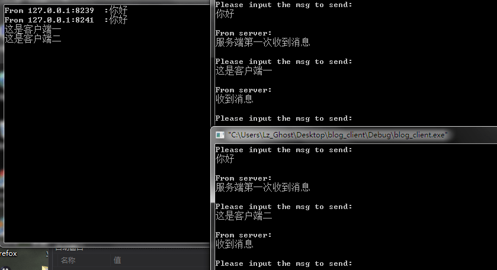

这一篇总结下windows网络编程中的最后一种模型的学习。完成端口模型，这也是windows中最复杂的一种网络模型。到现在为止，我对这种模型也不是很熟悉。网上有一篇博客讲完成端口模型讲的非常好，链接在[这里](http://blog.csdn.net/piggyxp/article/details/6922277)。

完成端口是一种真正的异步模型（书上这样讲），并且很好的利用了CPU的资源。就实际情况来看，使用这种模型开发的服务器程序很多。比如说Apache中就用到了这种模型。一般来说，当服务程序需要管理大量的套接字时，这种模型可以达到很高的系统性能，并且该模型能够随着CPU数量的增加性能得到提升。

该模型的实现也是以重叠IO为基础的，整体来看和之前的两种重叠IO模型相差不多。主要在于通知方式不同，不像之前的事件通知和完成例程那样。而是以一种新的核心对象“完成端口”实现通知的。应用程序调用WSARecv()函数重叠IO后立即返回，当数据被拷贝到数据缓冲区后，系统会向完成端口发送通知包。应用程序在发起接收数据操作后，会在完成端口上等待操作结果。当接收到IO完成的通知后，应用程序便可对数据进行处理。

**下面对完成端口做一个较为详细的介绍（均来自《精通windows sockets网络开发》）**

完成端口目标是实现高效的服务器程序，它克服了并发模型的不足。其方法一是为完成端口指定并发线程的数量；二是在初始化套接字时创建一定数量的服务线程，即所谓的线程池。当客户请求到来时，这些线程立即为之服务。

完成端口的理论基础是并行运行的线程数量必须有一个上限。这个数值是CPU的个数。如果一台计算机有两个CPU，那么多于两个可运行的线程就没有意义了。因为一旦运行线程数目超过CPU数目，系统就不得不花费时间来进行线程上下文切换，这将浪费宝贵的CPU周期。完成端口并行运行的线程数量和应用程序创建的线程数量是两个不同的概念。

服务器应用程序需要创建多少个服务线程，这是一个很难解答的问题。一般规律是CPU数目乘以2.例如，单核CPU的电脑，套接字应用程序应该创建两个线程的线程池。

接下来的问题是，完成端口如何实现对线程池的有效管理，使这些服务线程高效的运行起来。

当系统完成IO操作后，向服务器完成端口发送IO Completion packet。这个过程发生在系统内部，对应用程序是不可见的。在应用程序方面，此时线程池中的线程在完成端口上排队等待IO操作的完成。如果在完成端口上没有收到IO Completion packet时，这些线程处于睡眠状态。当IO Completion packet被送到完成端口时，这些线程按照先进后出（LIFO）的方式被唤醒。

完成端口之所以使用这种方式，其目的是为了提高性能。例如，有3个线程在完成端口上等待，当一个IO Completion packet到达后，队中最后一个线程被唤醒。该线程为客户端完成服务后，继续在完成端口上等待。如果此时又有一个IO Completion packet到达完成端口，则该线程又被唤醒，为该客户端提供服务。如果完成端口不采用FILO方式，完成端口唤醒另外一个线程，则必然进行上下文切换。通过LIFO方式，还可以使得不被唤醒的线程内存资源从缓存中清除。

在前面讲到，应用程序需要创建一个线程池，在完成端口上进行等待。线程池中的线程数目一定要大于完成端口并发运行的线程数目，似乎应用程序创建了多余的线程，其实不然，之所以这样做是因为尽可能的保证CPU尽量忙碌。

例如，在一台单CPU的计算机上，创建一个完成端口应用程序，为其指定并发线程数目为1.在应用程序中，创建2个线程在完成端口上等待。假如再一次为客户服务的时，被唤醒的线程因调用Sleep()之类的函数而处于阻塞状态，此时另外一个IO Completion packet被发送到完成端口上。完成端口会唤醒另一个线程为该客户端提供服务。这就是线程池中线程数量要大于完成端口指定的并发线程数量的原因。

根据上面分析，在某些情况下，完成端口并行运行的线程数量会超过指定数量。但是，当服务线程为客户端完成服务后，在完成端口等待时，并发的线程数量还会降下来。

总之，完成端口为套接字应用程序管理线程池，避免反复创建线程的开销，同时，根据CPU的数量决定并发线程数量，减少线程调度，从而提高服务器程序性能。

**与重叠IO模型的比较**

重叠IO模型和完成端口模型都是异步模型，都可以使得套接字应用程序性能得到改善。但是重叠IO模型相比于完成端口模型存在以下不足。

- 事件通知模型的不足

在事件通知方式的套接字应用程序中，使用WSAWaitForMultipleEvents()函数，应用程序最多等待WSA_MAXIMUM_WAIT_EVENTS个事件对象。在Win32SDK中，该值是64。作为一个服务器，该函数限制了服务器为之提供服务的客户端的数量。

应用程序必须维护一个“事件——套接字——重叠结构”关系表格。根据发生的事件对象，确定套接字和重叠结构。一个套接字可以关联一个、两个或者多个事件对象，而事件对象与重叠结构之间保持着一一对应的关系。应用程序管理这个关系表格时，如果出现一点疏漏，就会造成严重的后果。

- 完成例程的不足

完成例程虽然解决了事件通知方法的不足，但是利用该方法开发套接字应用程序时，还存在限制。只有发起重叠IO请求所在的线程才能提供完成例程。当该线程处于“可警告的等待状态”时，完成例程才有机会被回调。在一个高效的服务器程序中，最好任何一个线程都能够为客户端提供服务。

- 完成端口的优势

1. 与事件通知方法相比，对发起重叠操作的数量不存在限制。
2. 与完成例程相比，该模型允许一个线程发起重叠操作，而由另外一个线程为完成的操作提供服务。
3. 支持scalable架构。scalable系统是指随着RAM、磁盘空间或者CPU个数的增加而能够提升应用程序效能的一种系统。

完成端口模型需要的函数有：CreateIoCompletionPort()、WSARecv()、GetQueuedCompletionStatus()、PostQueuedCompletionStatus()等。

要使用完成端口模型首先要创建一个完成端口对象。创建的函数是 CreateIoCompletionPort()函数，定义如下：

```C++
HANDLE CreateIoCompletionPort (
  HANDLE FileHandle,              // 文件句柄
  HANDLE ExistingCompletionPort,  // 存在的完成端口句柄
  DWORD CompletionKey,            // 完成键，通常应用程序利用该参数保存于套接字相关的信息
  DWORD NumberOfConcurrentThreads // 完成端口并发线程的数量。如果该参数为0，则通知系统完成端口并发线程的数量等于CPU的数量
);
```
如果该函数调用成功，则返回完成端口的句柄；如果调用失败，则返回NULL。

另外需要注意的是，该函数有两个作用。

- 创建一个完成端口。
- 将完成端口与一个文件句柄关联起来。在该模型中，文件句柄就是套接字。当套接字的异步操作完成时，应用程序接收到通知。

在套接字应用程序中，如果要创建完成端口对象，需要设置 FileHandle 参数为 INVALID_HANDLE_VALUE，ExistingCompletionPort 参数为 NULL，CompletionKey参数为 0，NumberOfConcurrentThreads 参数为 0。

在创建完完成端口后，需要将套接字与完成端口绑定起来。该实现还是需要函数 CreateIoCompletionPort() 。这时候只要设置FileHandle参数为套接字句柄。ExistingCompletionPort参数为刚才创建的完成端口。CompletionKey参数是完成键。通常应用程序自定义一个数据结构，保存于套接字相关的信息。将该结构地址作为完成键传递进去。NumberOfConcurrentThreads参数设为0.

如果该参数调用成功，就会返回完成端口句柄，即ExistingCompletionPort。如果函数调用失败，就会返回NULL。

发起重叠IO的函数还是WSARecv()，这里就不多做介绍了。

等待重叠IO操作的结果的函数是 GetQueuedCompletionStatus()。定义如下：

```C++
BOOL GetQueuedCompletionStatus(
  HANDLE CompletionPort,                   //完成端口句柄 
  LPDWORD lpNumberOfBytesTransferred,      //指向DWORD的指针。IO操作完成后，返回实际传输数据的字节数
  LPDWORD lpCompletionKey,                 //完成键指针，该指针由CreateIoCompletionPort()函数的第三个参数指定
  LPOVERLAPPED *lpOverlapped,              //指向重叠结构的指针。通过该参数得到重叠IO操作的结果
  DWORD dwMilliseconds                     //函数在完成端口上的等待时间。如果在等待时间内，没有IO操作完成通知包送到完成端口，则该函数返回假，lpOverlapped参数为NULL。如果为INFINITE，则函数无限等待。如果为0，立即返回
);
```
该函数的返回值有以下几种情况。

- 如果在完成端口上提取了一个成功的IO操作完成通知包，则该函数返回真。此时可以从lpOverlapped、lpCompletionKey、lpNumberOfBytesTransferred参数中获取相关信息。
- 如果在完成端口上提取了一个失败的IO操作完成通知包，则该函数返回假。此时lpOverlapped不等于NULL。
- 如果该函数超时，则返回值是假，错误代码是 WAIT_TIMEOUT。

还有一个函数可以投递完成通知包，这个函数就是 PostQueuedCompletionStatus().定义如下：

```C++
BOOL PostQueuedCompletionStatus(
  HANDLE CompletionPort,             // 完成端口句柄
  DWORD dwNumberOfBytesTransferred,  // 指向DWORD的指针。IO操作完成后，返回实际传输数据的字节数
  DWORD dwCompletionKey,             // 完成键指针，该指针由CreateIoCompletionPort()函数的第三个参数指定
  LPOVERLAPPED lpOverlapped          // 指向重叠结构的指针。通过该参数得到重叠IO操作的结果
);
```
该函数可以向完成端口上发送一个IO操作完成的通知包。在服务线程中，GetQueuedCompletionStatus()函数返回调用PostQueuedCompletionStatus()函数时传递的第2,3,4个参数值。

整个完成端口模型开发的步骤可如下所示：

1. 创建完成端口。
2. 创建服务线程。通常服务线程的数量是CPU个数的两倍。
3. 将套接字与完成端口关联在一起。
4. 调用输入输出函数，发起重叠IO操作。
5. 在服务线程中，在完成端口上等待重叠IO操作结果。

下面是服务端代码，客户端代码同文章一：（win7 VC6.0）

```C++
#include <winsock2.h>
#include <stdio.h>
#pragma comment(lib,"ws2_32.lib")

#define PORT 5000
#define MSGSIZE 1024

//该结构体包含重叠IO结构，主要用来进行重叠操作
typedef struct{

    OVERLAPPED overlapped;
    WSABUF WsaBuf;
    char buffer[MSGSIZE];
    DWORD RecvBytes;
}MyOverData,*LPMyOverData;

//该结构体包含套接字信息，用来作为完成键
typedef struct{
    SOCKET s;
    SOCKADDR_IN sockaddr;
}MySockData,*LPMySockData;

//服务线程
DWORD WINAPI ServerThread(LPVOID lpParam);

int main(){

    //定义变量
    WSADATA wsaData;
    SOCKET sListen,sAccept;
    SOCKADDR_IN ServerAddr,ClientAddr;
    HANDLE CompletionPort;
    SYSTEM_INFO SystemInfo;
    LPMyOverData lpmyoverdata;
    LPMySockData lpmysockdata;
    DWORD Flags=0;
    
    //初始化套接字
    WSAStartup(MAKEWORD(2,2),&wsaData);
    
    //创建完成端口
    CompletionPort=CreateIoCompletionPort(INVALID_HANDLE_VALUE,NULL,0,0);
    
    //获取系统信息（cpu的核心数），原因是为了尽可能利用系统资源
    GetSystemInfo(&SystemInfo);
    
    //创建线程池，线程的个数为cpu核心数2倍
    for(UINT i=0;i< SystemInfo.dwNumberOfProcessors*2;i++){
        CreateThread(NULL,0,ServerThread,(LPVOID)CompletionPort,NULL,NULL);
    }

    //开始创建监听套接字
    sListen=socket(AF_INET,SOCK_STREAM,0);
    ServerAddr.sin_family=AF_INET;
    ServerAddr.sin_port=htons(PORT);
    ServerAddr.sin_addr.s_addr=htonl(INADDR_ANY);

    bind(sListen,(SOCKADDR*)&ServerAddr,sizeof(SOCKADDR));
    listen(sListen,5);

    while(1){
        int addrlen=sizeof(SOCKADDR);
        
        //获取客户端套接字
        sAccept=accept(sListen,(SOCKADDR*)&ClientAddr,&addrlen);
        
        //为自定义的结构体指针分配空间
        lpmyoverdata=(LPMyOverData)HeapAlloc(GetProcessHeap(),HEAP_ZERO_MEMORY,
            sizeof(MyOverData));
        lpmysockdata=(LPMySockData)HeapAlloc(GetProcessHeap(),HEAP_ZERO_MEMORY,
            sizeof(MySockData));
        
        //给结构体赋值，方便在子线程中使用
        lpmysockdata->s=sAccept;
        lpmysockdata->sockaddr=ClientAddr;
        lpmyoverdata->WsaBuf.len=MSGSIZE;
        lpmyoverdata->WsaBuf.buf=lpmyoverdata->buffer;
        
        //这里是该函数的第二个用途，将套接字和完成端口进行绑定，并将自定义的结构体作为完成键参数
        CreateIoCompletionPort((HANDLE)sAccept,CompletionPort,(DWORD)lpmysockdata,0);
        
        //进行重叠IO操作，这里使用自定义的重叠IO结构作为重叠结构体指针
        WSARecv(lpmysockdata->s,&lpmyoverdata->WsaBuf,1,&lpmyoverdata->RecvBytes,
            &Flags,&lpmyoverdata->overlapped,NULL);
    }
    return 0;
}


DWORD WINAPI ServerThread(LPVOID lpParam){
    //从线程参数中获取完成端口句柄
    HANDLE CompletionPort=(HANDLE)lpParam;

    //创建变量指针
    LPMyOverData lpmyoverdata;
    LPMySockData lpmysockdata;
    DWORD Flags=0;
    DWORD BytesTransferred;
    while(1){
        
        //等待函数，当IO完成后该函数将返回
        GetQueuedCompletionStatus(CompletionPort,
            &BytesTransferred,
            (LPDWORD)&lpmysockdata,        //这个参数由CreateIoCompletionPort()函数的完成键参数确定
            (LPOVERLAPPED*)&lpmyoverdata,  //这个参数由WSARecv()函数的lpOverlapped参数确定
            INFINITE);
        
        //链接关闭，扫尾
        if(BytesTransferred==0){

            printf("closesocket %d\n",lpmysockdata->s);

            if(closesocket(lpmysockdata->s)==SOCKET_ERROR){
                printf("close socket error %d\n",WSAGetLastError());
                return 0;
            }
            HeapFree(GetProcessHeap(),0,lpmysockdata);
            HeapFree(GetProcessHeap(),0,lpmyoverdata);
            continue;
        }
        
        //收到消息，进行消息处理
        else{
            printf("%s\n",lpmyoverdata->buffer);
            char msg[]="收到消息!";
            send(lpmysockdata->s,msg,sizeof(msg),0);
        }
        
        //重置变量
        Flags=0;
        memset(&lpmyoverdata->overlapped,0,sizeof(OVERLAPPED));
        lpmyoverdata->WsaBuf.len=MSGSIZE;
        lpmyoverdata->WsaBuf.buf=lpmyoverdata->buffer;
        
        //继续对套接字进行重叠IO操作
        WSARecv(lpmysockdata->s,&lpmyoverdata->WsaBuf,1,&lpmyoverdata->RecvBytes,
            &Flags,&lpmyoverdata->overlapped,NULL);
    }
}
```
运行截图如下：


对于以上程序来说，存在一些缺憾，比如accept函数还是同步的，因此效率还是会有些损失。所以为了使接收客户端连接也是异步的，下面使用AcceptEx函数来改写程序。

先看下AcceptEx函数的定义：

```C++
BOOL AcceptEx ( 
  SOCKET sListenSocket,        //监听套接字
  SOCKET sAcceptSocket,        //将用于连接的套接字
  PVOID lpOutputBuffer,        //指向一个缓冲区，该缓冲区用来接收新建连接后的第一块数据以及服务器的本地地址和客户端的远程地址
  DWORD dwReceiveDataLength,   //接收数据缓冲区的大小。这个大小不包括服务器本地地址和客户端远程地址。如果该参数为0，那么该函数将不等待接收数据，而是尽快建立连接
  DWORD dwLocalAddressLength,  //为本地地址信息保留的字节数。此值必须比所用传输协议的最大地址长度的大小长16个字节
  DWORD dwRemoteAddressLength, //为远程地址信息保留的字节数。此值必须比所用传输协议的最大地址长度的大小长16个字节  
  LPDWORD lpdwBytesReceived,   //指向一个DWORD变量的指针，表示接收到数据的字节数。该参数只在同步模式下有意义。
  LPOVERLAPPED lpOverlapped    //重叠IO结构，用于处理请求。
);
```
该函数如果调用成功，那么函数会返回真。如果调用失败，会返回假。错误信息如果为ERROR_IO_PENDING，那么这次行动成功启动并仍在进行中。

这个函数一次做了很多事情。首先该函数不像accept()函数那样返回一个客户端套接字，而是先创建一个套接字，并将该套接字作为第二个参数传进去，当客户端到来的时候。这个套接字就将作为客户端的套接字，从而节省了创建套接字的时间，提高了效率。 其次，该函数可以传入缓冲区，从而获取到客户端第一次传入的数据以及获取到服务器本地地址和客户端远程地址。因为接收的数据以及服务端和客户端地址都在一个缓冲区内，因此我们需要把他们给解析出来，而解析的话需要GetAcceptExSockaddrs()函数，该函数定义如下：

```C++
VOID GetAcceptExSockaddrs ( 
  PVOID lpOutputBuffer,        //指向传递给AcceptEx函数的接收客户第一块数据的缓冲区
  DWORD dwReceiveDataLength,   //缓冲区的大小，要和AcceptEx函数的一致
  DWORD dwLocalAddressLength,  //为本地地址预留的空间大小，要和AcceptEx函数的一致
  DWORD dwRemoteAddressLength, //为远程地址预留的空间大小，也和AcceptEx函数的一致
  LPSOCKADDR *LocalSockaddr,   //用来返回本地地址
  LPINT LocalSockaddrLength,   //用来返回本地地址的长度
  LPSOCKADDR *RemoteSockaddr,  //用来返回远程地址
  LPINT RemoteSockaddrLength   //用来返回远程地址的长度
);
```
该函数没有返回值。 

关于以上两个函数的使用需要说明一下。首先以上两个函数都是windows提供的扩展函数，在windows socket2标准库中是没有这两个函数的，如果想使用这两个函数需要包含头文件"Mswsock.h"和导入库"Mswsock.lib"。但是一般又这样使用。

一般使用该函数的方法是,使用函数WSAIoctl()以及参数SIO_GET_EXTENSION_FUNCTION_POINTER来获取AcceptEx()函数的指针，然后通过函数指针来调用AcceptEx()函数。这样做的原因是，当我们包含"Mswsock.h"头文件调用AcceptEx()函数的时候，这个函数并不是真正的AcceptEx()函数，它的内部会先调用WSAIoctl()函数来获取真正的AcceptEx()函数的指针，然后再去调用真正的AcceptEx()函数。那么在这种情况下，当我们每次使用AcceptEx()函数的时候，这个函数内部都会通过WSAIoctl()函数来获取真正AcceptEx()函数的指针。这样的话就会降低程序的性能。因此我们便使用WSAIoctl()函数来直接获取真正的AcceptEx()函数的指针，然后直接调用真正的AcceptEx()函数，这样的话，效率就高的多了。同理，对于函数GetAcceptExSockaddrs也同样如此。下面来看WSAIoctl()函数的定义：

```C++
int WSAIoctl (
  SOCKET s,                                               //套接字句柄
  DWORD dwIoControlCode,                                  //将进行操作的控制代码
  LPVOID lpvInBuffer,                                     //输入缓冲区的地址
  DWORD cbInBuffer,                                       //输入缓冲区的大小
  LPVOID lpvOUTBuffer,                                    //输出缓冲区的地址
  DWORD cbOUTBuffer,                                      //输出缓冲区的大小
  LPDWORD lpcbBytesReturned,                              //输出实际字节数的地址
  LPWSAOVERLAPPED lpOverlapped,                           //重叠IO结构体的指针
  LPWSAOVERLAPPED_COMPLETION_ROUTINE lpCompletionROUTINE  //一个指向操作完成后调用的例程指针
);
```
如果函数调用成功，那么返回值为0，否则的话将返回SOCKET_ERROR。

关于第一个参数，套接字句柄。实际上，在我们用该函数获取AcceptEx()函数的函数指针时，这个可以随便传进去一个有效的套接字，没有什么具体的要求。

第二个参数，因为我们是要获取函数的地址，所以第二个参数是：SIO_GET_EXTENSION_FUNCTION_POINTER。

第三个参数是输入缓冲区，那么我们需要指明我们需要获取什么函数。这里，如果是AcceptEx()函数，那么我们要首先定义一个变量 GuidAcceptEx=WSAID_ACCEPTEX，这里取该变量的地址，其中WSAID_ACCEPTEX宏是系统定义的。如果是函数GetAcceptExSockaddrs()，那么这里的宏是WSAID_GETACCEPTEXSOCKADDRS。

第四个参数是上面参数的大小。

第五个参数是指向我们定义的AcceptEx()函数或GetAcceptExSockaddrs()函数的指针。

第六个参数是函数指针的大小。

第七个参数是指向一个DWORD类型的指针，用来获取实际接收数据的大小。

第八个和第九个参数在这里都设为NULL。

下面是一个获取AcceptEx()函数指针的示例：

```C++
LPFN_ACCEPTEX lpfnAcceptEx = NULL;           //定义AcceptEx()函数指针，如果是GetAcceptExSockaddrs()函数，那么这里是 LPFN_GETACCEPTEXSOCKADDRS lpfnGetAcceptExSockAddrs = NULL;

GUID guidAcceptEx = WSAID_ACCEPTEX;          //定义AcceptEx()函数的GUID

DWORD dwBytes = 0;                             //用来获取实际接收数据的变量

WSAIoctl(Listen,                             //随便一个socket
        SIO_GET_EXTENSION_FUNCTION_POINTER,  //用来获取函数指针的控制代码
        &guidAcceptEx,                       //AcceptEx()函数的GUID
        sizeof(guidAcceptEx),                //大小
        &lpfnAcceptEx,                       //AcceptEx()函数的函数指针
        sizeof(lpfnAcceptEx),                //函数指针的大小
        &dwBytes,                            //实际接收数据的大小
        NULL,                                
        NULL
        );
```
如果要获取GetAcceptExSockaddrs()函数的函数指针的话，大致同上。

另外这里还需要说一个问题。在之前的模型中，我们都是使用accept()函数接收客户端的连接，即我们没有使用重叠IO操作来接收客户端，我们只是在接受客户端消息的时候进行了重叠IO操作。但是当我们使用AcceptEx()函数来接收客户端连接的时候，我们也使用了重叠IO操作。也就是说我们在接收客户端连接以及接收客户端数据的时候都使用了重叠Io操作，那么当一个重叠操作完成的时候，我们就无法判断这个操作是接收了一个客户端连接还是接收了客户端发送来的数据。因此，为了区分重叠IO的操作，我们需要自定义一些标识符来帮助我们判断是重叠Io进行的何种操作。这点会在代码中进行标示。

下面是代码，客户端同文章一：（win7  VS2013）

```C++
#include <stdio.h>
#include <WinSock2.h>
#include <MSWSock.h>
#pragma comment(lib,"ws2_32.lib")

//定义标识
#define SEND 0
#define RECV 1
#define ACCEPT 2

//定义缓冲区长度
#define DATA_LENGTH 4096


//定义socket结构体，用来作为完成键
typedef struct {
    SOCKET socket;
    SOCKADDR_IN clientAddr;
}PER_HANDLE_DATA, *LPPER_HANDLE_DATA;

//定义重叠IO
typedef struct {
    OVERLAPPED overlapped;
    WSABUF buffer;
    char dataBuffer[DATA_LENGTH];
    int dataLength;
    int operatorType;             //该成员就是帮助我们判断的标识
    SOCKET client;
}PER_IO_DATA, *LPPER_IO_DATA;

//线程函数
DWORD WINAPI ServerThread(LPVOID lpParam);

//创建全局AcceptEx函数指针
LPFN_ACCEPTEX lpfnAcceptEx = NULL;

//创建全局GetAcceptExSockAddrs函数指针
LPFN_GETACCEPTEXSOCKADDRS lpfnGetAcceptExSockAddrs = NULL;

int main(){
    
    //定义相关变量
    HANDLE CompletionPort;
    WSADATA wsaData;
    SYSTEM_INFO sysinfo;
    SOCKADDR_IN addr;
    SOCKET Listen;
    
    //初始化套接字
    WSAStartup(MAKEWORD(2, 2), &wsaData);

    //创建完成端口
    CompletionPort = CreateIoCompletionPort(INVALID_HANDLE_VALUE, NULL, 0, 0);
    
    //获取系统信息，根据CPU数量创建服务线程个数
    GetSystemInfo(&sysinfo);
    for (DWORD i = 0; i < sysinfo.dwNumberOfProcessors * 2; i++){
        HANDLE thread = CreateThread(NULL, 0, ServerThread, CompletionPort, 0, NULL);
        CloseHandle(thread);
    }

    //创建监听套接字
    Listen = socket(AF_INET, SOCK_STREAM, 0);
    
    //创建完成键指针，用来绑定套接字
    LPPER_HANDLE_DATA perHandleData;

    //分配内存
    perHandleData = (LPPER_HANDLE_DATA)HeapAlloc(GetProcessHeap(), HEAP_ZERO_MEMORY, sizeof(PER_HANDLE_DATA));

    //将套接字分配给完成键成员
    perHandleData->socket = Listen;

    //将套接字和完成端口绑定
    CreateIoCompletionPort((HANDLE)Listen, CompletionPort, (ULONG_PTR)perHandleData, 0);

    addr.sin_addr.S_un.S_addr = INADDR_ANY;
    addr.sin_family = AF_INET;
    addr.sin_port = htons(5000);
    
    //开始监听
    bind(Listen, (SOCKADDR*)&addr, sizeof(SOCKADDR));
    listen(Listen, 5);

    //定义GUID
    GUID guidAcceptEx = WSAID_ACCEPTEX;
    GUID GuidGetAcceptExSockAddrs = WSAID_GETACCEPTEXSOCKADDRS;
    DWORD dwBytes = 0;

    //动态获取AcceptEx函数指针
    WSAIoctl(Listen, 
        SIO_GET_EXTENSION_FUNCTION_POINTER,
        &guidAcceptEx, 
        sizeof(guidAcceptEx), 
        &lpfnAcceptEx,
        sizeof(lpfnAcceptEx), 
        &dwBytes, 
        NULL, 
        NULL);
    
    //动态获取GetAcceptExSockAddrs函数指针
    WSAIoctl(Listen, 
        SIO_GET_EXTENSION_FUNCTION_POINTER, 
        &GuidGetAcceptExSockAddrs,
        sizeof(GuidGetAcceptExSockAddrs), 
        &lpfnGetAcceptExSockAddrs,
        sizeof(lpfnGetAcceptExSockAddrs), 
        &dwBytes, 
        NULL, 
        NULL);

    //创建重叠IO结构体
    LPPER_IO_DATA perIoData = (LPPER_IO_DATA)HeapAlloc(GetProcessHeap(), HEAP_ZERO_MEMORY, sizeof(PER_IO_DATA));
    memset((void*)perIoData, 0, sizeof(PER_IO_DATA));
    
    //该成员设置标识为ACCEPT，方便我们在服务线程中进行判断
    perIoData->operatorType = ACCEPT;

    //先为客户端创建套接字
    perIoData->client = socket(AF_INET, SOCK_STREAM, 0);
    perIoData->buffer.buf = perIoData->dataBuffer;
    perIoData->buffer.len = perIoData->dataLength;
    perIoData->dataLength = DATA_LENGTH;
    DWORD flags = 0;

    //调用AcceptEx()函数，同时进行IO重叠
    lpfnAcceptEx(Listen,                                          //监听套接字
        perIoData->client,                                        //为还未到来的客户端创建的套接字
        perIoData->dataBuffer,                                    //数据缓冲区的地址
        perIoData->dataLength - ((sizeof(SOCKADDR_IN)+16) * 2),   //数据缓冲区中除去本地地址和远程地址的大小
        sizeof(SOCKADDR_IN)+16,                                   //服务器本地地址的大小，这里在地址原有基础上多了16字节
        sizeof(SOCKADDR_IN)+16,                                   //客户端远程地址的大小，这里在地址原有基础上多了16字节
        &dwBytes,                                                 //实际接收数据的大小
        &(perIoData->overlapped)                                  //重叠IO结构，用来进行重叠操作
        );
    
    //防止主线程结束，这里处理比较拙略
    getchar();

    //扫尾
    closesocket(Listen);
    WSACleanup();
}

//服务线程
DWORD WINAPI ServerThread(LPVOID lpParam){

    //完成端口通过参数传递进来
    HANDLE CompletionIoPort = (HANDLE)lpParam;

    //定义相关变量
    DWORD bytes;
    LPPER_HANDLE_DATA perHandleData = NULL;
    LPPER_IO_DATA perIoData;
    DWORD Flags;
    DWORD RecvBytes;
    while (1){
        //等待完成端口通知
        GetQueuedCompletionStatus(CompletionIoPort, 
            &bytes, 
            (LPDWORD)&perHandleData,    //该参数由创建端口的完成键参数确定，里面包含套接字相关的信息
            (LPOVERLAPPED*)&perIoData,  //该参数由WSARecv()函数或AcceptEx()函数的lpOverlapped参数确定，里面包含数据缓冲区等信息
            INFINITE); 
        
        //发生错误
        if (bytes == 0 && (perIoData->operatorType == RECV || perIoData->operatorType == SEND)){
            
            //扫尾
            closesocket(perHandleData->socket);
            HeapFree(GetProcessHeap(), NULL, perHandleData);
            HeapFree(GetProcessHeap(), NULL, perIoData);
            continue;
        }

        //根据标识判断是连接接入，因此作ACCEPT处理
        if (perIoData->operatorType == ACCEPT){
            SOCKADDR_IN *ClientAddr = NULL;
            SOCKADDR_IN *LocalAddr = NULL; 
            int remoteLen = sizeof(SOCKADDR_IN);
            int LocalLen = sizeof(SOCKADDR_IN);
            
            //获取客户端的首次消息以及客户端的地址信息
            lpfnGetAcceptExSockAddrs(perIoData->dataBuffer,              //数据缓冲区地址
                perIoData->dataLength - ((sizeof(SOCKADDR_IN)+16) * 2),
                sizeof(SOCKADDR_IN)+16, 
                sizeof(SOCKADDR_IN)+16, 
                (LPSOCKADDR*)&LocalAddr,                                 //服务端本地地址的地址
                &LocalLen,
                (LPSOCKADDR*)&ClientAddr,                                //客户端远程地址的地址
                &remoteLen);

            //输出客户端的首次消息
            printf("From %s:%d  :%s\n", inet_ntoa(ClientAddr->sin_addr),ntohs(ClientAddr->sin_port),perIoData->dataBuffer);

            //给客户端发送消息表示收到消息
            char firstmsg[] = "服务端第一次收到消息";
            send(perIoData->client, firstmsg, sizeof(firstmsg), 0);

            //创建新的socket结构体，使获取到的客户端socket和完成端口绑定
            LPPER_HANDLE_DATA pNewper_handle_data = (LPPER_HANDLE_DATA)HeapAlloc(GetProcessHeap(), HEAP_ZERO_MEMORY, sizeof(PER_HANDLE_DATA));
            
            //将客户端套接字的相关信息存到该结构体中，用来作完成键
            pNewper_handle_data->socket = perIoData->client;
            memcpy(&(pNewper_handle_data->clientAddr), ClientAddr, sizeof(SOCKADDR_IN));

            //将客户端socket和完成端口绑定
            CreateIoCompletionPort((HANDLE)(pNewper_handle_data->socket), CompletionIoPort, (DWORD)pNewper_handle_data, 0);
            
            //创建新的重叠IO结构，对获取的客户端socket投递RECV消息
            LPPER_IO_DATA pNewIoData =(LPPER_IO_DATA) HeapAlloc(GetProcessHeap(), HEAP_ZERO_MEMORY, sizeof(PER_IO_DATA));
            
            //客户端连接进来了，那么接下来就是等待客户端发送消息，而服务端这时候要接收消息了，设定标识为RECV
            pNewIoData->operatorType = RECV;
            DWORD dwFlags = 0;
            DWORD dwBytes = 0;
            pNewIoData->buffer.buf = pNewIoData->dataBuffer;
            pNewIoData->buffer.len = pNewIoData->dataLength = DATA_LENGTH;
            pNewIoData->client = pNewper_handle_data->socket;

            //对客户端套接字进行重叠IO操作
            WSARecv(pNewIoData->client, &(pNewIoData->buffer), 1, &dwBytes, &dwFlags, &(pNewIoData->overlapped), NULL);

            //给服务器监听套接字的相关结构重新初始化，方便对监听socket进行ACCEPT投递
            memset((void*)&(perIoData->dataBuffer), 0, DATA_LENGTH);

            //监听套接字的任务还是监听，因此继续设置其标识为ACCEPT
            perIoData->operatorType = ACCEPT;
            perIoData->client = socket(AF_INET, SOCK_STREAM, 0);

            //对服务器监听套接字进行重叠IO操作，以继续等待下一个客户端套接字连入
            lpfnAcceptEx(perHandleData->socket, perIoData->client, &(perIoData->dataBuffer), perIoData->dataLength - ((sizeof(SOCKADDR_IN)+16) * 2),
                sizeof(SOCKADDR_IN)+16, sizeof(SOCKADDR_IN)+16, &dwBytes, &(perIoData->overlapped));
            
            //继续循环
            continue;
        }

        //根据表示判断是RECV，因此作数据接收处理
        if (perIoData->operatorType == RECV){

            //输出消息
            printf("%s\n", perIoData->dataBuffer);

            //给客户端发送消息表示收到消息
            char sendBuf[] = "收到消息";
            send(perHandleData->socket, sendBuf, sizeof(sendBuf), 0);

            //对相关变量重新初始化
            Flags = 0;
            perIoData->operatorType = RECV;
            memset((void*)&(perIoData->overlapped), 0, sizeof(OVERLAPPED));

            //重新对客户端套接字进行重叠IO操作
            WSARecv(perHandleData->socket, &(perIoData->buffer), 1, &RecvBytes, &Flags, &(perIoData->overlapped), NULL);
            
            //继续循环
            continue;
        }
    }

    return 0;
}
```

以下是运行截图：

