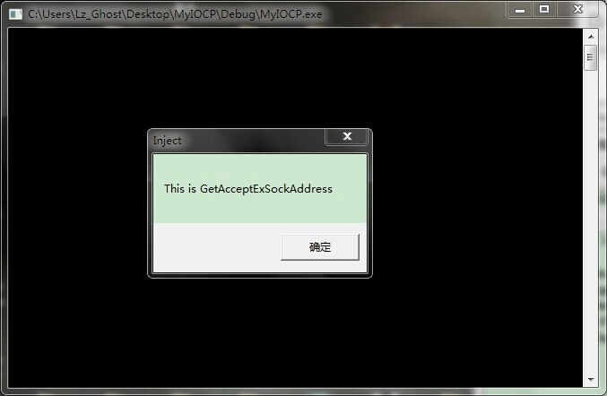
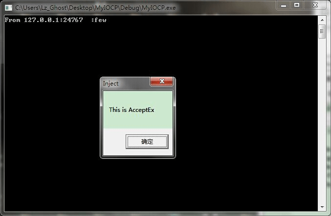
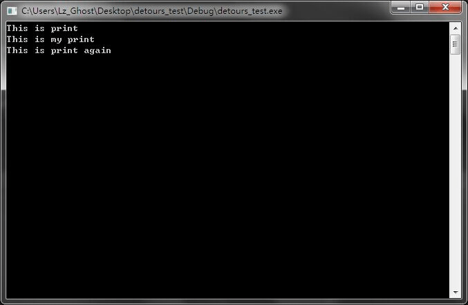

Detours是一个微软开发的API Hook函数库。使用这个函数库可以很方便的给函数挂钩，从而做一些不为人知的事情。

一直很奇怪，微软为什么会提供这样一个函数库。毕竟有了这个函数库，就使得开发一些恶意软件变得更加简单了。但不管微软怎么考虑，反正这的确是方便了我们这些个人开发者。

在使用这个函数库之前要做一些准备工作。

1. 首先要下载detours，detours下载链接在[这里](http://research.microsoft.com/en-us/downloads/d36340fb-4d3c-4ddd-bf5b-1db25d03713d/default.aspx)。我这里下载的是3.0版本。下载之后进行安装，一直点 next 完成安装。安装完成后，在安装目录下是没有lib文件以及头文件的，有的只有源代码以及makefile，我们需要再对其进行编译从而生成相应的头文件以及lib文件。

2. 打开cmd然后切换到VS目录中并执行VC目录下的vcvarsall.bat文件设置编译程序的环境变量。我这里是VS2013的编译环境。

3. 设置完环境变量后，切换到detours目录下，然后执行`nmake`命令进行编译。编译到后面会出现错误，网上有一个解决办法可以参考[这里](http://blog.csdn.net/buck84/article/details/8283477)，但是我试了之后还是不行，不过我认为这暂时来说并不重要，因为错误是在编译那些samples中的程序时发生的，而我需要的头文件以及lib等库文件已经编译好了。

而如果想要完整使用那些samples中的工具的话，可以使用vs2010的环境去进行编译，经过我的测试，发现使用vs2010的编译环境去编译detours3.0的话是不会发生错误的。

我为了方便使用，直接将头文件以及lib文件拷贝到VC目录中相应的include目录下和lib目录下了。这样使用的时候直接包含就行了，不必再在配置文件中添加附加库。

以下是一个简单的例子,在vs2013中编译成功。（来自[这里](http://blog.csdn.net/cbh84663973/article/details/7043370)）：

```c
#include <windows.h>
#include <detours.h>

#pragma comment(lib, "detours.lib") 

int (WINAPI* OLD_MessageBoxW)(HWND hWnd, LPCWSTR lpText, LPCWSTR lpCaption, UINT uType) = MessageBoxW;

int WINAPI NEW_MessageBoxW(HWND hWnd, LPCWSTR lpText, LPCWSTR lpCaption, UINT uType)
{

    //修改输入参数，调用原函数
    int ret = OLD_MessageBoxW(hWnd, L"输入参数已修改", L"[测试]", uType);
    return ret;
}

VOID Hook()
{
    DetourRestoreAfterWith();
    DetourTransactionBegin();
    DetourUpdateThread(GetCurrentThread());

    //这里可以连续多次调用DetourAttach，表明HOOK多个函数
    DetourAttach(&(PVOID&)OLD_MessageBoxW, NEW_MessageBoxW);

    DetourTransactionCommit();
}

VOID UnHook()
{
    DetourTransactionBegin();
    DetourUpdateThread(GetCurrentThread());

    //这里可以连续多次调用DetourDetach,表明撤销多个函数HOOK
    DetourDetach(&(PVOID&)OLD_MessageBoxW, NEW_MessageBoxW);

    DetourTransactionCommit();

}
int main()
{
    MessageBoxW(0, L"正常消息框", L"测试", 0);
    Hook();
    MessageBoxW(0, L"正常消息框", L"测试", 0);
    UnHook();
    return 0;

}
```

以上程序是一个自己给自己挂钩的例子，但是实际上很少会有人给自己写的程序挂钩，以上程序只是表明detours是怎么使用的。

一般情况下，使用这个库的情况是，写一个dll，然后注入到其他的程序中，从而给其他程序的相应函数挂钩，从而达到“恶意”的目的。

以下再给一个动态函数挂钩的例子。

在网络编程完成端口模型中，需要使用两个动态获取的函数，分别是 AcceptEx函数和GetAcceptExSockaddrs函数。这个例子就是针对这两个函数的。这是一个win32dll，使用vs2013编译成功。

```c
#include <stdio.h>
#include <winSock2.h>
#include <mswsock.h>
#include <detours.h>

#pragma comment(lib,"ws2_32.lib")
#pragma comment(lib,"detours.lib")

#pragma warning(disable:4996)

LPFN_GETACCEPTEXSOCKADDRS lpfnGetAcceptExSockAddress = NULL;
LPFN_ACCEPTEX lpfnAcceptEx = NULL;

VOID(WSAAPI * pOldGetAcceptExSockAddress)(
    __in PVOID lpOutputBuffer,
    __in DWORD dwReceiveDataLength,
    __in DWORD dwLocalAddressLength,
    __in DWORD dwRemoteAddressLength,
    __deref_out_bcount(*LocalSockaddrLength) struct sockaddr **LocalSockaddr,
    __out LPINT LocalSockaddrLength,
    __deref_out_bcount(*RemoteSockaddrLength) struct sockaddr **RemoteSockaddr,
    __out LPINT RemoteSockaddrLength
    );

BOOL(WSAAPI *pOldAcceptEx)(SOCKET sListenSocket, SOCKET sAcceptSocket, PVOID lpOutputBuffer, DWORD dwReceiveDataLength,
    DWORD dwLocalAddresssLength, DWORD dwRemoteAddressLength, LPDWORD lpdwBytesReceived, LPOVERLAPPED lpOverlapped);

BOOL WSAAPI MyAcceptEx(SOCKET sListenSocket, SOCKET sAcceptSocket, PVOID lpOutputBuffer, DWORD dwReceiveDataLength,
    DWORD dwLocalAddresssLength, DWORD dwRemoteAddressLength, LPDWORD lpdwBytesReceived, LPOVERLAPPED lpOverlapped){
    
    MessageBox(NULL, "This is AcceptEx", "Inject", MB_OK);

    return pOldAcceptEx(sListenSocket, sAcceptSocket, lpOutputBuffer, dwReceiveDataLength, dwLocalAddresssLength, dwRemoteAddressLength,
        lpdwBytesReceived, lpOverlapped);
}

VOID WSAAPI MyGetAcceptExSockAddress(
    __in PVOID lpOutputBuffer,
    __in DWORD dwReceiveDataLength,
    __in DWORD dwLocalAddressLength,
    __in DWORD dwRemoteAddressLength,
    __deref_out_bcount(*LocalSockaddrLength) struct sockaddr **LocalSockaddr,
    __out LPINT LocalSockaddrLength,
    __deref_out_bcount(*RemoteSockaddrLength) struct sockaddr **RemoteSockaddr,
    __out LPINT RemoteSockaddrLength
    ){

    MessageBox(NULL, "This is GetAcceptExSockAddress", "Inject", MB_OK);
    
    pOldGetAcceptExSockAddress(lpOutputBuffer, dwReceiveDataLength, dwLocalAddressLength, dwRemoteAddressLength, LocalSockaddr, LocalSockaddrLength, RemoteSockaddr,
        RemoteSockaddrLength);
    
}


BOOL APIENTRY InstallHook(){

    char err_buf[100];
    GUID GuidGetAcceptExSockAddrs = WSAID_GETACCEPTEXSOCKADDRS;
    GUID GuidAcceptEx = WSAID_ACCEPTEX;
    DWORD dwBytes = 0;

    int err = WSAIoctl(socket(AF_INET, SOCK_STREAM, 0), SIO_GET_EXTENSION_FUNCTION_POINTER, &GuidGetAcceptExSockAddrs,
        sizeof(GuidGetAcceptExSockAddrs), &lpfnGetAcceptExSockAddress, sizeof(lpfnGetAcceptExSockAddress),
        &dwBytes, NULL, NULL);
    
    
    WSAIoctl(socket(AF_INET, SOCK_STREAM, 0), SIO_GET_EXTENSION_FUNCTION_POINTER, &GuidAcceptEx, sizeof(GuidAcceptEx),
        &lpfnAcceptEx, sizeof(lpfnAcceptEx), &dwBytes, NULL, NULL);

    if (err == SOCKET_ERROR){
        sprintf(err_buf, "The WSAIoctl is error with code:%d", WSAGetLastError());
        MessageBox(NULL, err_buf, "Error", MB_OK);
    }

    pOldGetAcceptExSockAddress = lpfnGetAcceptExSockAddress;
    pOldAcceptEx = lpfnAcceptEx;

    DetourTransactionBegin();
    DetourUpdateThread(GetCurrentThread());

    DetourAttach(&(LPVOID&)pOldGetAcceptExSockAddress, MyGetAcceptExSockAddress);
    DetourAttach(&(LPVOID&)pOldAcceptEx, MyAcceptEx);

    DetourTransactionCommit();

    return TRUE;
}


BOOL APIENTRY UnInstallHook(){

    DetourTransactionBegin();
    DetourUpdateThread(GetCurrentThread());

    DetourDetach(&(LPVOID&)pOldGetAcceptExSockAddress, MyGetAcceptExSockAddress);
    DetourDetach(&(LPVOID&)pOldAcceptEx, MyAcceptEx);

    DetourTransactionCommit();
    
    return TRUE;
}


BOOL APIENTRY DllMain(HMODULE hModule, DWORD reason_call, LPVOID lpReserved){
    switch (reason_call){
    case DLL_PROCESS_ATTACH:
        InstallHook();
        break;
    case DLL_PROCESS_DETACH:
        UnInstallHook();
        break;
    default:
        break;

    }
    return TRUE;
}
```

将上述代码编译成功的dll注入到完成端口程序中后，当客户端连接上来时，就可以看到弹出来的消息框。截图如下：




以上实验证明detours函数库可以给动态函数挂钩，那么也就可以推断出detours可以给任意函数挂钩，只要能够获取到这个函数的入口地址。

以下是一个简单的示例，vs2013编译成功。

```c
#include <stdio.h>
#include <Windows.h>
#include <detours.h>

#pragma comment(lib, "detours.lib") 

void print(char *buf);


void(*pOld_print)(char *buf) = print;

void myprint(char *buf){
    printf("This is my print\n");
    pOld_print(buf);
}

VOID Hook()
{
    DetourRestoreAfterWith();
    DetourTransactionBegin();
    DetourUpdateThread(GetCurrentThread());

    DetourAttach(&(PVOID&)pOld_print, myprint);

    DetourTransactionCommit();
}

VOID UnHook()
{
    DetourTransactionBegin();
    DetourUpdateThread(GetCurrentThread());

    DetourDetach(&(PVOID&)pOld_print, myprint);

    DetourTransactionCommit();

}
int main()
{
    print("This is print\n");
    Hook();
    print("This is print again\n");
    UnHook();
    getchar();
    return 0;

}

void print(char *buf){
    printf(buf);
}
```
运行截图如下：


最后，表示我应该详细看一看detours库的官方文档的，后来的两个程序都是实际使用中实验出来的，为此我花费了相当多的时间，而detours能够给任意函数挂钩这一点官方文档肯定是会提到的。因此之后应当在使用第三方库的之前要好好研究下官方文档，节省时间，做更多有意义的事情。