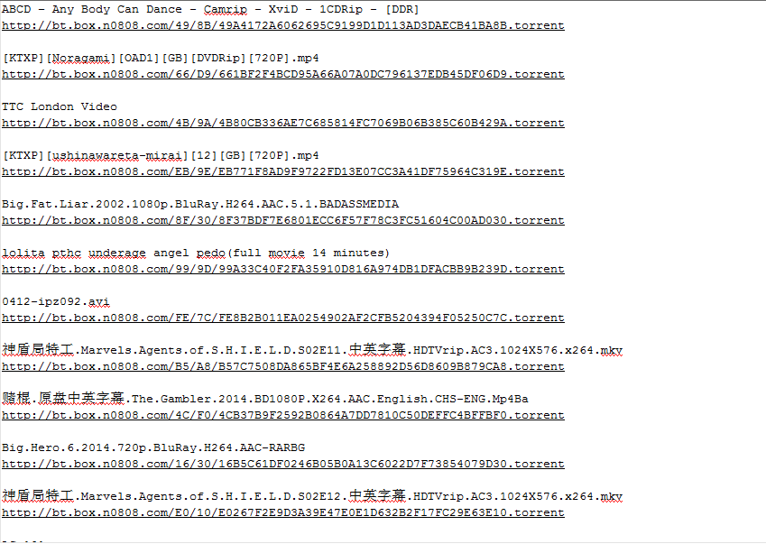

之前看了小虾的[博客](http://xiaoxia.org/2013/05/11/magnet-search-engine/)，他搭了一个种子搜索引擎，感觉很有意思，于是便萌生了学习一下如何抓取种子的方法的想法。

小虾的博客并没有很详细的介绍关于种子搜索方面的技术性的文章，网上找了一些相关的博客以及开源代码，链接如下：

1. [dht协议](http://www.bittorrent.org/beps/bep_0005.html)
2. [dht协议的中文翻译](http://justjavac.com/other/2015/02/01/bittorrent-dht-protocol.html)
3. [P2P中DHT网络爬虫](http://codemacro.com/2013/05/19/crawl-dht/)
4. [大白话讲解DHT原理及出现历史](http://doc.okbase.net/52web/archive/53067.html)
5. [BitTorrent协议详解](http://www.xuebuyuan.com/1908540.html)
6. [BitTorrent 协议规范（BT协议集合）](http://www.cppblog.com/fwxjj/archive/2008/04/25/48165.html)
7. [用Python教你如何“养”一只DHT爬虫](http://developer.51cto.com/art/201402/430007_all.htm)
7. [根据磁力链获得BT种子](http://www.cnblogs.com/cpper-kaixuan/p/3532694.html)

在上面几篇文章中，最需要参考的是第2篇文章，当然英文好，可以直接看官方的（第一篇）。第3篇到第6篇是用来帮助理解官方文档的，第7篇有一些代码，用来帮助理解路由表的概念，第8篇用来进行后续种子获取方面的处理。

除了上面几篇文章介绍外，在github以及其他网站上也找了一些可以用来参考的代码，链接如下：

1. [simDHT](https://github.com/old-woman/simDHT)
2. [DHT-simDHT](https://github.com/NanYoMy/DHT-simDHT)
3. [DHT-woodworm](https://github.com/NanYoMy/DHT-woodworm)
4. [dhtfck](https://github.com/0x0d/dhtfck)
5. [Python开发实例分享bt种子爬虫程序和种子解析](http://www.jb51.net/article/50287.htm)

上述几个代码中，我主要看了第1、2、5个，这几个相对来讲比较简单，而这三个中，第一个最简单，第二个在第一个之上添加了一些路由表相关的东西，而第5个的路由表功能更加健全。第4个程序貌似是一位大神编写用来抓取整个互联网种子的程序（第三个程序的作者说的）。

在讲解爬虫之前，需要先了解一下dht协议，关于dht协议，官方网站已经讲的很齐全了，但是即使这样，在我最开始阅读的时候也还是遇到了一些困难，因此在这里，按照我的理解，更通俗的记录一下和爬虫相关的dht协议，方便今后自己查阅。

在dht网络当中，每个下载者的客户端（这个客户端同时也是一个服务端）都有一个节点标识自己的存在，这个节点有一个在整个dht网络当中唯一的节点ID（我认为会有重复的），这个节点ID是一个长度为160bit（20字节）的字串，除了节点ID，节点还包含有节点ip和节点端口。

作为一个客户端，它有几种方法，这几种方法在官方文档中进行了详细的讲解，而在这个简单的爬虫中需要的方法有：find\_node,get\_peers,announce\_peer 。根据名字就可以知道这几个方法的具体作用。

find\_node方法是请求方法，主要是用来查找给定ID的节点的联系信息。其需要的参数有，自身节点的ID，目标节点的ID。当使用该方法后，目标节点会回复相应的信息，回复的信息包含的信息有：一个是回复客户端的节点ID，一个是回复客户端的路由表中离目标节点最近的K(8)个节点的联系信息。在爬虫程序中，需要发送find\_node请求，并接收目标节点的应答。

get\_peers方法也是请求方法，主要是用来获取想要下载资源的节点的信息。它需要两个参数：一个是自身节点的ID，一个是infohash的信息（这个hash值对应着唯一的一个种子信息，可以通过这个hash值获取到与其对应的种子）。当使用该方法后，目标节点同样会回复相应的信息，具体信息查阅官方文档，在爬虫程序当中，不需要关心其回复的信息。在爬虫程序中，只需要接收别人发给我们的请求并获取到infohash即可，不需要进行回复。

announce\_peer方法也是请求方法。当一个客户端开始下载某个torrent文件时，他就会向所有向他请求过的节点使用annouce_peer方法，及发送自身节点的ID，下载文件的hashinfo，下载使用的端口，以及token。当我们接收到announce\_peer请求时，需要根据情况对其进行回复，但是作为爬虫，这个回复并不重要，我们需要关心的是接收到的infohash。这个infohash代表已经有客户端开始下载这个infohash对应的文件了，所以这个infohash肯定是有效的，而通过get\_peers方法获取到的infohash是别的节点请求的，那么也就说明可能是死的。在爬虫程序中，也只需要接收别人发给我们的announce\_peer请求即可，不要对其进行回复。

接下来说下爬虫的思路。通过上面三种方法的介绍，便知道我们的主要抓取对象便是infohash，我们需要尽可能的抓取infohash，而infohash是和get\_peers与announce\_peer方法相关的，所以，如果我们想要尽可能多的获取到infohash就需要尽可能多的节点。而获取节点就需要使用find\_node方法。

在使用find_node方法之前，我们需要加入到dht网络当中。如何加入dht网络呢？我们可以向网络上那些公共的节点发送find\_node请求，这样，那些公共节点就会给我们回复一些节点的信息，这样我们就可以获取到一些节点，然后我们继续对获取到的这些节点发送find\_node请求，从而认识更多的节点。当认识这些节点后，这些节点也会认识我们自身，所以这些节点在调用get\_peers方法和announce\_peer方法时，就会发送通知给我们，而我们接收到这些信息后，就可以把这些infohash记录下来。然后循环这个过程，我们就可以不断的获取到很多infohash。

关于dht协议中提到的路由表，在这个简单的爬虫里面根本就没有用到，只是用了一个简单的队列代替了，如果想看路由表的一些简单实现，可以上面列的代码5。代码3、4我没有看，不清楚有没有实现路由表相关的部分。

接下来是程序，程序几乎和simDHT程序一模一样，我只是稍微改动了一些东西，另外，我会配上注释。感谢作者开源。

程序运行需要安装 bencode 库。

```python
#encoding: utf-8

import socket
from hashlib import sha1
from random import randint
from struct import unpack
from socket import inet_ntoa
from threading import Timer,Thread,Lock
from time import sleep
from bencode import bencode,bdecode
from collections import deque

# 一些公共节点地址，用来本地爬虫加入dht网络
BOOTSTRAP_NODES={
    ("router.bittorrent.com",6881),
    ("dht.transmissionbt.com",6881),
    ("router.utorrent.com",6881)
}

#一些全局变量
TID_LENGTH=2
RE_JOIN_DHT_INTERVAL=3
TOKEN_LENGTH=2

#用来生成随机字串
def entropy(length):
        return "".join(chr(randint(0,255)) for _ in xrange(length))

#根据随机字串生成nid，这样的话，自然很可能和其他的节点ID重复
def random_id():
    h=sha1()
    h.update(entropy(20))
    return h.digest()

#解析node，node长度为26，其中20位为nid，4位为ip，2位为port
def decode_nodes(nodes):
    n=[]
    length=len(nodes)
    if(length%26)!=0:
        return n
    for i in xrange(0,length,26):
        nid=nodes[i:i+20]
        ip=inet_ntoa(nodes[i+20:i+24])
        port=unpack("!H",nodes[i+24:i+26])[0]
        n.append((nid,ip,port))
    return n

#定时器函数
def timer(t,f):
    Timer(t,f).start()

#获取“邻居”nid
def get_neighbor(target,end=10):
    return target[:end]+random_id()[end:]

#一个node的结构
class KNode():
    def __init__(self,nid,ip,port):
        self.nid=nid
        self.ip=ip
        self.port=port

#DHT类，继承自Thread类
class DHT(Thread):
    def __init__(self,master,port):
        Thread.__init__(self)
        
        #用来输出和保存种子hash的对象
        self.master=master

        #创建队列，相当于路由表的简单模拟
        #根据原作者的注释来看，队列的最大长度越大，速度越快，耗费带宽越大
        self.nodes = deque(maxlen=2000)

        #生成的自身的网络节点
        self.nid=random_id()

        #创建socket
        self.socket=socket.socket(socket.AF_INET,socket.SOCK_DGRAM,socket.IPPROTO_UDP)
        self.socket.bind(("0.0.0.0",port))
        
        #处理"get_peers"和"announce_peer"请求的函数
        self.process_request_actions = {
            "get_peers": self.on_get_peers_request,
            "announce_peer": self.on_announce_peer_request,
        }
    
    #发包函数，发送的数据需要使用bencode编码
    def send_krpc(self,msg,address):
        try:
            self.socket.sendto(bencode(msg),address)
        except:
            pass
    
    #find node 方法，用来查找对应的node
    def find_nodes(self,address,nid=None):
        if not nid:
            nid=self.nid
        #扩大寻找node的范围
        nid=get_neighbor(nid)
        tid=entropy(TID_LENGTH)
        msg={
            "t":tid,
            "y":"q",
            "q":"find_node",
            "a":{"id":nid,"target":random_id()}
        }

        self.send_krpc(msg,address)

    #加入dht网络
    def joinDHT(self):
        for address in BOOTSTRAP_NODES:
            self.find_nodes(address)

    #重新加入dht网络
    def re_join_DHT(self):
        if len(self.nodes)==0:
            self.joinDHT()
        timer(RE_JOIN_DHT_INTERVAL,self.re_join_DHT)

    #重写run方法
    def run(self):
        self.re_join_DHT()
        while 1:
            try:
                #接收数据并解码
                (data,address)=self.socket.recvfrom(65536)
                msg=bdecode(data)
                self.on_message(msg,address)
            except:
                pass

    #处理find node方法的请求
    def process_find_node_response(self,msg,address):
        #将node解码
        nodes=decode_nodes(msg["r"]["nodes"])
        for node in nodes:
            (nid,ip,port)=node
            if len(nid)!=20:
                continue
            if ip=="0.0.0.0":
                continue
            n=KNode(nid,ip,port)
            #添加到node队列里
            self.nodes.append(n)

    #发送get peers 的请求，在msg参数中包含种子hash的信息
    def on_get_peers_request(self,msg,address):
        try:
            #获取hash值
            infohash=msg["a"]["info_hash"]
            #输出并保存
            self.master.log(infohash,"get_peers")
            tid=msg["t"]
            nid=msg["a"]["id"]
            token=infohash[:TOKEN_LENGTH]
            msg={
                "t":tid,
                "y":"r",
                "r":{
                    "id":get_neighbor(infohash,self.nid),
                    "nodes":"",
                    "token":token
                }
            }
            self.send_krpc(msg,address)
        except:
            pass

    #发送announce peer的请求，同样在msg参数中包含种子hash信息
    def on_announce_peer_request(self,msg,address):
        try:
            infohash=msg['a']['info_hash']
            self.master.log(infohash,"announce")
        except:
            print "error in on_announce_peer_request"
        finally:
            self.ok(msg,address)

    #对announce peer请求的响应
    def ok(self,msg,address):
        try:
            tid=msg["t"]
            nid=msg["a"]["id"]
            msg={
                "t":tid,
                "y":"r",
                "r":{
                    "id":get_neighbor(nid,self.nid)
                }
            }
            self.send_krpc(msg,address)
        except:
            print "error in ok"

    #处理接收到的消息
    def on_message(self,msg,address):
        try:
            #处理response消息
            if msg["y"]=="r":
                if msg["r"].has_key("nodes"):
                    self.process_find_node_response(msg,address)
            #处理request消息
            elif msg["y"]=="q":
                try:
                    self.process_request_actions[msg["q"]](msg,address)
                except:
                    self.play_dead(msg,address)
        except:
            print "error in on_message"

    #发送错误消息
    def play_dead(self,msg,address):
        try:
            tid=msg["t"]
            msg={
                "t":tid,
                "y":"e",
                "e":[202,"Server Error"]
            }
            self.send_krpc(msg,address)
        except:
            pass

    #对队列里的node继续发送find node请求，获取更多的node
    def auto_send_find_node(self):
        wait=1.0/2000
        while 1:
            try:
                node=self.nodes.popleft()
                self.find_nodes((node.ip,node.port),node.nid)
            except:
                pass
            sleep(wait)

#用来输出及保存种子hash
class Master():
    def __init__(self):
        self.mutex=Lock()
    def log(self,infohash,source):
        global inum
        infohash=infohash.encode("hex")
        inum+=1
        print inum,infohash,source
        file=open("hash.log","a")
        file.write(str(infohash)+"\n")
        file.close()
        
        
inum=0
t1=DHT(Master(),8006)
t1.start()
t1.auto_send_find_node()
```

这段代码非常简单，我运行测试了一下，速度勉强还可以，之前在网上看一些人的抓取速度是三天100万，还有的是三天150万，速度非常恐怖，这个简单的爬虫怕是达不到要求了。之前在vps上测试了一下，速度非常快，但是因为爬虫占用流量非常大，所以没敢在vps上长期运行，怕vps被封了。另外，这个程序是单线程的，可以根据情况改成多线程的。

抓取完之后，hash值会存储下来，但是这些hash值中有很多重复的，因此接下要做的就是去重。使用python的set类型可以非常方便的进行去重。

去重代码如下：

```python
file=open("hash.log","r")
l=[]
for i in file:
    l.append(i)
s=set(l)

while 1:
    try:
        file1=open("hash1.log","a")
        file1.write(str(s.pop()))
        file1.close()
    except:
        break 
```

去重之后，如果想要获取这些hash值所对应的种子的信息，可以把这些hash值换成相应的磁力链接，关于hash值如何换算成磁力链接的方法在最上面的第8篇博文中已经讲解了。将hash值改成磁力链接后，可以把磁力链接粘贴到迅雷中，然后由迅雷下载种子，然后再进行相关文件的下载。

但是实际上，上述方法非常费时费力，而且之前抓取的hash值当中有很多是无效的。为此，还是写一个脚本验证比较好。我根据这篇[Python开发实例分享bt种子爬虫程序和种子解析](http://www.jb51.net/article/50287.htm)文章的代码重新写了一段分析代码，代码如下：

```python

import bencode
import urllib2
import base64
from Queue import Queue 
import threading
q=Queue()
url="http://bt.box.n0808.com/"

file=open("hash1.log","r")

for line in file:
    line=line.upper()[0:-1]
    u=url+line[:2]+"/"+line[-2:]+"/"+line+".torrent"
    q.put(u)
file.close()    

def request():
    while 1:
        u=q.get(False)    
        try:
            f=urllib2.urlopen(u,timeout=5).read()
        except:
            print "exception"
            continue
        if f:
            try:
                fileEncode=bencode.bdecode(f)
            except Exception,e:pass
            if 'name.utf-8' in fileEncode['info']:
                filename=fileEncode['info']['name.utf-8']
            else:
                filename=fileEncode['info']['name']
            if "length" in fileEncode['info']:
                length=fileEncode['info']['length']
            else:
                length=0
            
            file1=open("file_info.txt","a")
            file1.write((str(filename)+"\n"+str(u)+"\r\n"))
            file1.close()
                
            print filename
            print u
            print '\n'
                
t=threading.Thread(target=request)
t.start()
```

该程序还是单线程的，当然改成多线程的也是相当方便的。

下图是处理后的结果。


整体来说，算是知道dht种子爬虫的大致原理了，但这只是很浅的东西，如果想要写出更加快速，hash值准确度更高的程序的话，还是需要了解更多东西的。

最后，最近又看到一片文章：[Node.js 去掉种子(torrent)文件里的邪恶信息](http://www.jb51.net.cn/article/62913.htm)，看完之后，我邪恶的笑了。我根据这篇文章又写了一个python版本的程序（不会js），程序如下：

```python
import bencode
import hashlib
file=open("123.torrent","rb").read()
fileEncode=bencode.bdecode(file)

if 'name.utf-8' in fileEncode['info']:
    fileEncode['info']['name.utf-8']=str(hashlib.md5(fileEncode['info']['name.utf-8']).hexdigest())
if 'name' in fileEncode['info']:
    fileEncode['info']['name']=str(hashlib.md5(fileEncode['info']['name']).hexdigest())
for i in fileEncode['info']['files']:
    if 'path' in i:
        for j in xrange(len(i['path'])):
            i['path'][j]=str(hashlib.md5(i['path'][j]).hexdigest())
    if 'path.utf-8' in i:
        for j in xrange(len(i['path.utf-8'])):
            i['path.utf-8'][j]=str(hashlib.md5(i['path.utf-8'][j]).hexdigest())

file=open("torren.torrent","wb")
file.write(bencode.bencode(fileEncode))
file.close()
```
当成功把种子信息修改之后，发现这个东西不太好用。同一个种子（有不健康信息的种子），在不修改文件名的情况下，纵然无法使用某雷的极速下载，但速度还是相当可观的，最起码能找到资源。但是当修改文件名之后，就发现某雷找不到资源了，这没资源还怎么下。。。。对于为什么某雷在种子内的文件信息修改之后无法快速的找到资源这一情况感到很是困惑。

后来，事情似乎出现了转机，我尝试了作者下载文件的方法，使用某云的离线下载，我昨天晚上把种子上传上去，今天晚上打开发现文件已经下载到云空间了。具体是什么时候下载完成的并不清楚，但是某云确实给下载下来了，但是当我从云端下载到本地的时候，某云就警告我说这是违规内容，无法下载到本地。对于此，我是感到非常无奈。