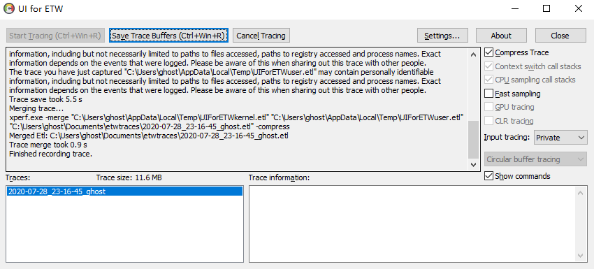
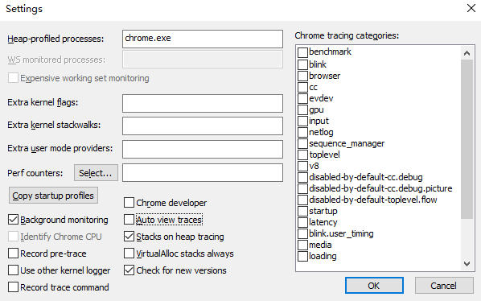
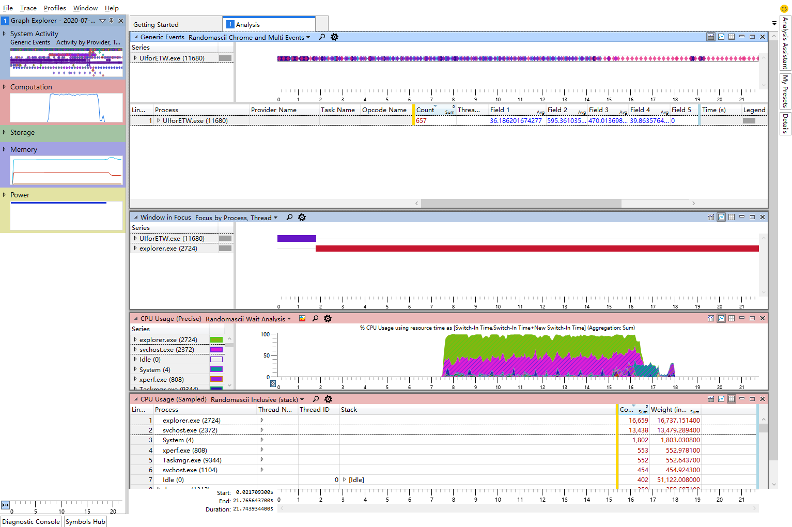
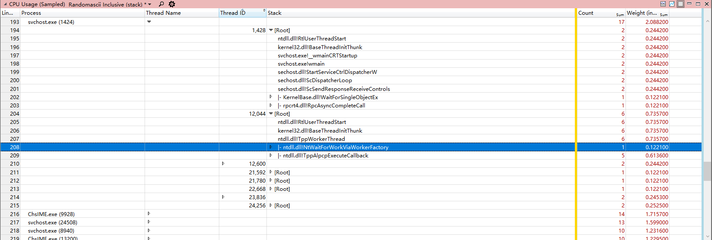
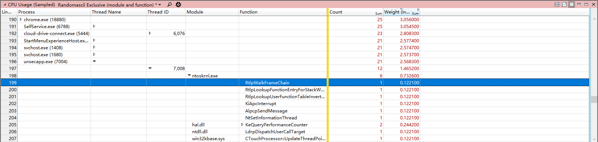
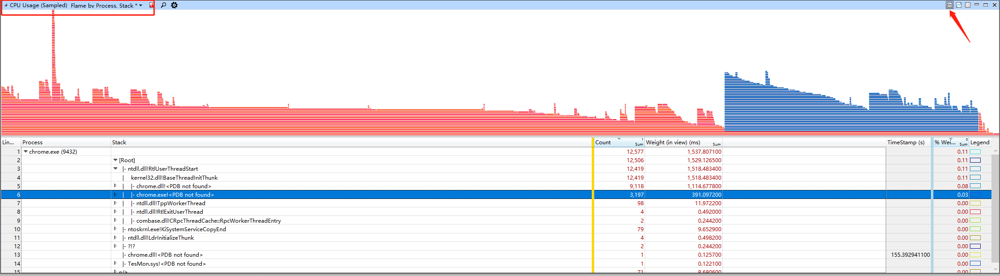
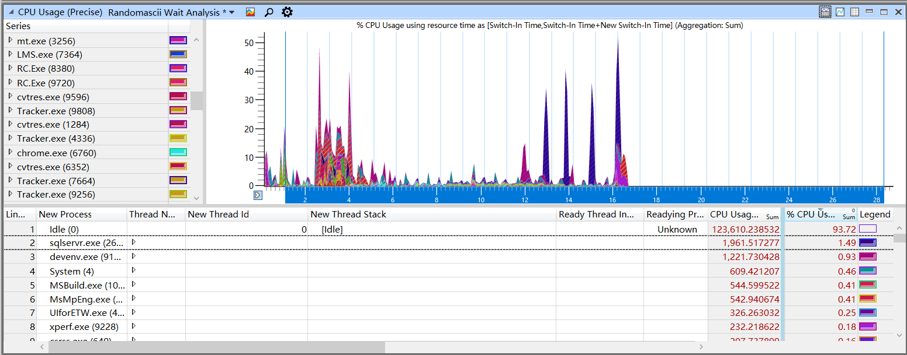

## 概述

在工作中，会经常遇到一些卡顿、卡死等性能问题，却常常没有高效好用的定位手段，在听说ETW并尝试使用ETW定位出一些问题后，逐渐意识到了ETW的强大之处，因此便决定专门研究学习下ETW的使用，以便后续更好的定位性能问题。

查阅资料发现`Bruce Dawson`大神的[博客](https://randomascii.wordpress.com/2015/09/24/etw-central/)中介绍了很多使用ETW分析性能问题的方法和经验，自己这一系列文章算是对`Bruce Dawson`大神博客的学习和总结。

使用ETW分析问题主要分为2步，

1. 使用Xperf或UIForETW工具记录ETW事件。
2. 使用Windows Performance Anlaysis（简称WPA)分析记录的事件。

Xperf工具是个命令行工具，上手门槛高，而UIForETW则是`Bruce Dawson`大神开发的一款界面化的记录工具，更加容易上手，因此本文也主要介绍UIForETW工具的使用。使用这些工具抓取完毕后，会生成一个.etl后缀的文件，之后由分析工具分析该文件。

对.etl事件文件分析一般是使用WPA工具，该工具会随Windows SDK一并进行安装（需要勾选`Windows Performance Toolkit`选项），如果是使用UIForETW工具，在第一次使用时，其会自动安装与系统版本匹配的WPA工具。

接下来分别对这UIForETW和WPA工具做个基本的介绍，为后面的性能使用分析打下基础。

# UIforETW介绍

UIforETW工具可以在[GitHub](https://github.com/google/UIforETW/releases)上下载，下载后，直接执行`bin/UIforETW.exe`文件即可，在第一次打开时，会自动检测并安装与系统相匹配的WPA工具。

UIforETW打开后界面如下，比较简单，没有非常复杂的配置选项。

如果希望开始抓取事件，那么直接点击`Start Tracing`即可，当触发卡顿或是性能问题时，点击`Save Trace Buffers`或是使用快捷键`Ctrl+Win+R`便会将刚刚记录的事件写入到.etl文件中，生成的.etl文件名会出现在下方的`Traces`列表中，直接双击列表中的文件名，便会自动打开WPA工具进行分析。

当不再想抓取事件后，点击`Cancel Tracing`按钮即可停止抓取，如果一直开启抓取，也没什么问题，默认情况下，UIforETW使用`Circular buffer tracing`模式，其内部会维护一个循环缓冲区，最近的事件会不断地被刷新到该循环缓冲区上，并不会占用大量内存。

在程序的右侧，有一些选项，说明如下：

1. Compress Trace，是否压缩生成的.etl文件，在win8之上，该选项可用，可使得.etl文件缩小5到10倍，在win7及以下系统上无法打开压缩的.etl事件。
2. Context switch call stacks，如果该选项被选中，那么将会记录线程切换时的堆栈。堆栈信息对分析因等待事件导致的卡顿问题非常有帮助，建议开启。当然它也会对性能有影响，但只要不是每秒有上千万次切换的程序，一般来说性能问题不大。
3. CPU sampling call stacks，该选项打开时，每当中断CPU采样时，都会记录下当时的线程堆栈。这对分析因CPU繁忙导致的卡顿问题非常有效。它的性能影响也不大，建议默认开启。
4. Fast sampling，默认情况下，CPU采样的频率是1KHz，当开启该选项后，采样频率将会是8KHz，在分析那些在微小时间段内发生的性能问题时，会很有帮助。但开启该选项后，会导致事件过大，若使用的是循环缓冲区模式（见后面说明），那么其中将只能容纳很短时间内的事件。
5. GPU tracing，开启该选项后，会记录GPU的事件数据，这些数据会在WPA中显示，可以在GPUView软件中进行深度分析。
6. Input tracing，如果设为private或是full，那么将会记录鼠标点击以及键盘点击事件。在为private时，会将记录的键盘字母都改为'A'，而数字改为'0'，如果时full，那么将会显示真正的按键信息，进而泄露隐私。
7. Tracing types：
    1. Circular buffer tracing，在这种模式下，事件将会写到一段循环缓冲区上，因此可以永久运行。当保存事件到.etl文件时，根据记录事件的数量，会将最后的5到500秒间的事件保存到文件中。
    2. Tracing to file，在这种模式下，所有的事件都会记录到文件中，这样可以记录很长一段时间内的事件，但会导致生成的.etl文件非常大。另外，在这种模式下，需要自行记住记录事件的起始和终止时间。
    3. Heap tracing to file，在这种模式下，指定进程名的所有堆分配操作都会被记录下来，注意，仅仅是开始记录追踪后的堆分配操作。这种模式下会产生大量的数据，因此只适合记录较短时间内的事件。

打开setting按钮，这里也有一些设置选项，说明如下：

1. Heap profiled processes，当用来进行堆栈跟踪（Heap tracing to file模式）时，用来指定要监控的进程，可用分号分隔指定多个进程。
2. Extra kernel flags，指定额外的kernel flag，使用`+`号隔开，例如`REGISTRY+PERF_COUNTER`。可以使用命令`xperf -providers k`查看所有的kernel flags。如果使用了错误的flag，将会记录事件失败。
3. Extra kernel stackwallks，指定额外的kernel stacks，例如`DiskReadInit+DiskWriteInit`，使用命令`xperf -help stackwalk`可以查看所有的stack列表。
4. Extra user mode providers，指定额外的用户的providers，使用`+`号分隔，例如`Microsoft-Windows-Audio+Microsoft-Windows-HttpLog`。可以使用命令`xperf -providers`来查看整个列表。
5. Copy startup profile，拷贝UIForETW中定义的WPA的启动配置，通过该配置，可以使用更合理的布局来分析性能问题。
6. Chrome developer，当选中该选项后，会默认增加chrome的符号服务器路径。
7. Auto view traces，当选中该选项后，当生成.etl文件后，会自动打开WPA软件。
8. stacks on heap tracing，当选中该选项后，会记录调用HeapAlloc、HeapRealloc等类似函数调用时的堆栈。
9. VirtualAlloc stack always，当选中该选项后，将会在所有的事件记录中都记录VirtualAlloc函数的堆栈，而不仅仅是在堆栈追踪中（Heap tracing to file模式）。
10. Background monitoring，当选中该选项后，后台线程将定期将有关系统性能的信息记录到正在记录的事件中，这有助于理解性能问题，但可能会影响功耗。
11. Identify Chrome CPU，在选中`Chrome developer`的基础上再选中该选项，在记录事件时，会把Chrome进程的详细CPU信息添加到事件中。
12. Record pre-trace，当选中该选项后，记录的事件中会获取模块的版本快照以及符号信息，这有助于帮助分析涉及跨升级的问题，比如Chrome的重启升级。
13. Use other kernel logger，当选中该选项后，会使用备用的kernel logger，这在那些已经在使用主kernel logger的机器上会很有用。
14. Record trace command，当选中该选项后，会把UIforETW使用的xperf命令记录到.etl文件中。
15. Chrome tracing categories，这些选项对应于Chrome的一些通用事件类别。这里不再做过多说明。

# WPA介绍

使用UIforETW工具抓取事件后，接下来需要使用WPA工具来对生成的事件进行分析。获取WPA软件有两个方法，一个是下载Windows SDK，在Windows performance tools中可以找到。另外一个方法是下载UIforETW，第一次启动UIforETW后，会自动安装WPA软件。

建议使用UIForETW软件，简单方便。在第一次打开UIForETW软件并安装好WPA软件后，建议先在UIForETW的设置中点击`Copy startup profiles`按钮，之后UIForETW会把调整优化后的配置覆盖到WPA软件下，这些配置主要是包含了WPA软件的界面布局，有利于更好的对.etl文件进行分析。

使用wpa软件打开一个.etl文件后，基本的界面布局如下。

下面对这些布局信息做个简单的介绍。

1. Generic Events，在这里会包含了一些电源状态、鼠标键盘输入、帧率等信息，当我们在定位卡顿问题时，可以根据该表格查看卡顿与哪些事件相关，进而关联到程序内部的实现。
2. Window in Focus，该表格用来显示某个时间段哪个窗口处于活动状态，这可以帮助我们确定哪个时间段对哪个窗口做了操作。
3. CPU Usage(Precise)，这里显示了CPU的使用率（精确数据），这里的图形来自线程的上下文切换数据，上下文切换的频率一般在几十微妙，它记录了线程何时、为何开始执行以及线程的CPU时间消耗。
4. CPU Usage（Sampled)，这里显示了CPU的使用率（采样数据），这里的数据来自于系统的profile provider，它默认以1Khz的频率中断当前的CPU，并查看他们这个时候在干什么。通过UIForETW的`Fast Sampling`选项，可以将频率提升到8Khz。由于这里的数据是采样数据，因此无法了解在两次采样中间CPU到底在做什么。

在定位不同类型的卡顿问题时需要关注不同的CPU使用数据，一般来说，因线程等待某个事件导致的卡顿问题需要查看精确数据，而那些因CPU密集计算导致的卡顿问题则需要查看采样数据。

由于这两部分数据在分析卡顿问题时比较重要，因此这里对它们窗口中的字段做一个较为详细的说明。

## 采样数据

如果使用UIForETW提供的wpa配置，那么默认情况下显示的是`Randomascii inclusive (stack)`视图，如下图所示。

另一个比较有用的是`Randomascii exclusive (module and function)`视图，如下图所示。

在`Randomascii inclusive (stack)`视图下，可以以调用栈的方式查看函数的CPU消耗，便于找到所谓的`expensive`函数。而在`Randomascii Exclusive(module and function)`视图中，可以很方便的查看每个模块中每个函数的CPU消耗。

下面对采样数据的一些数据列做下简单的说明。

1. Process Name，进程名称，该项仅显示进程名，会把同一个进程名但不同进程ID的进程项都归类到一起。
2. Process，进程，这里会显示进程名以及对应的进程ID，如果希望分析多个相同进程名中的某一个进程，那么开启该项将会很有用。
3. Stack，栈，可以动态的查看每个线程的栈回溯。
4. Module，模块，显示被采样命中的模块信息，很少与Stack项一并使用。
5. Function，函数，显示被采样命中的函数信息，一般和Module一块使用。
6. Address，地址，显示被采样命中时的指令地址，一般和Module、Function项一并使用。
7. Thread ID，线程id，如果打开该项，并放在Process和Stack中间，那么可以对进程中的每个线程进行栈回溯分析。
8. Weight(in view)，显示当前行所用的CPU时间，这是一个统计估计值，因为采样器实际上并不知道在两次采样之间到底发生了什么。单位是ms。
9. %Weight，当前行的CPU占用占整个CPU时间的比例，如果在一个八核CPU上，100%代表所有的线程都在满载执行，而12.5%则说明只有一个线程在满载运行，在多核CPU上，该项并不是很有用。
10. Count，这记录了当前行采样命中的次数，如果以默认的1Khz的频率采样，那么该值将和Weight很接近。一般来说，还是应该使用Weight项来估计当前行的CPU占用率。

最后再补充一个很有用的视图，选择`Flame by process,Stack*`，同时选择graph视图，如下图那样，之后将会在graph中显示CPU火焰图，通过火焰图，可以很直观的了解不同模块、堆栈的CPU占用情况。

## 精确数据

精确数据与采样数据不同，在系统内核对线程切换时，都会记录线程对应的CPU占用，因此这统计了线程的精确CPU占用。但是，它无法得知在线程连续使用CPU期间，线程到底做了是什么，而这个，便是采样数据的作用。

如果使用UIForETW提供的配置，那么CPU精确数据的默认视图是`Randomascii Wait Analysis`，通过该数据，可以很方便的找出线程的空闲时间、位置和原因。

在对其详细说明之前，需要先了解一些CPU上下文切换的概念。

一般来说，一个线程有3种状态，即：

1. 等待状态，这个时候线程调用了WaitForSingleObject、EnterCriticalSection等函数，它正在等待某个东西。
2. 就绪状态，这个时候，线程已经做好了开始执行的准备，但还未被CPU调度执行。当线程的等待条件满足或是超时后，它将转为就绪状态。
3. 正在运行，这个时候，线程正在一个CPU上执行指令。当CPU可用时，线程就会由就绪状态转为执行状态。

在上面的3种状态中，涉及到3个线程的概念，分别是：

1. New Thread，这说明该线程正由就绪状态转变为可执行状态。
2. Old Thread，这说明该线程正由执行状态切换为等待或是就绪状态。
3. Readying Thread，这个线程做好了执行的准备，处于就绪状态，这说明它满足了正在等待的一些的条件，比如一个临界区或是事件等。

简要来说，一次上下文切换意味着一个线程由Readying Thread变为了New Thread，或是一个线程由其他状态转变为了Old Thread。

下面对CPU精确数据的列进行说明。

1. New/Readying/Old Process Name，没有进程id的进程名，如果关注相同进程名但不同进程id的所有进程时，可以使用该选项。
2. New/Readying/Old Process，包含进程id的进程名，不同进程ID的相同进程会被分隔开。
3. New/Readying/Old ThreadID，线程id。
4. New Thread Stack，新线程的栈回溯，这个栈回溯是当前线程将被切换为开始执行时的栈回溯，也是它之前被切出去的栈回溯。
5. Readying Thread Stack，就绪状态线程的栈回溯。
6. Ready Time，这是一个线程在就绪过程所花费的时间。
7. Count，当前行的上下文切换次数。
8. Sum/Max Time Since Last(us)，线程上次执行完毕后到现在的时间，即线程处于等待和就绪状态的时间。
9. Sum/Max Waits(us)，线程处于等待状态的时间，即由等待变为就绪状态所花费的时间。
10. Sum/Max Ready(us)，线程处于就绪状态的时间，即它从进入就绪状态到开始执行所等待的时间。
11. Count Waits，非0时间等待的上下文切换次数，如果一个线程被抢占，那么它会由执行状态变为就绪状态，再重回执行状态前无需等待。该值统计了不是这种情况的上下文切换次数。

# 最后

本篇文章对UIforETW和WPA软件做了一个简单的介绍，接下来的几篇文章将会介绍如何通过这两个工具来分析具体的性能问题。

# 参考文章

1. [UIforETW – Windows Performance Made Easier](https://randomascii.wordpress.com/2015/04/14/uiforetw-windows-performance-made-easier/)
2. [WPA–Xperf Trace Analysis Reimagined](https://randomascii.wordpress.com/2012/06/19/wpaxperf-trace-analysis-reimagined/)
2. [The Lost Xperf Documentation–CPU Usage (Precise)](https://randomascii.wordpress.com/2012/05/11/the-lost-xperf-documentationcpu-scheduling/)
2. [The Lost Xperf Documentation–CPU sampling](https://randomascii.wordpress.com/2012/05/08/the-lost-xperf-documentationcpu-sampling/)
3. [ETW Flame Graphs Made Easy](https://randomascii.wordpress.com/2016/09/05/etw-flame-graphs-made-easy/)