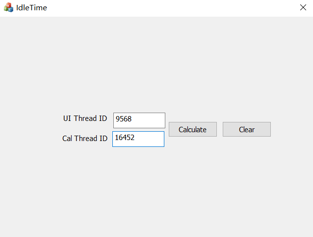
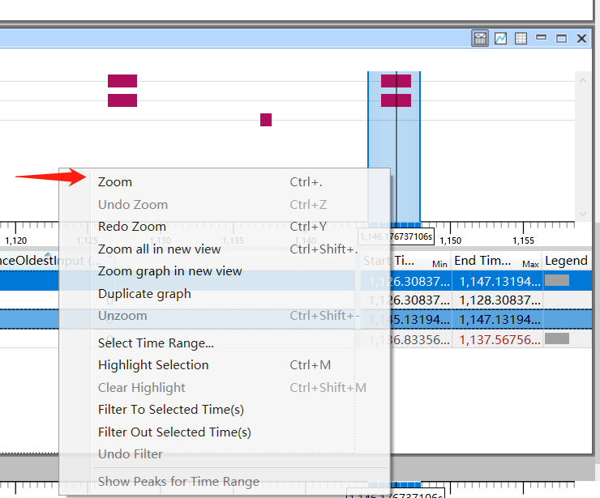
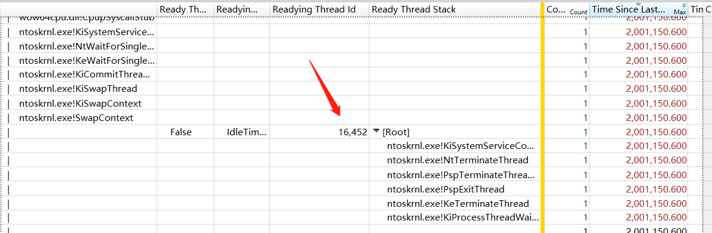

# 概述

本篇文章在上篇文章的基础上尝试提供几个简单的性能问题例子，用来阐述如何使用UIForETW和WPA来定位对应的性能问题。

对于客户端来说，一般说的性能问题主要是指界面有卡顿，而造成界面卡顿的一般有下面这2个原因。

1. 在UI线程中，CPU在等待某个东西，可能是锁、事件或是IO等，导致卡顿问题。
2. CPU在进行复杂操作（密集计算），占用了大量CPU资源，导致的卡顿问题。

本篇文章会编写程序并模拟这两种情况，并结合UIForETW和WPA软件来进行定位。


# CPU等待事件导致的卡顿

## 例子1

这里编写一个MFC的Demo程序，用来模仿因等待事件导致的卡顿例子，程序界面如下。



点击Calculate按钮后，在事件回调中会创建一个线程并等待线程执行完毕，待线程返回后，会将UI线程ID和创建的线程ID输出到界面的文本框中，核心代码如下。

```cpp
void CIdleTimeDlg::OnBnClickedButton1()
{
    // TODO: 在此添加控件通知处理程序代码
    int result = 0;
    std::thread th = std::thread([](int *res) {
        std::this_thread::sleep_for(2s);
        *res = GetCurrentThreadId();
    }, &result);

    th.join();

    m_UIThreadID.Format(_T("%d"), GetCurrentThreadId());
    m_CalThreadID.Format(_T("%d"), result);
    UpdateData(FALSE);
}
```

一般情况下，当点击按钮发现有卡顿问题后，我们可以立即去找按钮对应的回调实现，该程序的逻辑比较简单，因此一眼就可以看出问题所在，但如果事件的回调实现很复杂，那么就无法很快的定位出卡顿点在哪，而通过ETW便可以很快的将问题点定位出来。

开启UIForETW，按默认配置，直接`Start Tracing`，之后打开程序，点击`Calculate`按钮，待界面有响应，在文本框中输出对应的线程ID后，点击UIForETW的`Save Trace Buffers`按钮，生成对应的.etw文件，之后使用WPA软件打开刚生成的文件开始进行分析。

在定位卡顿问题时，我们需要首先定位到卡顿的时间点，通过`System Activity`中的`UI Delay`窗口，我们可以得知有哪些程序的UI存在未响应的情况（当UI未响应超过200ms时便会被记录到这里）。


由于自己触发了两次卡顿，因此这里有记录2次，我们选择后一次就好，通过下方的信息来看，每次卡顿的时间都是2s，这跟我们的程序实现相吻合，为了只关注后一次的卡顿，在图形框中选取最后一次的卡顿的时间段，并右键点击zoom，这样其他的图表也都会只展示这段时间内的事件。



对应这段时间，我们来查看下这段时间UI线程的CPU占用，用以判断是CPU密集计算导致的卡顿还是因等待事件导致的卡顿。


从图中可以看出这段时间内的UI线程9568的CPU占用一直为0，因此我们可以猜测它应当是在等待某件事件。对于这类问题，我们一般使用CPU Usage精确数据来进行定位。

在CPU Usage精确数据表格中，我们关注`Max Time Since Last`，在上篇文章中提到，该字段表示**线程上次执行完毕后到现在的时间，即线程处于等待和就绪状态的时间。**


这里我们恰好看到UI线程的最大等待时间是2s，跟程序实现相符，接下来我们根据这个最大等待时间，依次展开堆栈，查看导致这个等待的操作到底是什么。



展开到最底部，我们看到`Readying Thread` ID是16452，一般来说，`Readying Thread`满足当前线程所等待的条件，他可能是个锁，一个事件，一个线程或是其他的东西。但是如果线程在计时器到期时准备就绪，那么`Readying Thread`就和当前线程没有关系。计数器是通过触发中断来实现的，中断程序安排了延迟过程调用（DPC），DPC将在现在线程的上下文中进行执行。因此如果列表中显示`Readying Thread in DPC`为`true`，那么就可以忽略掉`Readying Thread`。

这里显示的DPC为`false`，因此我们可以确定接下来要执行的16452满足当前线程等待的条件。继续展开的线程堆栈不够详细，我们直接查看16452线程的堆栈调用。


展开16452线程的堆栈，我们可以发现这个线程也一直处于等待状态中，在它调用堆栈中有调用Sleep函数，因为该函数，整个线程暂停，随后执行的是Idle进程。

至此我们也就分析明白了该程序界面卡顿的原因了。

## 例子2

这里再举个等待IO的例子，MFC程序界面如下，


Open按钮左侧的文本框中用于输入文件的路径，之后点击Open按钮后，会打开路径指向的文件，并将内容显示到上方的文本框中。

核心代码是，

```cpp
void CIdleTime2Dlg::OnBnClickedButton1()
{
    UpdateData(TRUE);

    HANDLE hFile = NULL;
    hFile = CreateFile(m_UrlEdit.GetString(),
        GENERIC_READ,
        FILE_SHARE_READ,
        NULL,
        OPEN_EXISTING,
        FILE_ATTRIBUTE_NORMAL,
        NULL);
    if (hFile == INVALID_HANDLE_VALUE) {
        MessageBox("File is invlaid");
        return;
    }

    DWORD dwDataLen;
    char FileContent[1024] = { 0 };
    ReadFile(hFile, FileContent, sizeof(FileContent), &dwDataLen, NULL);
    FileContent[dwDataLen] = 0;
    CloseHandle(hFile);

    m_DisplayEdit = FileContent;

    UpdateData(FALSE);
}
```

为了模拟读文件卡死的情况，这里我使用内网NAS的samba服务的路径。首先我在NAS的共享目录中建立1个文本文件，内容是`123`，文件的路径是`\\192.168.2.100\swap\BaiduNetdiskDownload\1.txt`。

首先使用程序尝试打开该文件，确认功能是否正常。


功能一切正常，之后我把路径中的IP改为`192.168.2.200`，这个IP并未指向NAS服务器，因此无法访问，而这会导致CreateFile函数阻塞，进而导致程序卡死。待阻塞超时，程序恢复响应后，生成对应的etw文件进行分析。

查看UI Delays窗口，发现程序的大部分时间都在无响应状态，UIForETW的循环队列中记录的事件已经无法覆盖程序的无响应时间。


查看这段时间内的CPU占用，基本为0，因此可认为是等待事件导致，在CPU Usage（精确数据）中以Time Since Last（MAX）降序排序，依次展开时间最长的堆栈。


最终找到了CreateFile函数，之后我们可以依次打开`Storage` ->`File I/O`  -> `Activity by Process,Thread,Type`窗口。


可以看到堆栈中的CreateFile的等待结束时间与IO窗口中的Create事件时间吻合，在IO窗口中显示的路径是`C:\Windows\CSC\v2.0.6\namespace\192.168.2.200`，这个路径查了下与脱机文件存储有关，如果是本机的文件，估计应该会显示正确的路径。显示的结果是找不到对象名，这样就找到了调用CreateFile时产生阻塞问题的原因。

# CPU密集计算导致的卡顿

这里依旧实现一个MFC程序，用来模拟CPU密集计算导致的卡顿例子，程序界面如下。


程序有个文本框，在其中输入字母后，程序会根据当前的字符串计算出一个值，并显示到`Value`标签后的文本框中。

核心代码如下。

```cpp
void CCalculaterDlg::OnEnChangeEdit1()
{
    UpdateData(TRUE);
    int len = m_TextEdit.GetLength();
    UINT64 value = 0;
    for (int i = 0; i < len * 1000000; i++) {
        value += m_TextEdit[i % len];
    }

    m_TextValue.Format(_T("%d"), value);
    UpdateData(FALSE);
}
```

在这段代码中，刚开始输入文本时，程序并不会卡顿，但随着输入的文本字符串越来越长，程序会越来越卡顿。这模拟了印象笔记以及Typora这两个应用在markdown文本过长时的卡顿问题。自己实际有分析过印象笔记的卡顿问题，但发现堆栈在`libcef`模块中，由于没有该模块的pdb，因此无法了解实际原因。


在字符串过长时CPU占用特别高，为避免一直高CPU占用，这里在字符串过长时等待了一段时间，最后输入了字母`a`，输入后，界面卡顿后，之后使用快捷键`Ctrl+Win+R`生成了etw文件。

使用wpa软件打开etw文件，首先我还是要先定位出卡顿时的时机点。这里我们打开`Generic Event`窗口，然后在列表框中，依次打开Multi-Input，Keyboard窗口。这里我们可以看到记录的键盘事件，由于我这里设置UIForETW中的`Input tracing`选项为`Full`，因此会完整的记录下键盘的信息。


这里我们看到记录中的最后一个字母是`a`，与界面中的显示相一致。点击字母`a`事件，在图表框中便会显示出该事件所对应的时间。这里我们可以看到在按下字母`a`后，程序的CPU占用立马彪了起来。


再看下UI Delay窗口，可以看到在CPU彪起来这段时间内，发生了消息处理延迟。


接下来对图表进行缩放，只关注CPU高占用这段时间的事件。


接下来查看CPU Usage（采样数据）表格，按照CPU占用降序排序，找到占用CPU最多的线程，由于这里线程只有一个，所以我们依次展开其堆栈查看是哪里占用了大量CPU时间。在展开的过程中，时刻注意要展开占用CPU时间最多的那个堆栈。


最终我们定位到了函数`OnEnChangeEdit1`，我们还可以再向下展开，但这里已经没必要了。如果是更加复杂的逻辑，可以继续向下展开，找到导致问题的函数。

# 参考文章

1. [Xperf for Excess CPU Consumption: WPA edition](https://randomascii.wordpress.com/2013/04/23/xperf-for-excess-cpu-consumption-wpa-edition/)
2. [PowerPoint Poor Performance Problem](https://randomascii.wordpress.com/2011/08/29/powerpoint-poor-performance-problem/)
3. [Xperf Wait Analysis–Finding Idle Time](https://randomascii.wordpress.com/2012/05/05/xperf-wait-analysisfinding-idle-time/)

# 附录

1. [Demo程序](./Demo.zip)