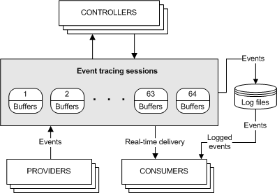
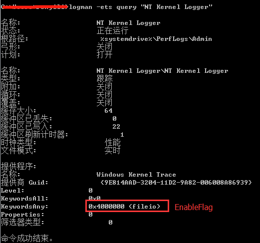
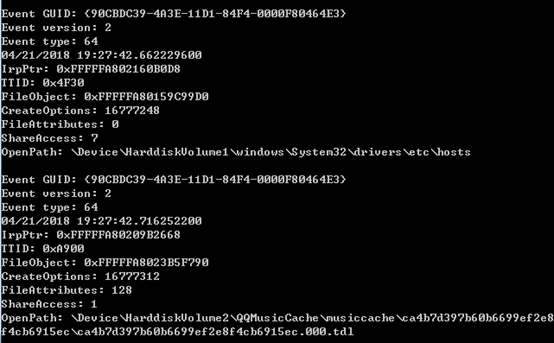
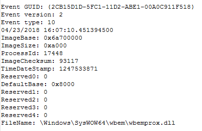
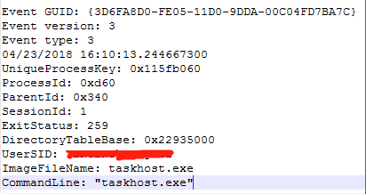
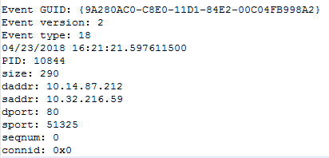
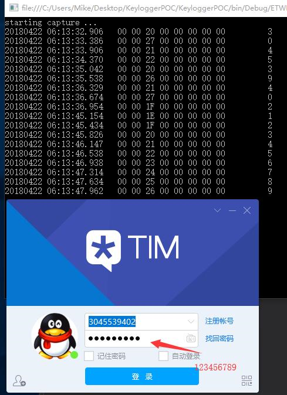

# 概述

> 该文写于2018年7月，整理资料找到，现整理放于博客上。

经过初步研究了解，通过ETW获取的信息非常丰富，可以通过ETW获取到的信息有：

1.	文件类信息，包括文件创建、删除、读写等信息。
2.	注册表信息，包括注册表的创建、删除、读写等信息。
3.	进程线程信息，包括进程创建退出、线程创建退出、模块加载等。
4.	网络信息，TCP、UDP协议的发送，接收ip地址以及数据长度等。
5.	CPU的使用情况、内存使用情况以及发生事件时的堆栈信息等。

更多的信息获取参见msdn中[EnableFlags](https://msdn.microsoft.com/en-us/library/windows/desktop/aa363784(v=vs.85).aspx)选项介绍。

由于ETW获取的信息非常丰富，且对系统性能影响不是很大，因此用来作为一种系统监控手段非常合适。

# ETW框架模型概述

`Event Trace for Windows`(ETW) 是一个高效的内核级别的事件追踪机制，它可以记录系统内核或是应用程序的事件到日志文件。我们可以通过实时获取或是从一个日志文件来解析处理这些事件，之后通过这些事件用来调试程序或是找到程序的性能问题。

ETW主要由三部分组成，分别是：

1.	Controllers（事件控制器），用来开关event trace 会话 和 Providers。
2.	Providers（事件提供器）， 用来提供事件。
3.	Consumers（事件消耗器），用来处理事件。

另有一个关键的概念Sessions。

这四者的关系图如下图所示：



## Controllers

通过Controllers可以进行各种设置。如设置日志是输出到文件还是实时解析，设置Session的打开和关闭，设置Session中数据缓冲池的大小以及其他统计信息等。

## Providers

Providers是提供事件的程序，当一个Provider注册后，可以通过Controller控制它是否输出事件。

常见的provider共有四种，分别是`MOF Providers`, `WPP Providers`, `manifest-based Providers`, 和 `TraceLogging Providers`。在vista之后应当使用`manifest-based`和`TraceLogging Provider`。

## Consumers

Consumers是一种可以选取一个或多个Session作为事件源的事件处理程序，它可以同时接收多个Session的事件。Consumers可以接收处理存储在日志文件中的事件，或是实时处理从Session获取的事件。

事件在某些情况下会丢失，这一般是设置不当导致的，可能的原因有以下几个：

1.	事件内容的总大小超过64kb。
2.	设置的事件缓冲区的大小小于事件的总大小。
3.	实时的事件处理器处理事件不够快或是记录到文件时，文件已经填满。
4.	当记录到文件时，磁盘速度太慢不足以快速的写入事件。

需要注意的是，这三个组件可以在一个应用程序中，也可以根据情况分布在不同的应用程序中。

## Sessions

除了上述三个组件外，还有一个概念也较为重要，这便是Session。Session由Controllers定义，Session记录了一个或多个Providers输出的事件，其主要用来管理和刷新事件的缓存。

系统同时最多支持64个Session，这些Session中有两个Session比较特殊，由操作系统直接定义，可直接使用，分别是：

1. `Global Logger Session`, 它用来记录操作系统早期启动过程中的事件，例如设备驱动相关的事件。
2. `NT Kernel Logger Session`，它用来记录操作系统生成的预定义系统事件，例如磁盘IO或页面错误事件。

# 基本实现

ETW本质上是一个日志记录追踪系统，一般的用法是让自己的程序作为Provider，并使用ETW机制输出日志，之后建立相应的Consumer来解析日志，根据日志分析应用程序的执行过程。

由于操作系统默认提供了NT Kerner Logger Session，且该Session提供了众多操作系统中的重要事件信息，因此可以直接使用该Session获取系统事件。由于该Session中已经包含了输出事件的Providers，因此在使用中只需要建立相应的Controller和Consumer即可。Controller用来控制Session的开关 ，Consumer用来处理从Session中拿到的事件。

整个实现以监控文件创建事件为例进行说明，程序中主要分为两个部分，一部分是Controller，用来控制Session的打开关闭；另一部分是Consumer，用来从Session中获取解析事件。

部分代码实现如下：

```cpp
#include <stdio.h>
#include <stdint.h>
#include <Windows.h>
#include <evntrace.h>
#include <evntcons.h>

/// 事件回调函数，微软提供的一种方式，详细参见附件代码
void WINAPI ProcessEvent(PEVENT_RECORD pEvent);

/// 事件实时处理线程
DWORD WINAPI consumer_thread(LPVOID param)
{
    EVENT_TRACE_LOGFILE trace;
    memset(&trace, 0, sizeof(trace));
    trace.LoggerName = const_cast<wchar_t*>(KERNEL_LOGGER_NAME);
    trace.LogFileName = NULL;
    /// 指定处理事件的模式，这里是实时处理
    trace.ProcessTraceMode = PROCESS_TRACE_MODE_REAL_TIME | PROCESS_TRACE_MODE_EVENT_RECORD;
    trace.Context = NULL;
    /// 指定事件处理函数，该函数实现较为复杂
    trace.EventRecordCallback = ProcessEvent;

    /// 打开session
    TRACEHANDLE handle = OpenTrace(&trace);
    if(handle == (TRACEHANDLE)INVALID_HANDLE_VALUE)
    {
        printf("handle is invalid value.\n");
        return -1;
    }

    /// 开始处理事件，该函数为阻塞函数，在这里不断调用事件处理函数处理事件，直到session关闭
    ProcessTrace(&handle, 1, 0, 0);

    CloseTrace(handle);
    return 0;
}

int main()
{
    uint32_t buff_size = sizeof(EVENT_TRACE_PROPERTIES) + sizeof(KERNEL_LOGGER_NAME);
    EVENT_TRACE_PROPERTIES *trace_config = reinterpret_cast<EVENT_TRACE_PROPERTIES*>(new char[buff_size]);

    memset(trace_config, 0, buff_size);
    trace_config->Wnode.BufferSize = buff_size;
    trace_config->Wnode.Flags = WNODE_FLAG_TRACED_GUID;
    trace_config->Wnode.ClientContext = 1;
    trace_config->Wnode.Guid = SystemTraceControlGuid;          //< NT Kernle Logger session的GUID
    trace_config->EnableFlags = EVENT_TRACE_FLAG_FILE_IO_INIT;    //< 关注磁盘文件IO事件
    trace_config->LogFileMode = EVENT_TRACE_REAL_TIME_MODE;     //< 事件追踪的模式，这里是实时处理事件
    trace_config->LoggerNameOffset = sizeof(EVENT_TRACE_PROPERTIES);

    EVENT_TRACE_PROPERTIES *temp_config = reinterpret_cast<EVENT_TRACE_PROPERTIES*>(new char[buff_size]);
    memcpy(temp_config, trace_config, buff_size);

    TRACEHANDLE session_handle = NULL;
    uint32_t status = 0;
    
    /// 指定开启session的名称，这里是 NT Kernel Logger
    status = StartTrace(&session_handle, KERNEL_LOGGER_NAME, temp_config);
    if (ERROR_SUCCESS != status)
    {
        if (ERROR_ALREADY_EXISTS == status)
        {
            printf("The NT Kernel Logger session is already in use.\n");
            /// NT Kernel Logger session 已经存在，这里先关闭后再重新打开。
            status = ControlTrace(NULL, KERNEL_LOGGER_NAME, temp_config, EVENT_TRACE_CONTROL_STOP);
            if(SUCCEEDED(status))
            {
                status = StartTrace(&session_handle, KERNEL_LOGGER_NAME, trace_config);
                if(ERROR_SUCCESS != status)
                {
                    printf("err %d\n", GetLastError());
                }
            }
        }
        else
        {
            printf("EnableTrace() failed with %lu\n", status);
        }
    }

    /// 创建事件处理器线程，用来实时处理事件
    CreateThread(NULL, 0, consumer_thread, NULL, 0, 0);

    /// 按键等待，阻塞在这里使得事件处理器线程执行
    printf("Press any key to end trace session.\n");
    getchar();
	
    /// 关闭 NT Kernel Logger session
    status = ControlTrace(session_handle, KERNEL_LOGGER_NAME, trace_config, EVENT_TRACE_CONTROL_STOP);
    
    if(trace_config != NULL)
    {
        delete []trace_config;
    }

    return 0;
}
```

程序开启后，可以使用命令`logman –ets query "NT Kernel Logger"`查看当前的kernel session的状态，这里测试如下：



图中画框的部分即为设置`EVENT_TRACE_PROPERTIES`结构体的`EnableFlags`成员时的`EVENT_TRACE_FLAG_FILE_IO_INIT`宏的值。

程序运行截图如下。



- `EventType`为64，代表了文件创建事件，文件相关的事件类型码可参考[MSDN](https://msdn.microsoft.com/zh-cn/library/windows/desktop/aa363884(v=vs.85).aspx)
- `IrpPtr`是io请求数据包。此属性用来标识io活动。
- `TTID`是创建该文件的线程ID，可通过函数`GetProcessIdOfThread`获取到对应的进程ID。
- `FileObject`是文件标识符，用来关联到文件创建和关闭事件之间的文件对象实例。
- `CreateOptions`是调用`NTCreateFile`函数时传入的`CreateOptions`和 `CreateDispositions`参数。
- `FileAttributes`是调用`NTCreateFile`函数时传入的`FileAttributes`参数。
- `ShareAccess`是调用`NTCreateFile`函数时传入的`ShareAccess`参数。
- `OpenPath`是要打开的文件路径，这里的路径是DOS设备路径，可转为逻辑路径。

本例主要关注文件的创建事件，如果希望获取其他信息，可以在设置`trace_config->EnableFlags` 时，指定其他的Flag标志，Flag标志可参考[MSDN](https://msdn.microsoft.com/en-us/library/windows/desktop/aa363784(v=vs.85).aspx)。

在代码中直接修改`EnableFlags`字段的值即可，通过修改为`EVENT_TRACE_FLAG_IMAGE_LOAD`可以获取dll加载的相关信息，测试结果如下图所示。



通过修改为`EVENT_TRACE_FLAG_PROCESS`可以获取进程的相关信息，测试结果如下。



通过修改为`EVENT_TRACE_FLAG_NETWORK_TCPIP`可以获得网络的相关信息。



# 其他应用

根据网上资料，发现有根据ETW获取键盘按键信息的[文章](https://www.cyberpointllc.com/srt/posts/srt-logging-keystrokes-with-event-tracing-for-windows-etw.html#fn2)，文章中提供了C#的[测试代码](https://github.com/CyberPoint/Ruxcon2016ETW/tree/master/KeyloggerPOC)，执行效果如下：



在测试中发现按键信息的记录稍有延迟，在另一篇[文章](https://zhuanlan.zhihu.com/p/23473665)上看到该方法目前已经被杀软封杀。

使用virustotal检测后，共66款杀软，其中10款报毒(10款为18年结论，现在则有45款杀软报毒），详细信息见[链接](https://www.virustotal.com/#/file/b5d1ef9fc7332075b3353cc94f1c2e7022921c4280ccf482ec7d836f892e14ab/detection)。

根据文章，该代码的基本原理是，操作系统中默认提供了很多的Providers，查看系统上提供了哪些Providers可以在命令行中使用命令`logman query providers`查看。

这些Providers中有一些和USB相关，其主要目的是用来提供调试驱动和总线的一些问题的。

这些USB相关的Providers中，有两个比较特殊，分别是：

1.	`Microsoft-Windows-USB-UCX` (36DA592D-E43A-4E28-AF6F-4BC57C5A11E8)
2.	`Microsoft-Windows-USB-USBPORT` (C88A4EF5-D048-4013-9408-E04B7DB2814A)

第一个provider是USB3.0相关的，第二个则是USB2.0相关的。通过研究这两个provider的数据，发现数据中有疑似USB键盘和鼠标输入的数据。

该代码的原理也就是获取这两个provider的数据，对数据进行过滤分析后，得到了其中键盘的按键信息。

# 参考资料

1.	[https://msdn.microsoft.com/en-us/library/windows/desktop/aa363668(v=vs.85).aspx](https://msdn.microsoft.com/en-us/library/windows/desktop/aa363668(v=vs.85).aspx)
2.	[https://www.cyberpointllc.com/srt/posts/srt-logging-keystrokes-with-event-tracing-for-windows-etw.html](https://www.cyberpointllc.com/srt/posts/srt-logging-keystrokes-with-event-tracing-for-windows-etw.html)
3.	[http://www.freebuf.com/column/138862.html](http://www.freebuf.com/column/138862.html)