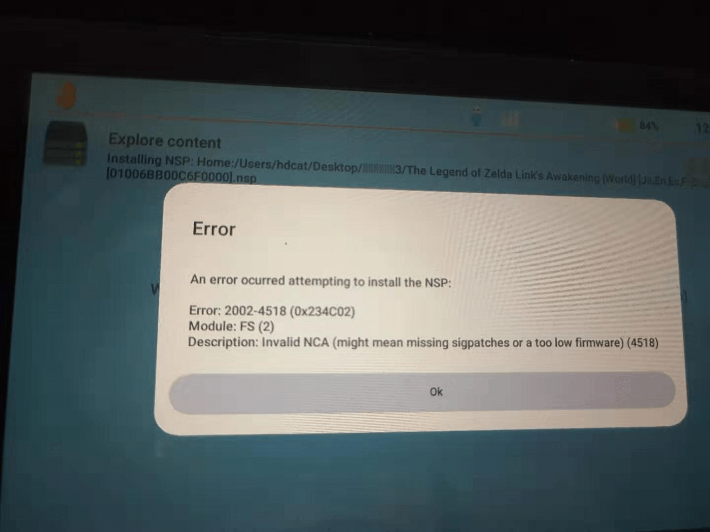
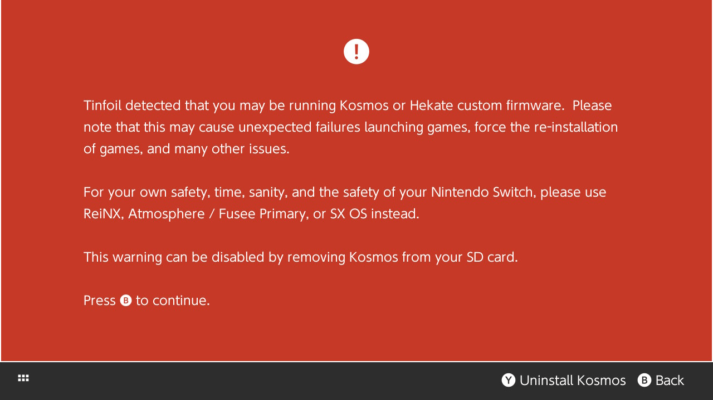
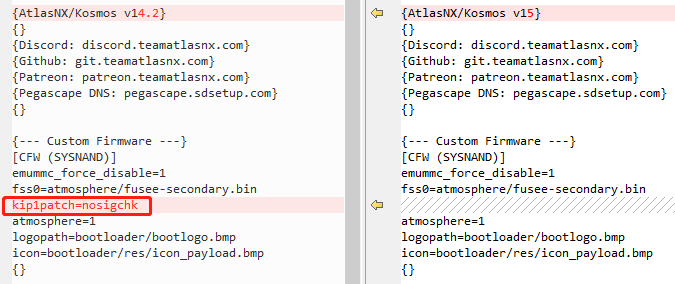

周围同事都买了Switch，受他们的影响，也打算买台玩玩。在正版与破解版本之间最终还是选择了破解版，闲鱼2200收了台可破解的正版Switch。到手后便迫不及待的开始准备破解了，但自己的这个破解过程实在是有点曲折，遂记录之。

整个破解过程基本上都可以参考[Kosmos安装指南](https://github.com/ln93/kosmos_chs_tutorial)这篇文章，这篇文章讲解的很详细。

但自己根据这篇文章尝试后，发现个小问题。自己的系统版本是9.0，使用的是`Kosmos v15`版本，破解完成后可以正常安装绝大多数游戏，但有些游戏使用金叶子安装时会提示`Invalid NCA(might mean missing sigpatches or a too low firmware)`，截图如下（来自网络）。



虽然参考的这篇文章也有提到`Invalid NCA`，但是自己有按照它的说明安装对应的Patch。另外一点是，自己可以安装大部分的游戏，只有部分游戏会出现这个错误。后面又在网上查了一些资料，基本上也都说是因为没有安装patch，但明明有按照这篇文章安装Patch。后来想着是否要将系统升级到最新版本，不过暂时忍住了升级，这是最终没有办法的尝试。

后来自己随便找了一个整合包（来自[网站](http://www.ns-atmosphere.com/zh/)），其中有`TINFOIL`安装器，想使用`TINFOIL`尝试安装下金叶子提示问题的安装包，在打开`TINFOIL`时会提示错误`tinfoil detected that you may be running kosmos or hekate`，截图如下（来自网络）。



自己又查了一些资料，有些说`TINFOIL`不支持`kosmos`系统。后来发现这个整合包中的`TINFOIL`版本是1.63，而官网上的版本是7.01，本着死马当活马医的想法试了下7.01的版本，发现竟然可以进去😒。真不知道这个整合包为何要整合不能用的`TINFOIL`版本。

在使用`TINFOIL`安装金叶子提示`Invalid NCA`的安装包时，依旧有问题，提示签名有问题，查了下，在`TINFOIL`的选项中，有个`install unsigned code`功能，在执行后，需要输入一个密码，输入`上 上 下 下 左 右 左 右 B A + `后便开启了这个功能，之后再去安装那些提示签名有问题的游戏则都正常了。

后来与同事交流，他使用的是国内论坛的整合包，这个整合包在安装我说的那些游戏时（安装包一样，是他拷给我的）并没有出现我遇到的那个问题。他使用的整合包来自[Switch-9.1系统大气层原版整合包](https://www.91wii.com/forum.php?mod=viewthread&tid=134245&highlight=9.1)，后来自己也更换成了这个系统，再使用金叶子安装那些先前提示`Invalid NCA`的安装包时一点问题都没有🤔。

自己不死心，想要找到根据这篇[Kosmos安装指南](https://github.com/ln93/kosmos_chs_tutorial)操作却不成功的原因。后来自己详细对比了下配置，在`bootload`目录下的`hekate_ipl.ini`文件中，`kosmos v15`版本的配置是：

```ini
{--- Custom Firmware ---}
[CFW (SYSNAND)]
emummc_force_disable=1
fss0=atmosphere/fusee-secondary.bin
atmosphere=1
logopath=bootloader/bootlogo.bmp
icon=bootloader/res/icon_payload.bmp
{}
```

而整合包中的则是：

```ini
{---- Miscellaneous ---}
[Atmosphere]
payload=bootloader/payloads/Atmosphere.bin
{ }
```

两者并不一样，自己尝试把整合包中的整个`bootload`目录替换到`Kosmos v15`中，重新启动switch并测试安装先前提示有问题的游戏，发现可以正常安装。看来似乎是`Kosmos v15`的配置有问题。

后来自己又看了下`Kosmos`在GitHub上的issues，在这篇[帖子](https://github.com/AtlasNX/Kosmos/issues/245)中也有人提到这个问题，不过看作者表示在新版本中已经修复了，看当时的日期新的版本差不多是v14.2，本着试试的态度，把v14.2版本下了下来，首先比对了下v14.2与v15在`hekate_ipl.ini`中是否有不同，发现确实有不一样的地方。



v14.2版本中比v15多了个`kip1patch=nosigchk`的配置，自己尝试使用v15版本并把这个配置加上，再重新启动Switch使用金叶子安装先前有问题的游戏，发现也可以正常安装了😢。

到了这里，明面上的原因算是找到了，更深入的已经不想研究了，自己只是为了破解，并不想深入的研究相关原理，而且单单上面这些破问题就差不多用了自己一个周末的时间。后来反思，自己最开始的破解方向就错了，要是一开始就向同事请教并使用91wii论坛的整合包，也就没有后面这些问题了。

最后，自己也没有用自己折腾出的解决方法，为了避免后面会遇到其他坑，还是还是用了整合包。

破解完成之后需要安装游戏，相较于将游戏拷贝到内存卡上再安装，使用USB安装就简单了很多。查了下，金叶子和`TINFOIL`都可以通过USB安装游戏。

金叶子的话可以直接看下面这两篇文章，看了些网上其他的文章，有些已经过时了。

1. [Install NSPs over USB (Goldtree)](https://switch.homebrew.guide/usingcfw/installnsps/installnsps-goldtree)
2. [Quark and USB setup](https://github.com/XorTroll/Goldleaf/blob/master/Quark.md)

`TINFOIL`的话，可以从[官网](https://tinfoil.io/Download#download)上下载NUT软件的源码，在源码中的`readme.md`中了解`TINFOIL`使用USB安装软件的详细方法。

