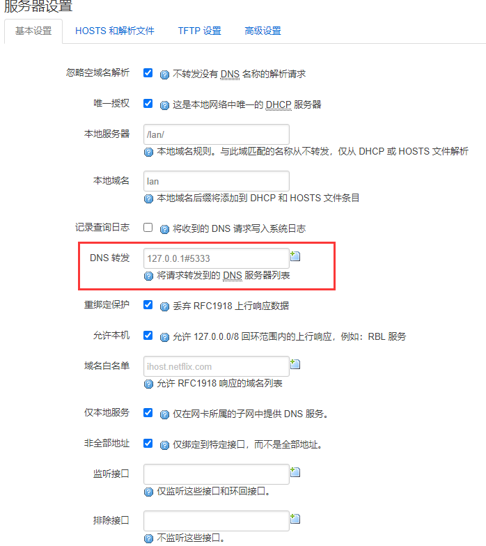
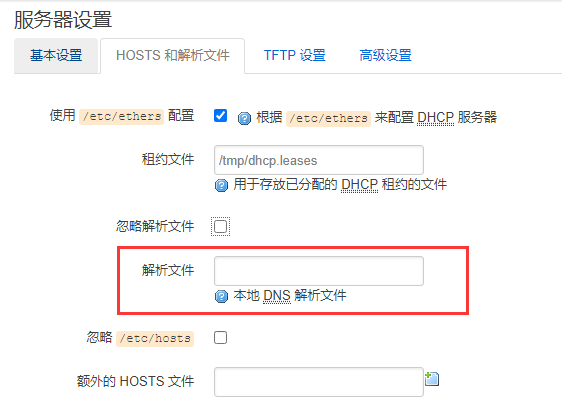
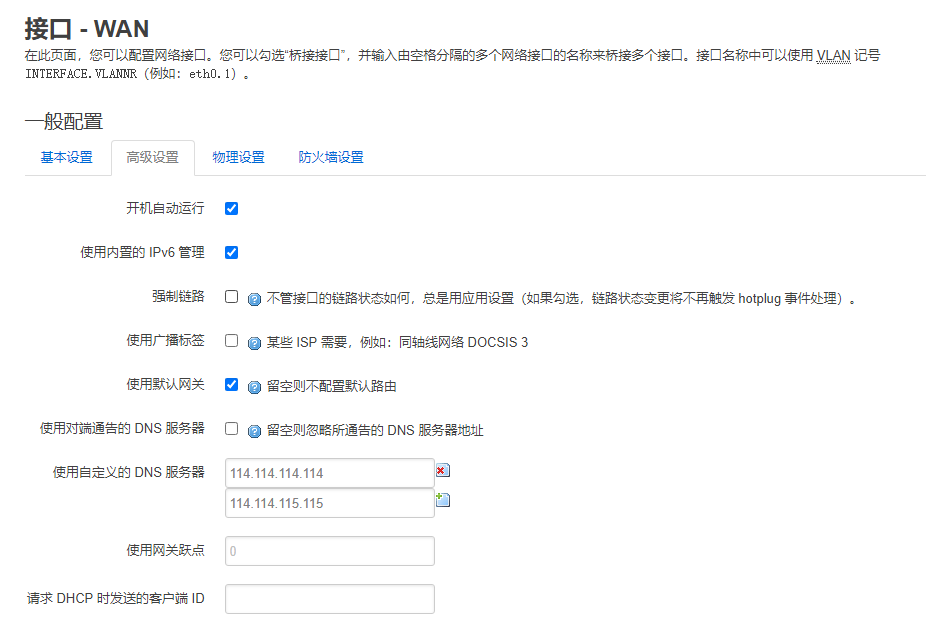
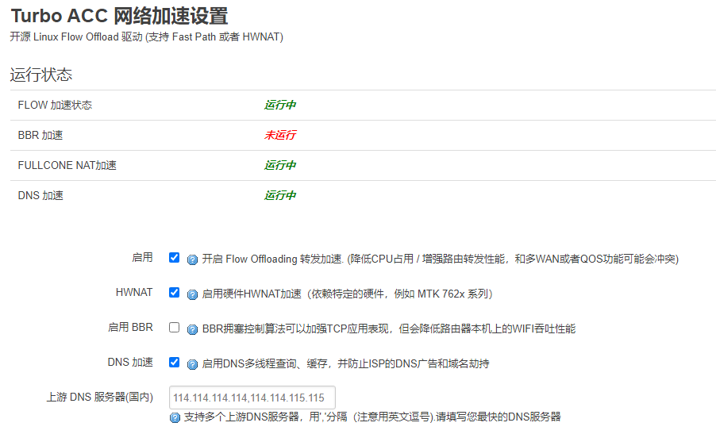
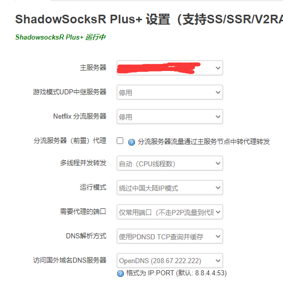
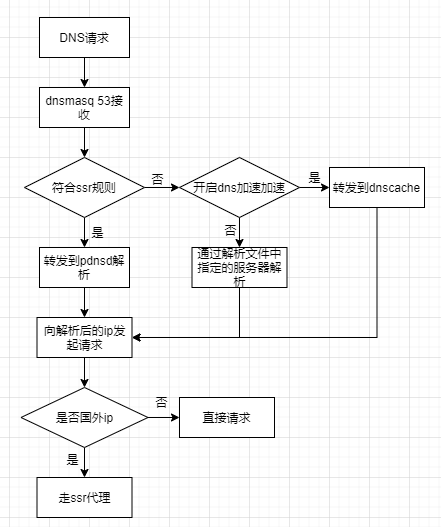

# 背景

自己使用的是k2p路由器，安装Lean大的openwrt后非常好用，尤其是ssr plus插件，开启`绕过中国大陆模式`后，无论国外网站是否被干扰，都通过代理访问，大大提升了网络的访问体验。

但在长期的使用过程中依旧会发现某些网站无法访问，浏览器开启全局代理后则没有问题，后研究后发现是dns污染的原因。

按自己之前的理解，开启`绕过中国大陆模式`后是不应该出现这个问题的，为了搞清楚原因，摸索了下Lean大openwrt的dns解析流程。

# 摸索

实际使用中，与DNS有关的共有这些地方。

## 客户端dns

客户端通过dhcp的方式获取ip地址以及dns服务器地址，在openwrt中，dns地址一般是openwrt自身的地址，在openwrt中使用dnsmasq提供服务。

dnsmasq绑定53端口，在DHCP/DNS中的`DNS转发项`和`解析文件项`中可以设置dnsmasq的上游服务器。





默认情况下，`DNS转发项`是空的（截图中调整了），dnsmasq使用解析文件获取上游服务器（解析文件路径一般是`/tmp/resolv.conf.d/resolv.conf.auto`），而解析文件中的dns地址一般是运营商分配的dns服务器，其地址可以通过ssh的方式到路由器上查看。另，通过wan接口高级设置中选项可以修改解析中的地址。

## wan接口高级设置中的DNS服务器



配置`/tmp/resolv.conf.d/resolv.conf.auto`中的服务器便来自于此，该配置中的服务器默认作为dnsmasq的上游服务器，如果想要更改dnsmasq的上游服务器，更改这里就行了。

一般来说，这里会自动获取运营商的dns服务器，由于运营商的服务器一般都有各种各样的问题，因此可以设置为114公共服务器。

## Turbo ACC DNS加速

在Turbo ACC网络加速中，有个DNS加速。



这里使用的是pdnsd软件（进程名为dnscache，但实际上还是pdnsd，为做区分，后面还称为dnscache），在设置完加速后，再去看DNS选项中的`DNS转发项`，会发现那里的值改为了`127.0.0.1#5333`，其中5333端口便是dnscache软件绑定的端口。

当开启DNS加速后，客户端发起dns请求后，请求先是到了dnsmasq，在dnsmasq中将dns请求转发到了本地的5333端口，也即dnscache软件，之后由dnscache软件返回结果。其中dnscache软件的上游路由器便是DNS加速选项中指定的上游路由器。

## ssr plus插件中的dns解析方式

默认情况下，这里使用的是pdnsd软件，通过配置查看可以知道其绑定的是本机的5335端口。



在dnsmasq的配置中，指定了`/tmp/dnsmasq.ssr/`作为配置路径，在这个路径下有多个文件，如`gfw_base.conf`、`gfw_list.conf`等，这些配置内容大致如下：

```conf
server=/0rz.tw/127.0.0.1#5335
ipset=/0rz.tw/gfwlist
server=/10.tt/127.0.0.1#5335
ipset=/10.tt/gfwlist
server=/1000giri.net/127.0.0.1#5335
ipset=/1000giri.net/gfwlist
.....
```

通过dnsmasq的server选项的域名绑定机制，将指定域名的解析转发到5335端口，也即pdnsd中进行解析。

在pdnsd软件中，会通过tcp的方式对上游服务器进行请求，这里要注意，由于上游dns在国外，那么它们在经过iptables时，也会被转发到代理服务器上，通过代理服务器向国外的dns服务器进行请求解析，这样就杜绝了dns被污染的问题。

了解了各处dns设置的作用，接下来将整个`绕过中国大陆模式`的dns请求流程串起来，如下图：



# 解决

对比流程，模拟那些无法访问网站的dns请求流程，首先访问的域名不在dnsmasq的ssr规则中，因此没有走pdnsd进行解析。之后，如果设置了dns加速，那么会走dnscache解析，虽然dnscache中有设置清除部分污染ip地址，但实际解析出来的ip并不在这些列表中，因此也就直接返回了。

返回后的ip是个国外ip，会通过代理访问，但由于这个ip地址是被污染的，因此即使通过代理也无法访问。

既然明白了是dns污染的问题，那么解决起来也就很简单了，即通过搭配chinadns等项目自行建立一个无污染的dns服务就行了。之后将dns加速中的上游服务器改为chinadns的地址即可。

# 最后

以上过程分析了绕过中国大陆模式的dns解析流程，GFW模式的流程同理，只是在iptables规则那里，不再是非中国大陆ip转发到代理，而是改为了仅在gfw列表中的ip才转发到代理服务器。

另，自己对网络这块并不是很熟悉，相关的软件了解也不够深，因此分析难免会有问题，不当之处欢迎指出。