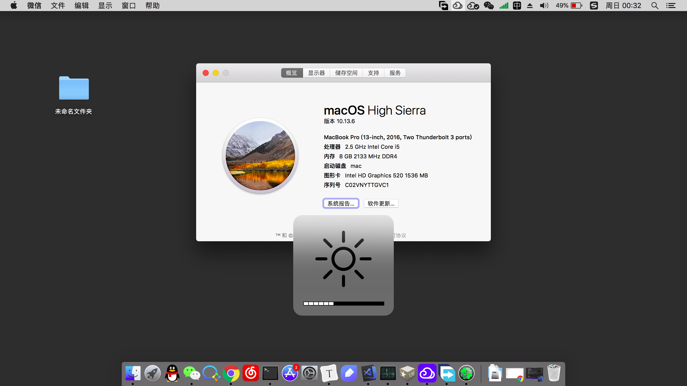
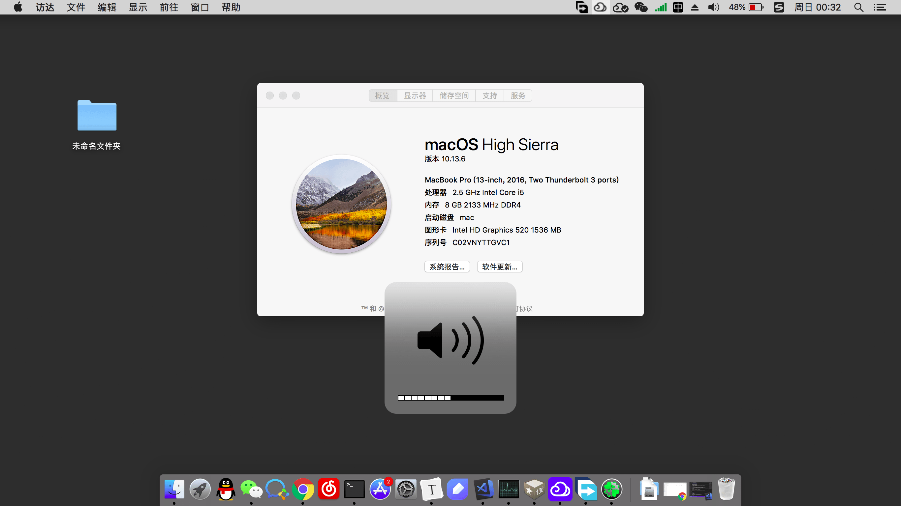
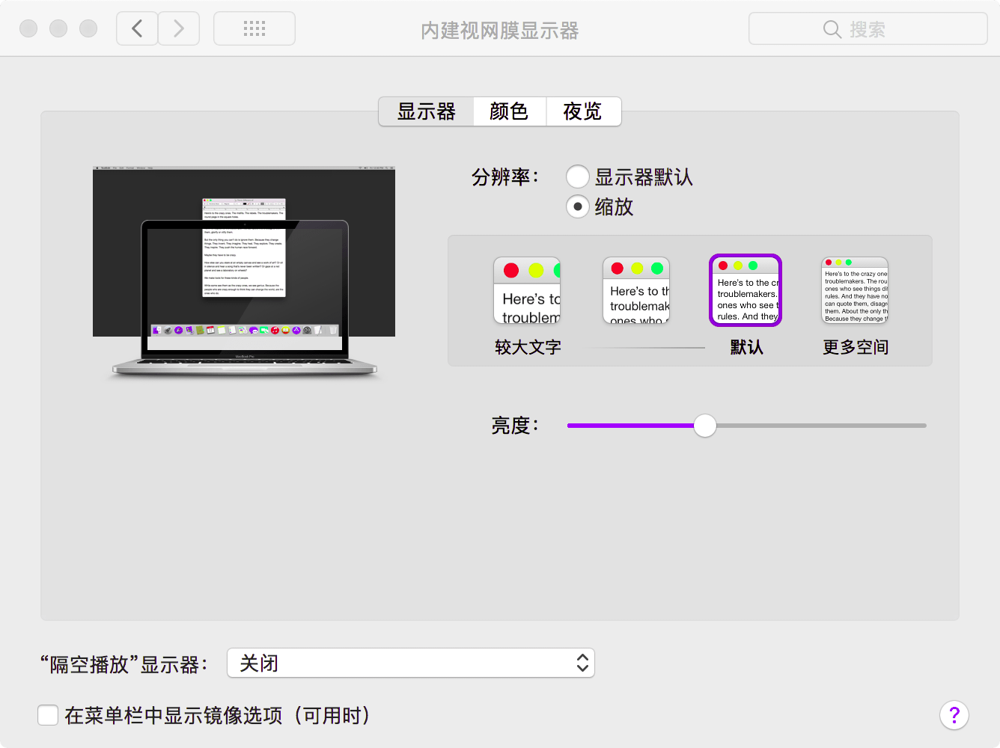

大神最近将苹果系统安装到了他的ThinkPad X1上，于是心痒研究了下如何将苹果系统安装到ThinkPad X260上，目前已经基本安装OK，最起码达到了我的使用要求，实现的功能如下：
1. 声音输出正常，Fn快捷键调节音量大小正常。
2. 显卡驱动正常，Fn快捷键调节亮度正常。
3. 电池显示基本正常（x260有两块电池，显示的信息只是一块的，当第一块电量耗完后，会再显示第二块的）。
4. 睡眠唤醒正常。

现在依旧存在的问题有：
1. 内置网卡、蓝牙不可用。网卡目前使用USB网卡解决，蓝牙未解决，也可通过USB蓝牙解决。
2. HDMI 直接连HDMI显示器可以正常使用，但使用HDMI转VGA线连接到VGA口的显示器则会重启（暂时搞不定）。
3. 读卡器不可用。
4. 摄像头不可用。
5. 由于自己不使用触摸板，因此触摸板也基本处于不可用状态，曾尝试过ApplePS2SmartTouchPad-3.kext驱动，触控板基本可用，不过会带来一些其他问题（F4，F5调节亮度失效），后续也就懒得再研究了。

现附上自己目前使用的[Clover配置](https://share.weiyun.com/5ydtstn)，供有需要的朋友使用。

同时这里也备份下自己在安装过程中使用的相关[软件](https://share.weiyun.com/5QB3VDx)

安装后的截图：




# 安装详细过程

整个系统的安装可分为两部分。
1. 系统的安装。
2. 系统功能的完善与打磨。

系统的安装相对会容易很多，而系统功能的完善与打磨则会花费很多时间与精力。

## 系统安装

系统是从远景的这篇帖子中（[【终极之礼】macOS High Sierra 10.13.6 17G65 With Clover 4596原版镜像](http://bbs.pcbeta.com/viewthread-1790952-1-1.html)）下载的。对系统没有什么深入的研究，使用这个系统的目的则是因为这个系统的clover中自带了很多主流配置的config。

x260的显卡驱动是HD520，因此使用这个系统中自带的`config_HD515_520_530_540.plist`即可驱动显卡。

系统的详细安装参见远景上的一些帖子，整体来说很简单，将系统镜像刻录到U盘，之后将电脑的启动方式改为UEFI，从U盘启动安装系统即可。有的系统镜像的EFI中的配置会与x260不兼容，导致系统从U盘启动时出现错误，不过在这个镜像中使用`config_HD515_520_530_540.plist`这个配置倒是没有出现这个问题。

网上的一些系统安装的帖子，供参考：

[macOS安装教程兼小米Pro安装过程记录](https://blog.daliansky.net/MacOS-installation-tutorial-XiaoMi-Pro-installation-process-records.html)

[【超级教程】黑苹果各个版本各种引导安装通用教材](http://bbs.pcbeta.com/forum.php?mod=viewthread&tid=1599202&extra=page%3D1%26filter%3Drecommend%26orderby%3Drecommends%26recommend%3D1%26recommend%3D1%26orderby%3Drecommends)

[【授人以渔】UEFI+GPT+Clover OS X Yosemite原版单、双系统双版教程(正式版)](http://bbs.pcbeta.com/viewthread-1542110-1-1.html)

[从零开始学黑苹果-基础安装教程(10.11.6)](https://www.jianshu.com/p/529392e7b0f6)

[从零开始学黑苹果-进阶安装教程(10.12.6)](https://www.jianshu.com/p/69cb2c3b86ef)

系统安装后，基本上处于不可用状态，主要有以下几个问题：

1. 无线网卡不可用。
2. 亮度无法调节及无法使用Fn快捷调节亮度。
3. 睡眠之后会自动唤醒，导致睡眠失效。
4. 电量信息无法显示。

下面一一解决这些问题。

## 系统功能的完善与打磨

在这一部分主要是需要对DSDT打补丁的方式来完善系统功能，因此在此之前需要先学会如何对DSDT打补丁，这里可参考远景的这篇帖子，一步步跟着来即可。

[DSDT打补丁](http://bbs.pcbeta.com/viewthread-1571455-1-1.html)

另在系统功能完善这一部分，基本上都是参考了github上的这篇帖子[Install Hackintosh on Thinkpad T450 20BV-A00YCD](https://github.com/shmilee/T450-Hackintosh)，虽然这篇帖子介绍的机型是T450，但是我在按照这个步骤进行后，发现基本都可以在x260上使用。

### 无线网卡不可用

在论坛上有看到自己换电脑自带的网卡的，我懒得这么麻烦，直接装了个usb无线网卡，无线网卡的驱动是`RTL8192CU`，而这个驱动在远景上刚好有，可以自行搜索下载，安装好后基本上是解决了网络的问题。

貌似蓝牙跟无线网卡是在一块板子上的，因此蓝牙也无法驱动，这个也可以使用usb蓝牙设备解决。不过我个人暂时没有使用蓝牙的需求，因此这点也就不管了。

可以在帖子[RTL88xx系列USB无线网卡 macOS 10.9~10.13驱动](http://bbs.pcbeta.com/forum.php?mod=viewthread&tid=1774171)下载。

### 亮度调节

在亮度调节这里我折腾了好久，原因是我一直以为亮度调节与显卡驱动是强关联的，我的系统之所以无法亮度调节，是因为显卡驱动安装的不正确导致的。这点实际上是我方向错了，使用我上面提到的`config_HD515_520_530_540.plist`后，显卡已经驱动正常了，只需要对DSDT打补丁就可调节亮度了。

使用Rehabman大神的Brightness fix补丁对DSDT打补丁，之后就可以调节亮度了。

打完补丁后只是能够在设置中对亮度进行调节，而无法使用快捷键对亮度进行调节，这里还需要对DSDT再打一个补丁。

补丁参见[Install Hackintosh on Thinkpad T450 20BV-A00YCD](https://github.com/shmilee/T450-Hackintosh)这篇帖子的`Fn_Keys.txt`。

之后亮度调节与快捷键调节就应该都没有问题了。


### 睡眠之后会自动唤醒，导致睡眠失效

参考[Install Hackintosh on Thinkpad T450 20BV-A00YCD](https://github.com/shmilee/T450-Hackintosh)这篇帖子，我的电脑的睡眠失败的原因与他的相同，均是
```C++
kernel[0]: Wake reason: IGBE XHCI (Network)
```

使用`2_usb_prw.txt`这个补丁后可以解决睡眠失败的问题，但是当睡眠唤醒后，LED灯依旧会不断的闪烁，因此需要打`2_led_blink.txt`补丁。

之后睡眠唤醒的问题完美解决。

### 电量信息无法显示

使用这篇帖子[Install Hackintosh on Thinkpad T450 20BV-A00YCD](https://github.com/shmilee/T450-Hackintosh)这篇帖子的`4_battery_Lenovo-T450.txt`补丁后，即可解决电量显示的问题。

除了使用上述的补丁外，其实也可以自己制作电量显示补丁，参考帖子[[MaciASL补丁制作实战] 制作电量显示补丁](http://bbs.pcbeta.com/viewthread-1521462-1-1.html)即可。

### 支持内建HiDPI

我的X260的屏幕分辨率是1080的，如果使用默认的1080分辨率的话，眼是一定要瞎的。因此需要降低分辨率以放大字体。在将分辨率改到1280 * 720后，字体大小感觉已经比较合适了，但是字体会非常糊。

下载RDM工具后，可以开启HiDPI功能，这样字体就会清晰很多。但这样在每次开机后都需要手动设置，非常的不方便，这里参考帖子[完美开启HIDPI的方法!!!!区别于syscl大神的教程](http://bbs.pcbeta.com/forum.php?mod=viewthread&tid=1758964)。通过这篇帖子，可以开启内建的HiDPI，不用每次开机设置。另外在按照这篇帖子配置时，我将默认的分辨率调节到了1366 * 768，自认为这个分辨率在12.5的屏幕上显示是非常合适的。