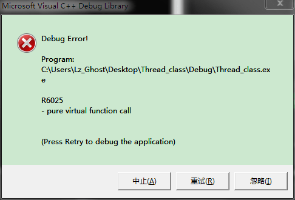

5月10日更新
===============================

前两天用之前的那个线程类去交工，然后就被批了，因为那个线程类是有bug的（如果实现类自杀的话，就不存在这个问题），韩老师的书上也有说明，但是我并没有注意。

在说明bug之前，我先给个完全复现bug的程序。

把Wrapper函数更为此。即在调用Execute函数之前，先等待2秒。

```c++
DWORD WINAPI Thread::Wrapper(LPVOID arg){
    Thread *thread_this = (Thread*)arg;
    Sleep(2000);
    thread_this->Execute();
    ExitThread(thread_this->return_value);
    return 0;
}
```

其他类成员函数不变。主函数以及子类如下：
```c++
class my_thread :public Thread{
protected:
    void Execute(){
        printf("this is execute\n");
        return ;
    }
};
int main(){
    my_thread *th = new my_thread();
    th->Run();
    delete th;
    return 0;
}
```

运行程序之后，会出现错误：



调用纯虚函数了。。。。说句实话，这个bug很是让我摸不着头脑。

我大概说一下问题出在哪里，问题主要出在虚函数上（为此专门把虚函数给好好看了看）。

在代码中有这么几个关键地方。

父类的析构函数。
```c++
Thread::~Thread(){
    if (thread_id != 0){
        this->WaitFor();
        CloseHandle(thread_handle);
    }
}
```
静态函数。
```c++
DWORD WINAPI Thread::Wrapper(LPVOID arg){
    Thread *thread_this = (Thread*)arg;
    //注意这个Sleep函数
    Sleep(2000);
    thread_this->Execute();
    ExitThread(thread_this->return_value);
    return 0;
}
```
主函数中的delete。
```c++
int main(){
    my_thread *th = new my_thread();
    th->Run();
    delete th;
    return 0;
}
```
在讲解问题之前，还要再声明一下，当调用子类析构函数的时候，类的虚表是子类的虚表，当调用父类的析构函数的时候，这个时候虚表是父类的虚表。

在程序的main函数中，调用线程类的Run方法，然后创建线程，这个时候，静态函数被调用，但是因为执行了Sleep函数，所以这个时候，Execute函数还并未执行。这个时候，主线程中已经调用delete函数去释放内存了。先调用子类的默认析构函数，然后调用父类的析构函数，这个时候虚表就被替换成父类的虚表。然后在析构函数中调用WaitFor函数进行等待。在线程中，Sleep函数返回，然后调用Execute函数，但是由于Execute函数是虚函数，由虚表的函数指针指向实际执行的内容，但是那个虚表已经被替换成父类的虚表，所以这时候调用Execute函数的时候，自然就调用父类的纯虚函数了，因此也就产生了这个bug。

如果要进行修复的话，也很简单，把父类析构函数中的内容写到子类的析构函数中，亦或是直接在主函数调用Run方法后就执行WaitFor方法，然后再执行delete。

对于第一种方法，因为等待函数是在子类的析构函数中调用的，这个时候虚表还是子类的虚表，所以执行Execute函数不会出错。

第二种方法，在调用delete之前就等待线程执行完毕，自然也不会出现任何问题。

除了上述的两种方法外，还有一种更为通用的方式。韩老师称之为策略者模式。貌似在java中有两种创建线程的方法，一种是和我之前写的相似，一种是Runnable方法。不过我没学过java，所以具体的不是很清楚。而这种更为通用的方法貌似就类似与java中的Runnable方法。

新的线程类如下：

```c++
#include <WinSock2.h>
#include <stdio.h>

//Runnable类，在该类中定义纯虚函数
class Runnable{
public:
    virtual unsigned long Execute() = 0;
};

//线程类
class Thread{
private:
    static DWORD WINAPI Wrapper(LPVOID arg);
    int return_value;
    unsigned long thread_id;
    HANDLE thread_handle;

    //在这里定义类成员Runnable变量指针
    Runnable *FRunnable;
public:
    Thread(Runnable *run);
    virtual ~Thread();
    void Run();
    void WaitFor();
    int GetThreadID();
    HANDLE GetHandle();
    int GetReturnValue();
    DWORD Suspend();
    DWORD Resume();
};

Thread::Thread(Runnable *run){
    FRunnable = run;
    thread_id = 0;
    thread_handle = 0;
    return_value = 0;
}

Thread::~Thread(){
    if (thread_id != 0){
        this->WaitFor();
        CloseHandle(thread_handle);
    }
}

void Thread::Run(){
    thread_handle = CreateThread(NULL, 0, Wrapper, this, 0, &thread_id);
}

void Thread::WaitFor(){
    if (thread_id == 0){
        return;
    }
    WaitForSingleObject(thread_handle, INFINITE);
}

int Thread::GetThreadID(){
    return thread_id;
}

HANDLE Thread::GetHandle(){
    return thread_handle;
}

int Thread::GetReturnValue(){
    return return_value;
}

DWORD WINAPI Thread::Wrapper(LPVOID arg){
    Thread *thread_this = (Thread*)arg;
    //在这里执行Runnable类的虚函数方法
    thread_this->FRunnable->Execute();
    ExitThread(thread_this->return_value);
    return 0;
}

DWORD Thread::Suspend(){
    return SuspendThread(this->thread_handle);
}

DWORD Thread::Resume(){
    return ResumeThread(this->thread_handle);
}

//Runnable类的子类，重写虚函数
class my_runnable :public Runnable{
protected:
    unsigned long Execute(){
        printf("this is son runnable\n");
        return 0;
    }
};

//main函数，在这里创建my_runnable类，并作为参数传给线程类
int main(){
    my_runnable *r = new my_runnable();
    Thread *th = new Thread(r);
    th->Run();
    delete th;
    return 0;
}
```


分割线，下面是老旧的内容。
==========================================

之前重构之前项目的代码，需要将代码封装成类，其中一个任务就是将线程的操作封装成一个类，当时遇到的一个主要问题就是怎么在类中创建线程。

网上查了一些资料，发现有三种方法，三种只记得前两种，分别是使用静态函数以及使用友元。因为c++实在太菜，所以也就懒得看友元了，大概看了看静态函数的实现方式，本来感觉这种处理方式非常简单，但是后来文章又说使用静态函数的时候就无法使用类成员了。对此感到非常蛋疼。后来这个问题请教了韩老师。

一问韩老师才知道，他写的书《老码识图》中就已经讲了线程类的封装。他的方法还是使用静态函数，只是将类的this指针作为参数传到静态函数中，从而继续使用类成员变量。看到这里，我才想起来，在我很早写MFC程序的时候，就使用过这种方法。当时在MFC中需要使用多线程，但是我又不想使用MFC的那一套东西，习惯了直接调用windows sdk函数，但是又要访问MFC的类成员变量，当时网上找了一种方法就和韩老师书中的方法类似，在MFC中定义一个全局函数，然后使用该函数作为参数创建线程，因为要使用类成员变量，所以把this指针作为参数传给该函数。没想到当年使用的这个方法到现在反而忘了。。。

最后，参考韩老师的书，整理出来的代码如下：

```c++
//定义Thread类
class Thread{
private:
    unsigned long thread_id;
    HANDLE thread_handle;
    //该函数为静态函数，被用来创建线程
    static DWORD WINAPI Wrapper(LPVOID arg);
protected:
    int return_value;
    //纯虚函数，用来被重写
    virtual void Execute() = 0;
public:
    Thread();
    ~Thread();
    void Run();
    void WaitFor();
    int GetThreadID();
    HANDLE GetHandle();
    int GetReturnValue();
    DWORD Suspend();
    DWORD Resume();
};

//线程类的构造函数
Thread::Thread(){
    thread_id = 0;
    thread_handle = 0;
    return_value = 0;
}

//线程类的析构函数
Thread::~Thread(){
    if (thread_id != 0){
        this->WaitFor();
        CloseHandle(thread_handle);
    }
}

//线程类的执行函数，用来创建线程
void Thread::Run(){
    thread_handle = CreateThread(NULL, 0, Wrapper, this, 0, &thread_id);
}

//线程类的等待函数，用来等待线程执行完毕后才继续执行下一条命令
void Thread::WaitFor(){
    if (thread_id == 0){
        return;
    }
    WaitForSingleObject(thread_handle, INFINITE);
}

//获取线程的ID
int Thread::GetThreadID(){
    return thread_id;
}

//获取线程的句柄值
HANDLE Thread::GetHandle(){
    return thread_handle;
}

//获取线程函数的返回值
int Thread::GetReturnValue(){
    return return_value;
}

//静态函数，该函数执行Execute虚函数，Execute虚函数由派生类重写
DWORD WINAPI Thread::Wrapper(LPVOID arg){
    Thread *thread_this = (Thread*)arg;
    thread_this->Execute();
    ExitThread(thread_this->return_value);
    return thread_this->return_value;
}

//挂起线程
DWORD Thread::Suspend(){
    return SuspendThread(this->thread_handle);
}

//重新运行线程
DWORD Thread::Resume(){
    return ResumeThread(this->thread_handle);
}
```

整个线程类的大致代码如上，当需要使用线程类的时候，直接继承这个类，并进行重写Execute函数，再调用类的Run函数，然后新的线程就开始运行了。就执行方式来看，这和python当中使用线程类的方法是非常类似的，表示我当年最初学python多线程的时候，并不明白为什么要继承python当中Thread类，然后再进行重写run函数。而现在，差不多就明白了原因了。

后来在这个线程类的基础上，我们又遇到一个问题，就是我们不知道我们创建的这个线程什么时候会结束。因为这个一个类，当线程结束的时候，一方面需要释放线程的资源，另一方面也需要释放这个类的资源，但是我们并不知道线程什么时候会结束，这样的话，我们就只能够在类中释放线程的资源，但是我们该在何处调用delete去释放这个类的资源呢？

最先想到的就是，在外面设置一个全局布尔变量，当线程执行完毕的时候，就设置这个全局变量为真，然后另外有一个函数在监视这个变量，一旦这个变量为真，然后就去执行delete释放线程类的资源。但是这样的话，就要还有一个方法时刻监视这个变量，这样的话就会增加额外的开销，能不能想一种方法实现类的自杀呢？

后来和韩老师探讨了一下，最后解决方法大致如下。

在上面那个类的Wrapper函数中进行如下更改。

```c++
DWORD WINAPI Thread::Wrapper(LPVOID arg){
    Thread *thread_this = (Thread*)arg;
    thread_this->Execute();
    //ExitThread函数执行之后，线程就退出了
    ExitThread(thread_this->return_value);
    //delete执行之后，类内存就被释放了
    delete thread_this;
    return 0;
}
```

在执行Execute函数后，直接delete就行了。因为Wrapper是一个静态函数，实际上是个全局函数，所以可以执行delete并不发生错误。就实际运行情况来看，这种使用方法并不会导致错误的产生。

但是这里有个问题，是先执行ExitThread函数还是先调用delete方法？如果调用ExitThread函数了，那么线程就退出了，线程退出了，自然也就不会再继续调用delete方法了。当顺序反过来的时候，如果先调用了delete方法，那么类的内存就释放了，所以ExitThread函数也就不会执行了。在这点如何完美的进行扫尾工作，我还暂时并不清楚，待研究之后，我再进行补充。
