# 一、简介

> 传输层安全性协议（英语：Transport Layer Security，缩写：TLS）及其前身安全套接层（英语：Secure Sockets Layer，缩写：SSL）是一种安全协议，目的是为互联网通信提供安全及数据完整性保障。

总的来说，TLS/SSL是保障通信安全的一种协议。其中SSL最早被提出，但SSL1.0、SSL2.0版本均存在漏洞，直到SSL3.0版本，经过重新设计后，才被广泛使用。

后来IETF将SSL标准化，称其为TLS，从技术上讲，TLS1.0与SSL3.0的差异非常小。后来在2006年发表了1.1版本，2008年发表了1.2版本，1.3版本在2018年8月推出，目前使用最多的还是1.2版本。TLS 1.1、1.2、1.3版本之间的区别可以参见[Wiki](https://zh.wikipedia.org/wiki/%E5%82%B3%E8%BC%B8%E5%B1%A4%E5%AE%89%E5%85%A8%E6%80%A7%E5%8D%94%E5%AE%9A)。

SSL/TLS主要解决了3个问题：

1. 配置身份证书，防止身份被冒充。
2. 传输数据加密，第三方无法窃听。
3. 增加校验机制，保证数据无法被纂改。

# 二、通信流程

## 2.1 概述

SSL/TLS的通信涉及到3方，分别是客户端、服务端以及证书颁发机构。

设想一下，当客户端向服务端发送消息时该如何保证服务端就是期望的服务端，而不是伪造的服务端？在SSL/TLS的通信框架中，引入了证书颁发机构（Certificate Authority，简称CA）的概念，借助公私钥加密机制，它能够很好的解决身份验证问题。流程如下：

1. 服务器 example.com将从CA机构请求TLS证书，例如Digicert。
2. Digicert将为example.com创建证书，证书中将包含必要的数据，例如服务器名称，服务器的公钥等。
3. Digicert将创建数据（证书）的哈希值，并使用自己的私钥对其进行加密，加密后的哈希值将附加在证书上。
4. 浏览器和操作系统自带Digicert等权威机构的公钥。
5. 当浏览器收到签名证书时，它将使用系统自带的Digicert公钥解密随证书附加的加密hash值，之后使用证书中指定的哈希算法生成证书的哈希值，如果两个哈希值匹配，则签名验证成功并且证书是可信的。
6. 现在浏览器可以使用证书中指定的example.com的公钥继续进行身份验证过程。

如果有中间人改了证书，那么计算出的hash与加密后的hash是不一致的。如果改了证书，同时还修改了加密后的hash，但由于其不是由证书颁发机构加密的，客户端也会解密失败，进而发现这不是正确的证书。

## 2.2 信任链

为了避免这些证书颁发机构的私钥泄漏导致所有的签发证书失效，因此增加了一层中间证书签发机构。逻辑很简单，A信任B，我们又信任A，那么我们也可以信任B。如果我们收到了B签发的证书，那这个证书也是可信的。这里的A可称之为根证书颁发机构，而B则称之为中间证书颁发机构。

根证书颁发机构只需要给少数的中间证书办法机构颁发证书，而所有的服务端都由中间证书颁发机构颁发证书。通过这种方式可降低私钥泄露的风险。

在加入中间证书颁发机构后，浏览器验证证书时，首先会使用存储在本地的根证书颁发机构的公钥验证中间证书颁发机构的证书，之后再用中间证书颁发机构的公钥验证服务器的证书。

# 三、 通信细节

通过前面的介绍，对TLS的大致通信流程有了基本的认识，这里做详细的介绍。

整个通信流程分为5步，如下（\*表示可选或是某些情况下才发送的消息）：

```bash
Client                                               Server

ClientHello                  -------->
                                                    ServerHello
                                                    Certificate*
                                              ServerKeyExchange*
                                             CertificateRequest*
                             <--------           ServerHelloDone
Certificate*
ClientKeyExchange
CertificateVerify*
[ChangeCipherSpec]
Finished                     -------->
                                              [ChangeCipherSpec]
                             <--------                  Finished
Application Data             <------->          Application Data
```

1. 客户端发送ClientHello消息，携带自己支持的tls版本、随机数以及支持的加密方法。
2. 服务端发送ServerHello等消息。携带选择的tls版本、加密方式、随机数、证书等必要的信息。最终的ServerHello消息表示问好消息结束。
3. 客户端发送Client Key Exchange等消息。发送预主密钥、转换加密状态以及最终的测试消息等。
4. 服务端发送ChangeCipherSpec等消息。发送转换加密状态以及最终的测试消息。
5. 客户端与服务端开始以协商好加密算法以及密钥进行数据传输。

TLS协议基于TCP协议，是一个可分层的协议，称之为记录协议（Record Protocol）。在每一层，消息都可以包括长度，描述和内容字段。发送方将数据分成可管理的块，压缩（可选），生成MAC值，加密并发送结果。接收方将收到的数据解密，验证，解压缩，重新组合后传递给更上层的应用使用。

有4种类型的协议基于记录协议，分别是：

1. HandShake Protocol，负责客户端与服务端之间协商认证。
2. Alert Protocol，负责传递警告消息，当协商过程中出现问题时会发送该消息。
3. Change Cipher Spec Protocol，负责通知加密方式更改。
4. Application Data Protocol，基于对称加密的数据传输。

记录协议的基本格式如下。

```cpp
struct {
  uint8 major;
  uint8 minor;
} ProtocolVersion;

enum {
  change_cipher_spec(20), alert(21), handshake(22),
  application_data(23), (255)
} ContentType;

struct {
  ContentType type;
  ProtocolVersion version;
  uint16 length;
  opaque fragment[TLSPlaintext.length];
} TLSPlaintext;
```

- Type，单字节，表示数据类型，目前有4种类型。
- Version，TLS协商版本，用2个字节表示，SSL3.0是0x0300，TLS1.0是0x0301，TLS1.1是0x0302，TLS1.2是0x0303。
- length，数据的长度，2个字节。

接下来，将对通信的过程做详细的说明。

## 3.1 客户端发送ClientHello消息

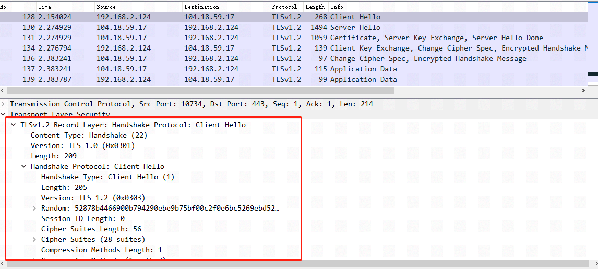

首先客户端会向服务端发送一个Client Hello的握手包，从中可以看到类型为HandShake，TLS版本为1.0，数据长度为209。实际的数据位于Client Hello的下拉列表中。

部分字段介绍如下。

**Version** 

代表客户端支持的TLS版本，首选客户端希望支持的最新协议版本。

**Random**

Random是一个32字节的随机数，前4个字节为epoch格式的当前日期时间。其余28个字节由随机生成器生成。

**Seesion ID**

如果客户端希望复用之前的连接，就会带上该参数，如果该参数为空，那么客户端可能是第一次连接或是希望重新进行认证。

客户端发送这个Session ID后，服务端会在缓存中查找是否匹配，如果匹配成功，就会在后面的Server Hello消息中发送同样的Session ID。之后将会复用之前协商的参数，直接发送Change Cipher Spec消息，建立连接。

通过这种方式，可以减少握手时间。

**Cipher Suites**

客户端还会发送自己知道的密码套件列表，其按照客户端支持的优先级排列，但最终使用哪个算法还是由服务端决定。

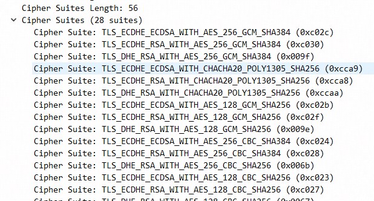

这些加密算法按照一定的规则命名，比如下面这个例子。

```bash
Cipher Suite: TLS_ECDHE_ECDSA_WITH_AES_128_GCM_SHA256 (0xc02b)
```

- TLS：指使用的协议是TLS

- ECDHE：密钥交换算法

- ECDSA：签名或验证算法

- AES_128_GCM：批量加密算法。

- SHA256：消息认证算法。

**Compression Methods**

为了减少带宽，可以选择压缩数据，但是使用压缩时可能捕获到用HTTP头发送的参数，从而劫持Cookie，因此从TLS1.3开始，就开始禁用了压缩。

**Extensions**

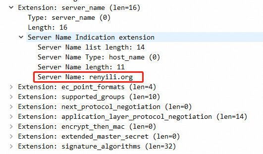

扩展信息，包含服务器名称，支持的签名算法等信息。

## 3.2 服务端发送ServerHello等消息

服务端回复的消息共有4个，且在不同的数据包中，这些消息分别是：

1. Server Hello消息。
2. Certificate，证书信息。
2. Server Key Exchange，服务端密钥交换信息。
3. Server Hello Done，问好完毕信息。

### 3.2.1 ServerHello消息

服务端在收到客户端的Hello信息后，将会进行答复，答复是必须的。服务端会验证客户端Hello协议中的TLS版本信息、加密算法等信息，如果不能满足客户端的条件，那么它将会返回握手失败的消息。若可以满足，将会发送ServerHello消息。

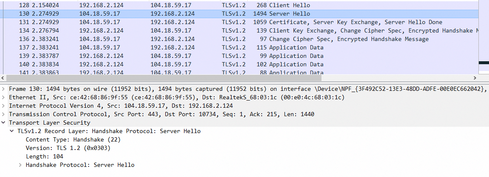

下图是Server Hello消息中的详细数据。

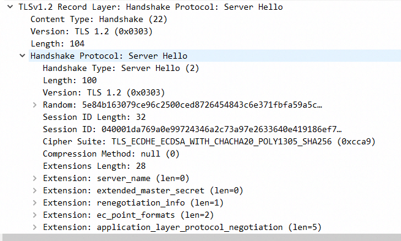

**Version**

版本号，从这里看到版本号是TLS1.2版本，说明服务端同意使用1.2版本。

**Random**

类似客户端的随机数，服务端也会生成一个随机数，前4个字节依旧是时间，后面28个字节是随机数。

**Cipher Suite**

服务端会从客户端发送的密码套件列表中选择1个，这里选择的是`TLS_ECDHE_ECDSA_WITH_CHACHA20_POLY1305_SHA256`。

**Session ID**

服务端会将协商的Session参数存储在TLS缓存中，并生成与其对应的Session id。它与Server Hello一起发送到客户端。客户端会将Session id存储下来，并设置到期时间。

客户端在Client Hello中会包含此id。如果客户端在到期时间之前再次连接到服务端，则服务端可以检查与Session id对应的缓存参数，并重用它们，无需再次协商。 

 **Compression Method**

 如果支持，服务端将会同意客户端的首选压缩方法，在这个例子中，服务器响应为空，说明服务器不会进行压缩。

### 3.2.2 证书消息

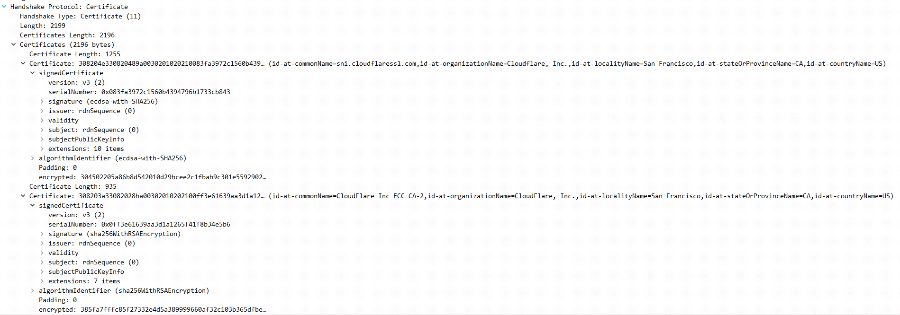

在这个例子中，证书有2199字节大小，这包含完整的证书信息，包括信任链的信息。在信息链中，首先发送服务器的证书，之后发送验证服务器证书的中间证书颁发机构的证书，之后依次递归，服务器不会发送根证书颁发机构的信息，因为这个信息在浏览器本地有存储。

从上面的例子中，可以看到首先是`sni.cloudflaressl.com`的证书，之后是中间证书颁发机构`CloudFlare Inc ECC CA-2`的证书。证书属于谁可以从`id-at-commonName`字段中看到。

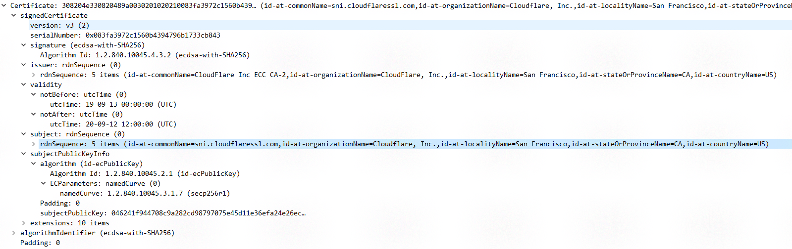
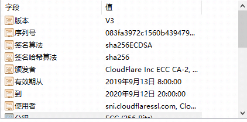

将协议中的字段与真实证书的字段再比对一下。

- signature，证书的签名hash算法。示例中的hash算法为`SHA-256`，签名算法为`sha256ECDSA`。
- Issuer，证书的颁发机构。这里可以看到是CloudFlare Inc ECC CA-2。
- Validity，合法性。该字段有2个值，Not Before和Not After。如果当前日期不在这些值之间，则证书无效，浏览器就不会信任该证书。
- subject，证书的使用者。这里看到是sni.cloudflaressl.com。
- Subjecdt Public Key Info，该字段携带公钥和用于生成公钥的算法，该密钥用于交换密钥。


### 3.2.3 Server Key Exchange消息

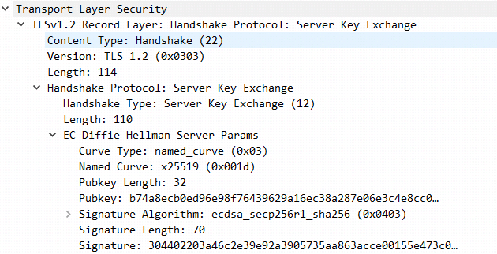

服务器密钥交换协议是可选的，只有当服务器提供的证书不足以允许客户端交换预主密钥时，才会发送此消息。

由于协商的密码套件是`TLS_ECDHE_ECDSA_WITH_CHACHA20_POLY1305_SHA256`，意味着双方使用`Elliptic Curve Diffie Hellman`算法来交换密钥，在该算法中，客户端无法自行计算预主密钥，因此客户端需要从服务端获取Diffie-Hellman公钥。当使用该算法时，这个公钥并不在证书中，因此服务器必须要在单独的消息中向客户端发送公钥，以便客户端可以计算预主密钥。

### 3.2.4 Server Hello Done消息

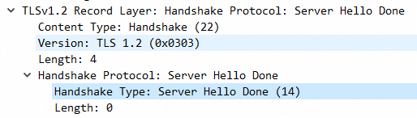

这条信息很简单，表示服务端已经问好完毕。

## 3.3 客户端发送ChangeCipherSpec等消息

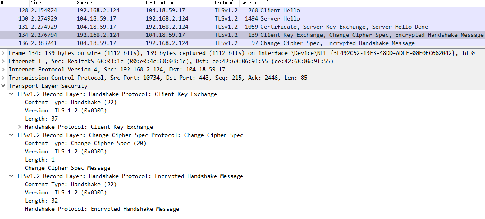

在服务器发送完Server Hello消息后，客户端将会回复必要的信息，从截图中来看，有3部分的信息。

1. Client Key Exchange，客户端密钥交换信息。
2. Change Cipher Spec信息。
3. Encrypted Handshake Meesage（Finished）信息。

接下来分别对这3部分数据进行说明。

### 3.3.1 Client Key Exchange消息

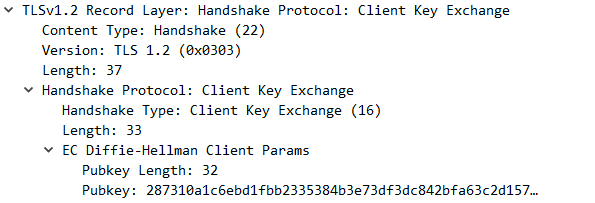

前面提到，Diffie-Hellman算法需要进行密钥交换，而服务器通过Server Key Exchange消息已经将服务端生成的公钥发送给了客户端。

客户端也需要创建一个密钥对，并通过该消息将客户端创建的公钥发送给服务端进行共享。

### 3.3.2 Change Cipher Spec消息

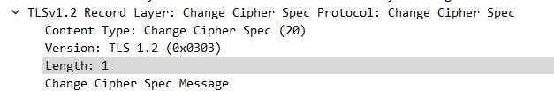

通过密钥交换，客户端与服务端都已经可以计算出预主密钥（这个会在后面进行说明）。之后客户端会发送Change Cipher Spec消息，用来向服务器说明自己已经计算出了主密钥，之后的通信将会采用协商好的对称加密算法和密钥加密传输。

### 3.3.3 Encrypted Handshake Message（Finished）消息

为了确保服务器也计算出了同样的主密钥，客户端会使用协商好的密钥、加密算法以及hash算法生成一个测试消息发给服务端，服务端会验证解密是否成功。

这个加密的信息就在Encrypted Handshake Message消息中，如下图所示，由于这个时候消息已经加密，因此无法从wireshark中得到明文消息。

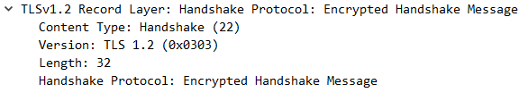

## 3.4 服务器发送Change Cipher Spec等消息

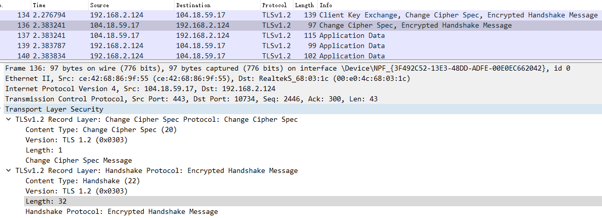

服务器在收到客户端的Client Key Exchange消息后，也已计算出了主密钥，之后会向客户端发送2条消息。

1. Change Cipher Spec消息。
2. Encrypted Handshake Message消息。

### 3.4.1 Change Cipher Spec消息

这个时候服务端也已经计算出对应的主密钥，因此也会向客户端发送Change Cipher Spec消息，表示后续的数据将会采用协商好的加密方式以及密钥传输。

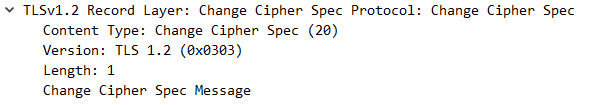

### 3.4.2 Encrypted Handshake Message消息

服务端在收到客户端发送的Encrypted Handshake Message消息后，会尝试用自己的密钥对其进行解密，如果解密成功，说明协商的加密算法以及密钥等信息正确。

为了确保客户端使用的也是正确的加密算法和密钥，服务端也会生成一个测试消息发送给客户端，如果客户端成功解密，那么双方便都协商正确。

之后就可使用协商好的算法、密钥进行数据传输了。

服务端在解密客户端消息成功后，之所以还会再发送一个测试消息确保客户端正常解密的原因是，客户端加密的密钥和服务端加密的密钥是不同的。这点在下面的密钥计算部分说明。

# 四、密钥计算

密钥的计算分为3步，

1. 计算预主密钥。
2. 根据预主密钥计算主密钥。
3. 根据主密钥计算实际对称加密的密钥。

### 4.1 计算预主密钥

由于算法的不同，预主密钥的计算方法也不同，常见的两种算法是RSA算法和Diffie-Hellman算法。在之前的例子中，博客的证书采用的是Diffie-Hellman算法。

#### 4.1.1 RSA算法计算

前面提到，服务端发送了密钥交换信息（Server Key Exchange），这个信息在算法为Diffie-Hellman时才会发送，而在RSA算法下，则不会发送。

在RSA算法下，预主密钥完全由客户端进行计算。客户端通过连接协议版本（2个字节）和客户端随机生成的一些字节（46字节）来生成48位的预主密钥。之后客户端通过服务器证书上的公钥对预主密钥进行加密，之后通过Client Key Exchange消息发送给服务端，服务端使用私钥解密后，拿到预主密钥。

#### 4.1.2 Diffie-Hellman算法计算

在Diffie-Hellman算法中，预主密钥的计算需要客户端与服务端共同计算出来。

首先，服务端发送的密钥交换信息（Server Key Exchange）中，这其中包含了服务端算出的Diffie-Hellman公钥，之后，在客户端发送的密钥交换信息（Cilent Key Exchange）中，也将携带客户端生成的Diffie-Hellman公钥。

通过服务端与客户端发送给对方的公钥，就可以计算出预主密钥。

计算方法大致可以用下面的例子来理解。

首先客户端A和服务端B都有一个共同颜色，黄色。黄色对应着**证书**中的公钥，服务端B直接把黄色发送给了客户端A，被中间者拦截无所谓。之后，A和B各自生成一个私钥，分别对应图中的橙色和绿色，不互相发送，中间者也不知道。

A和B各自根据自己的私钥以及证书的公钥计算出一个新的值，相当于图中的颜色混合，对A来说是黄色与橙色混合，形成了粉色。对B来说是黄色与绿色混合形成了蓝色。

之后双方把生成的颜色互相发送给对方，也即Key Exchange信息中的公钥，中间人也可以拿到这个值。在获取到对方的颜色后，A将蓝色与自己的橙色，也即自己的私钥进行运算，最终得到褐色，褐色便是预主密钥。同样，B拿到粉色后，将其与自己的绿色，也即自己的私钥进行运算，最终也到了褐色，这样就也得到了预主密钥。

对中间人来说，它能够拿到的只有黄色、粉色以及蓝色，但由于它不知道A和B的私钥，因此它无法得到最终的褐色。

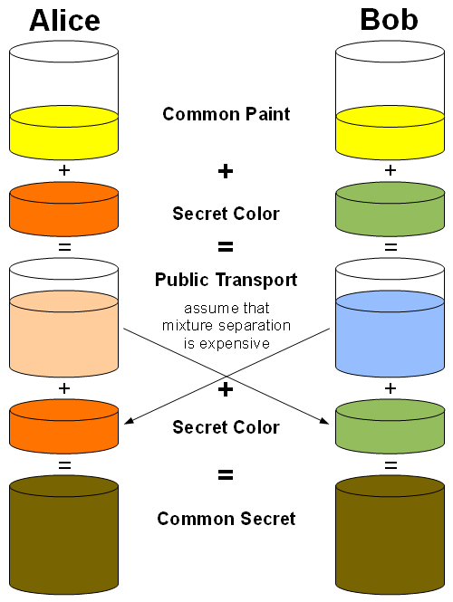

### 4.2 计算主密钥

现在服务器以及客户端都有了这几个值，

1. pre_master_secret，预主密钥。
2. "master secret"，一个ascii字符串。
3. ClientHello.random，客户端hello消息中的随机数。
4. ServerHello.random，服务端hello消息中的随机数。

主密钥生成的方法是：

```bash
master_secret = PRF（pre_master_secret，“master secret”，ClientHello.random + ServerHello.random）[0..47];
```

其中的PRF是一个伪随机函数，用来生成随机数，最终的主密钥是随机数的前48字节。

虽然计算出了主密钥，但客户端与服务端并不直接用这个主密钥进行加解密，而是根据这个主密钥又生成了几个密钥用来加密。

### 4.3 根据主密钥计算实际加密的密钥

根据要求，会根据主密钥生成4个密钥，分别是：

1. 客户端数据加密密钥，客户端用来对数据进行加密的密钥，服务端用来解密。
2. 服务端数据加密密钥，服务端用来对数据进行加密的密钥，客户端用来解密。
3. 客户端MAC密钥，客户端用来根据该密钥创建MAC，服务端用来校验MAC。
4. 服务端MAC密钥，服务端用来根据该密钥创建MAC，客户端用来校验MAC。

这里解释下MAC，TLS不仅仅会对传输的数据进行加密，为了防止数据被纂改，TLS还会生成传输数据的Hash，这个HASH被称为MAC。

这个MAC值会通过明文数据以及生成的MAC密钥计算生成，Hash算法是之前的算法协商阶段协商出的算法，MAC密钥的作用是为了防止中间者从数据中计算出一样的MAC。生成的MAC值会跟明文一并被加密发送到服务端。

服务端收到数据后，对数据进行解密，之后将明文数据与MAC分开，使用同样的算法和MAC密钥重新计算明文的MAC值，之后与得到的MAC值进行比对，如果匹配，那么便说明数据没有被纂改。

上面的4个密钥通过下面的方式生成：

```bash
key_block = PRF(SecurityParameters.master_secret, "key expansion", SecurityParameters.server_random + SecurityParameters.client_random);
```

PRF函数可以生成任意长度的数据，通过循环往复的生成，直到生成满足要求的密钥字节数。

在某些加密算法中，还需要一段数据作为初始化向量（IV），这段数据也会通过上面的方法一并生成。

# 五、小结

TLS确实比较复杂，经过一番学习，也只是对其大致的流程有了一些认识，更为深入的认知还需要通过不断的实践学习。另注意，上面总结的内容均是基于TLS1.2的，TLS1.3版本还未了解。

以上资料都参考自网络，若有错误，欢迎评论指正。

# 六、参考链接

1. [传输层安全性协议](https://zh.wikipedia.org/wiki/%E5%82%B3%E8%BC%B8%E5%B1%A4%E5%AE%89%E5%85%A8%E6%80%A7%E5%8D%94%E5%AE%9A)
2. [SSL/TLS协议详解(上)：密码套件，哈希，加密，密钥交换算法](https://xz.aliyun.com/t/2526)
2. [SSL/TLS协议详解(中)——证书颁发机构](https://xz.aliyun.com/t/2530)
3. [SSL/TLS协议详解(下)——TLS握手协议](https://xz.aliyun.com/t/2531)
4. [The Transport Layer Security (TLS) Protocol](https://tools.ietf.org/html/rfc5246)