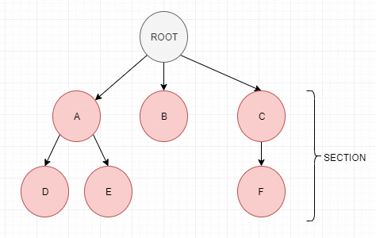

# 介绍

[Catch2](https://github.com/catchorg/Catch2)是一个C++单元测试库，相较于其他的C++单元测试库，比如Google Test、Boost.Test、CppUnit等，Catch2有以下特点。

1. 使用简单，只需要包含`catch.hpp`头文件即可使用。
2. 没有额外依赖，只需要C++标准库以及支持C++11的编译器即可。
3. 可将单元测试分为几个section，每个section都是独立运行的。
4. 同时支持传统单元测试模式以及BDD单元测试模式。
5. 只有一个核心的断言宏，使用C++的操作符进行比较。
6. 可以用任何形式的字符串给测试命名，不用担字符是否合法。

# 使用示例

一个使用Catch2的的单元测试代码如下：

```cpp
/// 定义CATCH_CONFIG_MAIN宏后，main函数由catach2自动生成，无需手动实现
#define CATCH_CONFIG_MAIN
#include "catch.hpp"

// 被测函数
unsigned int Factorial(unsigned int number) {
    return number <= 1 ? number : Factorial(number - 1)*number;
}

// 单元测试
TEST_CASE("Factorials are computed", "[factorial]") {
    // REQUIRE断言宏，如果不符合预期将直接退出该用例，不再执行后续代码
    REQUIRE(Factorial(0) == 1);
    REQUIRE(Factorial(1) == 1);
    REQUIRE(Factorial(2) == 2);
    REQUIRE(Factorial(3) == 6);
    REQUIRE(Factorial(10) == 3628800);

    // CHECK断言宏，如果不符合预期，将会继续执行后续代码
    CHECK(Factorial(1) == 1);
    CHECK(Factorial(2) == 2);
    CHECK(Factorial(3) == 6);
    CHECK(Factorial(10) == 3628800);
}
```

在这个例子中，在包含`catch.hpp`头文件之前，定义了宏`CATCH_CONFIG_MAIN`，这个宏告诉Catch2由其自动生成main函数，若不想由Catch2自动生成main函数，可以在后面的[自实现main函数](#自实现main函数)部分了解。如果有多个文件都需要包含`catch.hpp`文件，只用在一个实现文件中定义`CATCH_CONFIG_MAIN`宏，若定义多个显然会无法编译通过。

在`TEST_CASE`中实现单元测试逻辑，相较于其他单元测试框架，Catch2的断言宏很少，核心的只有`REQUIRE`和`CHECK`这两个。`REQUIRE`宏在断言失败时，会退出当前单元测试，不再执行后续代码，而CHECK宏在断言失败后，依旧会执行后续的代码。

# 单元测试编写

Catch2有两种单元测试模式，分别是传统模式和BDD模式。

## 传统模式

传统模式使用TEST_CASE宏定义单元测试，

```cpp
TEST_CASE( test name [, tags ] )
```

TEST_CASE宏需要2个参数，

- test name，测试用例名，必填，字符串类型。可填写任意字符串，需要保证全局唯一。
- tags，标签名，可选，字符串类型。字符串中需要使用方括号将标签名包含，可填写多个标签。标签名无需全局唯一。

一些示例有，

```cpp
TEST_CASE( "A", "[widget]" ) { /* ... */ }
TEST_CASE( "B", "[widget]" ) { /* ... */ }
TEST_CASE( "C", "[gadget]" ) { /* ... */ }
TEST_CASE( "D", "[widget][gadget]" ) { /* ... */ }
```

标签可以标记同一类测试用例，通过命令行参数可以指定属于某个tag的测试用例执行。在上面的例子中，如果选择`[widget]`标签，那么将会选中`A`、`B`、`D`这3个测试用例。如果选择`[gadget]`标签，那么将会选择`C`、`D`这两个测试用例。

除了这类普通的标签外，还有一些特殊的标签，见[Tags](https://github.com/catchorg/Catch2/blob/master/docs/test-cases-and-sections.md#Tags)。

传统模式除了提供基本的测试功能外，还可将测试用例内部划分为几个section，**定义的每个section都是一段独立的逻辑，与其他section无关**。section使用宏`SECTION`定义，

```cpp
SECTION( section name )
```

- section name，section名，字符串类型，必填。

传统模式的示例代码如下。

```cpp
TEST_CASE( "vectors can be sized and resized", "[vector]" ) {

    std::vector<int> v( 5 );

    REQUIRE( v.size() == 5 );
    REQUIRE( v.capacity() >= 5 );

    // section1
    SECTION( "resizing bigger changes size and capacity" ) {
        v.resize( 10 );

        REQUIRE( v.size() == 10 );
        REQUIRE( v.capacity() >= 10 );
    }
    // section2
    SECTION( "resizing smaller changes size but not capacity" ) {
        v.resize( 0 );

        REQUIRE( v.size() == 0 );
        REQUIRE( v.capacity() >= 5 );
    }
    // section3
    SECTION( "reserving bigger changes capacity but not size" ) {
        v.reserve( 10 );

        REQUIRE( v.size() == 5 );
        REQUIRE( v.capacity() >= 10 );
    }
    // section4
    SECTION( "reserving smaller does not change size or capacity" ) {
        v.reserve( 0 );

        REQUIRE( v.size() == 5 );
        REQUIRE( v.capacity() >= 5 );
    }
}
```

上面的代码中，使用`SECTION`宏将代码划分成了一个个代码section，这些代码section的执行互不干扰，且都从测试用例起始代码开始执行。在上面例子中，首先定义了1个大小为5的vector，当开始执行section1时，vector大小为5，这是理所当然的。而当开始执行section2时，vector的大小依旧为5，而不是10，它的大小与section1的执行完全无关。当开始执行section3时，vector大小依旧为5，section4同理。

更强大的是，section中可以内嵌section，比如下面的例子。

```cpp
SECTION( "reserving bigger changes capacity but not size" ) {
    v.reserve( 10 );

    REQUIRE( v.size() == 5 );
    REQUIRE( v.capacity() >= 10 );

    SECTION( "reserving smaller again does not change capacity" ) {
        v.reserve( 7 );

        REQUIRE( v.capacity() >= 10 );
    }
}
```

section中可以内嵌任意多个section（受限于堆栈的大小）。可将内嵌section的结构可以理解为一个树结构，树的根节点是单元测试的起始代码，每个含有内嵌section的section都是根的一个子树，没有内嵌section的section是树的叶子节点。Catch2会遍历执行树的所有路径（根到叶子节点），每个路径的执行均与其他路径的执行不相关。




## BDD模式

> BDD，全称Behavior-driven             development，译为行为驱动开发，是敏捷开发的一种技术，它鼓励软件项目中的开发者、QA和非技术人员或商业参与者之间的协作。BDD的重点是通过与利益相关者的讨论取得对预期的软件行为的清醒认识。它通过用自然语言书写非程序员可读的测试用例扩展了测试驱动开发方法。

具体来说，一个典型的BDD测试形式如下。

```bash
Feature: 简单的介绍这个功能
  对功能的更多介绍
  介绍....

  Scenario: 要测试的测试案例1
    Given 前提条件是....
    When 做了某件事....
    Then 结果应该得到...

  Scenario: 要测试的测试案例2
    Given 前提条件是....
    When 做了某件事....
    Then 结果应该得到...
```

在Catch2中，提供了`SCENARIO`、`GIVEN`、`WHEN`、`THEN`等宏。

```cpp
SCENARIO( scenario name [, tags ] )
```

- scenario name，场景名，必填，字符串类型。可填写任意字符串，需要保证全局唯一。
- tags，标签名，可选，字符串类型。字符串中需要使用方括号将标签名包含，可填写多个标签。标签名无需全局唯一。

`SCENARIO`宏在实现上与`TEST_CASE`宏相同，只是在测试用例名称前会自动添加**"Scenario: "**前缀。

```cpp
GIVEN( something )
WHEN( something )
THEN( something )
```

`GIVEN`、`WHEN`、`THEN`宏在实现上与`SECTION`宏相同，只是会在section名前增加**"given: "**、**"when: "**、**"then: "**前缀。

```cpp
AND_GIVEN( something )
AND_WHEN( something )
AND_THEN( something )
```

同`GIVEN`、`WHEN`、`THEN`宏，只是增加了**”and"**前缀。

**使用这些宏除了会在输出中增加对应的前缀以及以GIVEN、WHEN等格式展示外，其实际的行为与TEST_CASE、SECTION完全一致。**

使用的例子如下。

```cpp
SCENARIO( "vectors can be sized and resized", "[vector]" ) {

    GIVEN( "A vector with some items" ) {
        std::vector<int> v( 5 );

        REQUIRE( v.size() == 5 );
        REQUIRE( v.capacity() >= 5 );

        WHEN( "the size is increased" ) {
            v.resize( 10 );

            THEN( "the size and capacity change" ) {
                REQUIRE( v.size() == 10 );
                REQUIRE( v.capacity() >= 10 );
            }
        }
        WHEN( "the size is reduced" ) {
            v.resize( 0 );

            THEN( "the size changes but not capacity" ) {
                REQUIRE( v.size() == 0 );
                REQUIRE( v.capacity() >= 5 );
            }
        }
        WHEN( "more capacity is reserved" ) {
            v.reserve( 10 );

            THEN( "the capacity changes but not the size" ) {
                REQUIRE( v.size() == 5 );
                REQUIRE( v.capacity() >= 10 );
            }
        }
        WHEN( "less capacity is reserved" ) {
            v.reserve( 0 );

            THEN( "neither size nor capacity are changed" ) {
                REQUIRE( v.size() == 5 );
                REQUIRE( v.capacity() >= 5 );
            }
        }
    }
}
```

# 断言宏

Catch2有两类断言宏，分别是`REQUIRE`类和`CHECK`类，这两类宏的区别在于，`REQUIRE`宏在断言失败后，会终止当前测试的执行，而`CHECK`则不会，会继续向下执行。

相较于其他单元测试框架，Catch2的断言宏并不是很多，它主要靠标准的操作符来进行判断。

Catch2的断言宏是非线程安全的，这点要注意，详情见[the limitations page](https://github.com/catchorg/Catch2/blob/master/docs/limitations.md#thread-safe-assertions)。

下面对Catch2的断言宏进行说明。

## 普通表达式

**REQUIRE & CHECK**

```cpp
REQUIRE( expression );
CHECK( expression );
```

这两个宏是Catch2的核心断言宏，验证表达式是否成立。

大小、不等等条件可直接使用操作符`>`、`<`、`!=`。而在Google Test中，要验证相等、不等、大于等情况则要分别使用`EXPECT_EQ`、`EXPECT_NE`、`EXPECT_GT`等宏。

简单的例子有：

```cpp
CHECK( str == "string value" );
CHECK( thisReturnsTrue() );
REQUIRE( i == 42 );
CHECK(i > 10);
```

**REQUIRE_FALSE & CHECK_FALSE**

```cpp
REQUIRE_FALSE( expression );
CHECK_FALSE( expression );
```

这两个宏用来验证结果为假，主要用来解决某些 **!** 无法处理的情况。

**注意**

虽然是使用标准的操作符，但不能使用`&&`或`||`这类操作符，比如`CHECK(a == 1 && b == 2);`和`CHECK( a == 2 || b == 1 );`。这类的表达式对Catch2来说过于复杂，会无法编译通过，可将这类表达式拆分为多个简单表达式。

## 浮点

在比较浮点数时，有时需要允许一定的误差和不精确的表示形式，在Catch2中，比较浮点数使用`Apporx`类，它允许在一定的误差范围内比较浮点数。它重载了`==`符，可直接进行比较，一个直接的例子如下。

```cpp
REQUIRE(performComputation() == Approx( 2.1 ));
```

Approx类提供了3个方法，分别是：

1. epsilon，它用来设置一个误差百分比，在百分比范围内即认定为相等。比如设为0.01，即意味着误差在1%范围内，结果便相等。默认情况下的epsilon值为`std::numeric_limits<float>::epsilon()*100`。其中`std::numeric_limits<float>::epsilon()`为1.0和float的下一个可表示值之间的差值。
2. margin，epsilon用来设置一个相对误差，而margin则用来设置一个绝对误差，比如设为5，那么便在±5的范围内认为相等。默认情况下为0.0。
3. scale，scale用于更改Apporx的量级以进行相对比较，使用scale后，允许的误差是(Approx::scale + Approx::value)* epsilon， scale默认值为0.0。

下面是一些使用示例。

**epsilon**

```cpp
Approx target = Approx(100).epsilon(0.01);
100.0 == target; // true，误差为1
200.0 == target; // false
100.5 == target; // true
```

**margin**

```cpp
Approx target = Approx(100).margin(5);
100.0 == target; // true，误差为5
200.0 == target; // false
104.0 == target; // True
```

**scale**

```cpp
Approx target = Approx(100).scale(100).epsilon(0.01);
100.0 == target; //  true，允许误差为2
101.5 == target; //  true
200.0 == target; //  false
```

## 异常

**REQUIRE_NOTHROW & CHECK_NOTHROW**

```cpp
REQUIRE_NOTHROW( expression );
CHECK_NOTHROW( expression );
```

验证表达式没有抛出异常。

**REQUIRE_THROWS & CHECK_THROWS**

```cpp
REQUIRE_THROWS( expression );
CHECK_THROWS( expression );
```

验证表达式触发异常。

**REQUIRE_THROWS_AS & CHECK_THROWS_AS**

```cpp
REQUIRE_THROWS_AS( expression, exception type );
CHECK_THROWS_AS( expression, exception type );
```

验证表达式抛出了指定类型的异常。

还有一些其他类型的断言宏，可以参见官方文档[Assertion Macros](https://github.com/catchorg/Catch2/blob/master/docs/assertions.md#top)。

# 命令行参数

catch2支持的命令行参数有很多，这里挑选一些比较常用的命令行参数进行说明。

```bash
-?, -h, --help                            display usage information
<test-spec> ...
-l, --list-tests                          list all/matching test cases
-t, --list-tags                           list all/matching tags
-s, --success                             include successful tests in
-b, --break                               break into debugger on failure
-o, --out <filename>                      output filename
-r, --reporter <name>                     reporter to use (defaults to console)
-d, --durations <yes|no>                  show test durations
```

**\<test-spec>...参数**

指定哪些单元测试执行，可以是单元测试名或是通配符名，也可以是tag。单元测试名如果有空格则必须要用双引号，而tag则必须要使用中括号。

通配符是*号，可以出现在字符串的开头和结尾，匹配任意多个任意字符，也包括空字符。

在字符串的最前面使用~号表示把匹配上测试用例给排除掉，不再执行。

下面是一些例子。

```bash
thisTestOnly            Matches the test case called, 'thisTestOnly'
"this test only"        Matches the test case called, 'this test only'
these*                  Matches all cases starting with 'these'
exclude:notThis         Matches all tests except, 'notThis'
~notThis                Matches all tests except, 'notThis'
~*private*              Matches all tests except those that contain 'private'
a* ~ab* abc             Matches all tests that start with 'a', except those that
                        start with 'ab', except 'abc', which is included
```

若要指定tag，那么tag名需要被方括号包含，一个例子如下。表示匹配同时含有[one]和[two]以及含有[three]的单元测试。

```bash
[one][two],[three]
```

**-r参数**

```bash
-r, --reporter <reporter>
```

-r参数用来选择reporter，所谓reporter是一个用来格式化和汇总测试结果的对象，默认的reporter是console。一些可选的reporter有，

- console，默认reporter。
- compact，输出结果会更加紧凑。
- xml，输出成xml格式。
- junit，输出成符合junit规范的格式。

**-b参数**

```bash
-b, --break
```

在调试状态下，通过该参数可以让Catch2在执行测试用例失败时，自动中断到调试器中，以便用户查看用例失败时的状态。

**-s参数**

```bash
-s, --success
```

默认情况下Catch2只会显示失败的测试用例情况，通过该参数，可以让Catch2输出成功用例的详细情况。

**-l、-t等参数**

```bash
-l, --list-tests
-t, --list-tags
--list-reporters
```

`-l`和`--list-tests`参数用来列出所有的测试用例名。

`-t`和`--list-tags`参数用来列出所有的tag名。

`--list-reporters`参数用来列出所有可选的reporter。

**-o参数**

```bash
-o, --out <filename>
```

默认情况下，结果通过stdout的方式输出，通过该参数可让结果输出到文件中，。

**-d参数**

```bash
-d, --durations <yes/no>
```

默认情况下，catch2的结果不显示用例的执行时间，通过指定该参数为yes，可以输出测试用例的执行时间，单位为毫秒。

# 自实现main函数

默认情况下，在包含catch.hpp头文件前定义宏`CATCH_CONFIG_MAIN`即可让Catch2自动生成main函数，但有时候需要添加额外的命令行参数，或是需要做一些初始化反初始化的操作，这种情况下就需要自己提供一个main函数。

从3个不同的使用场景说明下如何自实现main函数。

## 完全让Catch处理参数

这种情况下，完全让Catch2处理参数，不对参数做任何修改，仅仅是为了增加初始化以及反初始化的代码。

```cpp
/// 注意宏改为了 CATCH_CONFIG_RUNNER
#define CATCH_CONFIG_RUNNER
#include "catch.hpp"

int main( int argc, char* argv[] ) {
  // global setup...

  int result = Catch::Session().run( argc, argv );

  // global clean-up...

  return result;
}
```

这里要注意一点，包含catch.hpp前的宏名改为了 `CATCH_CONFIG_RUNNER`。

在这个例子中，只需要在`run`函数前后实现初始化和反初始化代码即可。

## 修改参数

这种情况下，还是让Catch2处理参数，但会对输入的参数进行调整修改。代码如下。

```cpp
#define CATCH_CONFIG_RUNNER
#include "catch.hpp"

int main(int argc, char* argv[])
{
    Catch::Session session;

    // 通过修改configData()对象来设置参数
    session.configData().reporterName = "compact";
    session.configData().showDurations = Catch::ShowDurations::OrNot::Always;

    // catch解析输入的命令行参数
    int returnCode = session.applyCommandLine(argc, argv);
    if (returnCode != 0) // Indicates a command line error
        return returnCode;

    // 在解析完输入参数后，这里可修改configData()以重写覆盖参数
    session.configData().reporterName = "xml";

    int numFailed = session.run();

    return numFailed;
}
```

参数的处理依旧由Catch2负责，但可以调整configData()返回的配置实例以修改参数。

默认情况下，Catch2不会输出每个测试用例的运行时间，通过这种方法，可以设置默认输出测试用例的执行时间。

## 增加自定义参数

在之前的例子中，增加和修改的参数依旧是合法的Catch2参数，如果想要增加自定义的参数就需要下面这种方式。

```cpp
#define CATCH_CONFIG_RUNNER
#include "catch.hpp"

int main(int argc, char* argv[])
{
    using namespace Catch::clara;
    Catch::Session session;

    // 定义与选项关联的变量
    int height = 0;
    auto cli = session.cli()     // 获取Catch的命令行解析器
        | Opt(height, "height")  // 将变量绑定到带有提示字符串的新选项
        ["-g"]["--height"]       // 指定与变量相关联的选项名
        ("how high?");           // 指定选项的描述信息以在帮住信息中显示


    // 将新增的选项添加到Catch中
    session.cli(cli);

    // Let Catch (using Clara) parse the command line
    int returnCode = session.applyCommandLine(argc, argv);
    if (returnCode != 0) // Indicates a command line error
        return returnCode;

    // if set on the command line then 'height' is now set at this point
    if (height > 0)
        std::cout << "height: " << height << std::endl;

    return session.run();
}
```

程序编译好后，输入`-h`参数查看帮助信息，将会看到新增的`-g`参数。

```BASH
  -g, --height <height>                     how high?
```

若单元测试存在自定义的处理逻辑，可通过这种方式增加参数以执行自定义处理逻辑。

# 常见问题

## 为何单元测试编译太慢

有很多人反馈使用Catch2编译程序太慢，Catch2的实现全部都在1个头文件中，这确实会有一些影响，但并没有想象中那么大，可以通过下面这种实践来规避。

将这段代码实现在一个单独的cpp文件中，除了这2行代码外，不再写任何单元测试。

```cpp
#define CATCH_CONFIG_MAIN
// 或
//#define CATCH_CONFIG_RUNNER
#include "catch.hpp"
```

Catch2的所有实现都在一个头文件中，单元测试的实现均需要包含这个头文件，可能会以为编译器在编译每个cpp文件时都要完整的编译Catch2库，但实际上并不是这样，Catch2通过条件宏使得Catch2只被编译1次，被编译的cpp便是定义`CATCH_CONFIG_MAIN`或`CATCH_CONFIG_RUNNER`宏的cpp。

因此尽量避免在定义`CATCH_CONFIG_MAIN`或`CATCH_CONFIG_RUNNER`宏的cpp中实现单元测试，这样就不用修改单元测试后要再完整的编译Catch2库。

更为详细的说明见文档[Why do my tests take so long to compile?](https://github.com/catchorg/Catch2/blob/master/docs/slow-compiles.md#top)

## 在循环语句中定义SECTION

如果要在循环语句中定义secion，那么需要保证secion的名称是不同的，一个推荐的方法是把循环的计数器添加到名字中，示例如下。

```cpp
TEST_CASE( "Looped section" ) {
    for (char i = '0'; i < '5'; ++i) {
        // 在这里将循环计数器添加到了SECTION的命名中
        SECTION(std::string("Looped section ") + i) {
            SUCCEED( "Everything is OK" );
        }
    }
}
```

## 测试用例在失败后可能会再次执行

如果一个用例的最后一个section失败了，那么这个测试可能被再次执行。这是因为Catch2在运行时动态的发现section的，如果测试用例中的最后一个section在运行时终止了，那么Catch2不知道在测试中是否还有其他section，因此需要再运行一遍测试。

## 线程安全

Catch2的断言宏是非线程安全的，但这不意味着无法在使用线程的用例中使用断言宏，而是只有单个线程可与断言宏进行交互，比如下面这个例子便是可以的。

```cpp
std::vector<std::thread> threads;
std::atomic<int> cnt{ 0 };
for (int i = 0; i < 4; ++i) {
    threads.emplace_back([&]() {
        ++cnt; ++cnt; ++cnt; ++cnt;
    });
}
for (auto& t : threads) { t.join(); }
REQUIRE(cnt == 16);
```

而下面这个例子则不行。

```cpp
std::vector<std::thread> threads;
std::atomic<int> cnt{ 0 };
for (int i = 0; i < 4; ++i) {
    threads.emplace_back([&]() {
        ++cnt; ++cnt; ++cnt; ++cnt;
        CHECK(cnt == 16);
    });
}
for (auto& t : threads) { t.join(); }
REQUIRE(cnt == 16);
```

# 参考链接

1. [Why do we need yet another C++ test framework](https://github.com/catchorg/Catch2/blob/master/docs/why-catch.md)
2. [Catch2 Tutorial](https://github.com/catchorg/Catch2/blob/master/docs/tutorial.md)
3. [Catch2 Reference](https://github.com/catchorg/Catch2/blob/master/docs/Readme.md)
4. [catch2:一个好用的C++单元测试框架](https://blog.csdn.net/ithiker/article/details/87909651)
5. [BDD/TDD差別是什麼？ 手把手用 Cucumber 實作示範BDD](https://tw.alphacamp.co/blog/bdd-tdd-cucumber-behaviour-driven-development)