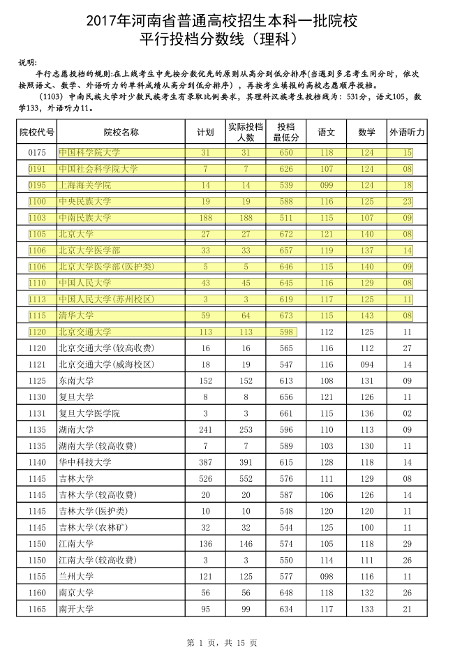
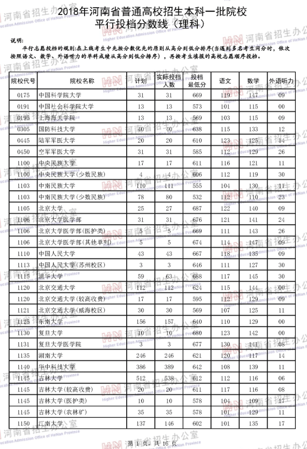
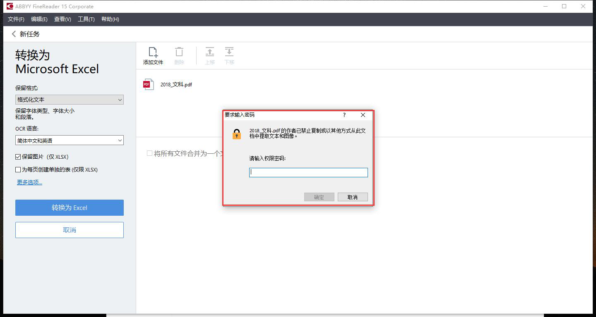
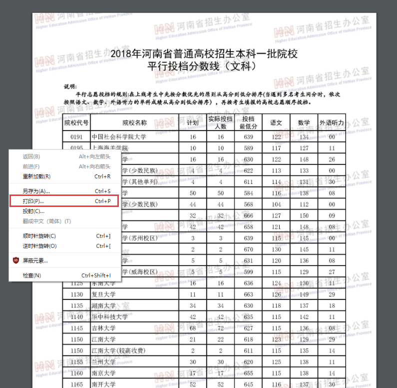
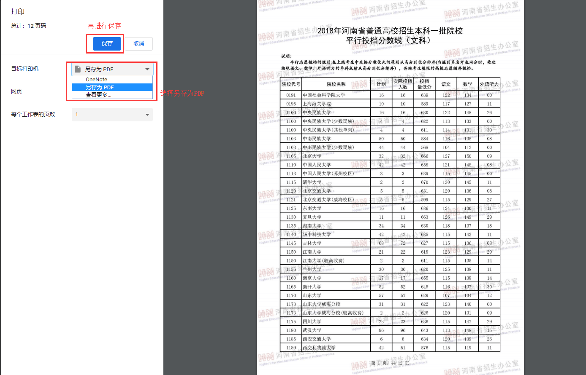
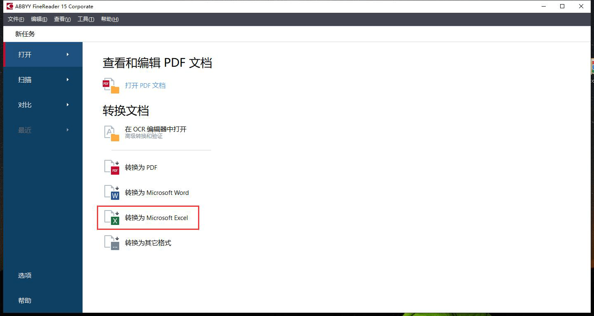
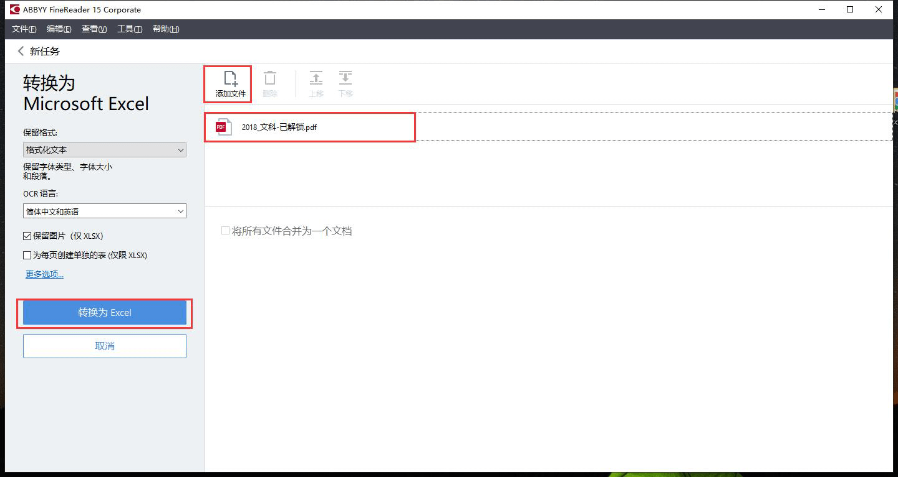
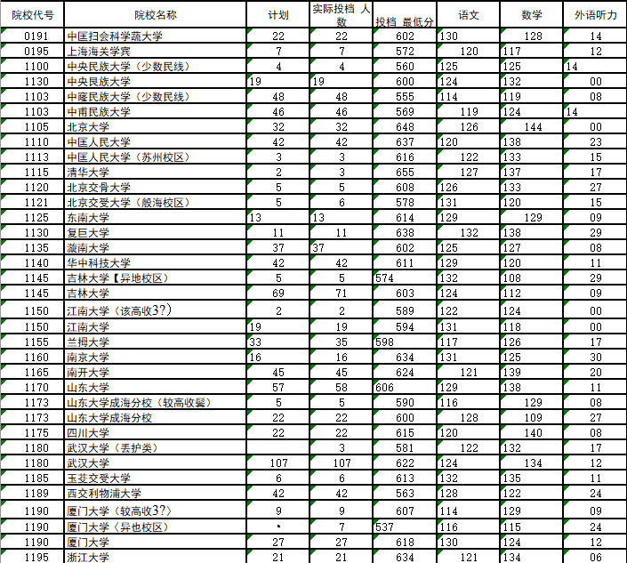
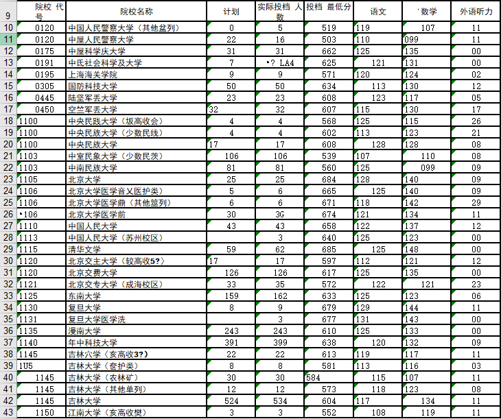
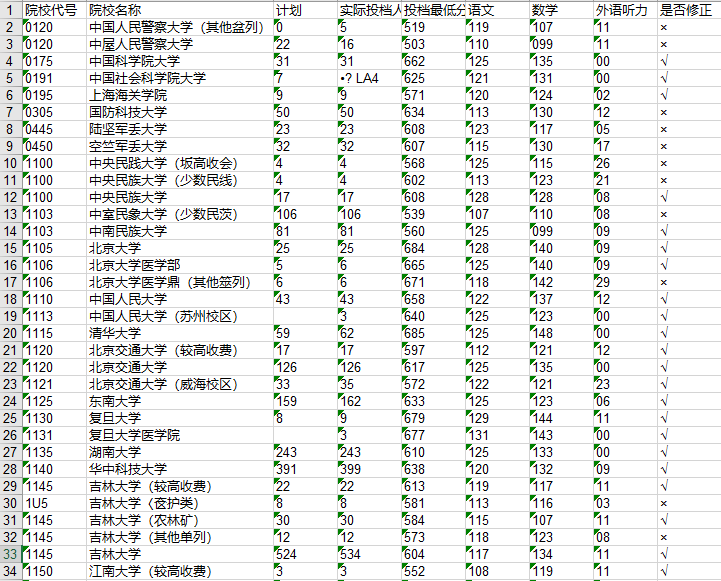

# 背景

家中有老师每年要帮学生报考志愿，而报考志愿需要有**按投档最低分降序排序**的往年投档分数线，而河南招生信息网上提供的投档分数线都是按院校代号升序排序的，这并不满足需求，需要自己进行重排序。但坑爹的是招生网上近两年提供的投档线都是加了水印的PDF，要想重排序将会非常麻烦。

查看17年的投档线，会发现那个时候的PDF是不加水印的文本格式，可以非常容易转换成EXCEL，而在18年以及19年，格式改成了图片加水印，同时还加了权限密码以禁止提取文本和图像，似乎官方并不想让大家转换格式排序。

下面是17年的投档线，是可以直接复制的文本格式，能够非常容易的转换为EXCEL。



这是18年的投档线，是加了水印的图片，很难直接转换为EXCEL。



然而志愿还得报，顺序还得排，办法还得想。

# 解决方法

要想将近两年的投档线PDF转为EXCEL，需要3个步骤。

1. 预处理，去掉权限密码校验，以便可以OCR识别。
2. OCR识别，将图片识别为文字。
3. 后处理，修正识别错误的文字。

## 1. 预处理，去掉权限密码校验

若将18或19年的投档线PDF直接用OCR识别软件进行转换，OCR识别软件将会提示禁止复制以及提取文本。



经过查阅，要想解除这个限制非常简单，直接用Google Chrome即可。将PDF使用Chrome打开，然后右键->打印->另存为PDF->保存，重新生成的PDF文件就解除了校验。





之后再使用OCR识别软件打开重新生成的PDF软件就不再有提示了。若不使用Chrome浏览器，那么也可以使用这两个网站进行解密。

1. [ILovePDF PDF解密](https://www.ilovepdf.com/zh-cn/unlock_pdf)
2. [SmartPDF PDF解密](https://smallpdf.com/cn/unlock-pdf)

上传并解密下载后，再次使用OCR软件也不会提示权限问题了。

## 2. OCR识别，将图片识别为文字

OCR识别软件有很多，但哪个好用呢？在知乎上查看[OCR中文识别用哪种软件识别率比较高？](https://www.zhihu.com/question/19593313)这类讨论，再结合自己的实际体验，这里还是最推荐使用[ABBYY FineReader](https://www.abbyy.cn/finereader/)软件，它的识别功能非常强大，同时也很智能，可直接将投档线PDF的表格格式转为对应的EXCEL表格格式，避免了自己手工二次处理。

`ABBYY FineReader`是收费软件，但可以使用试用版本，30天的试用期，基本上够用了，若想长期使用，也可以付费购买或是网上寻找相关的破解版本。

`ABBYY FineReader`的使用非常简单，这里以最新的15版本为例进行说明。打开软件后，选择`转换为Excel格式`。




之后`添加`要识别的投档线pdf文件，再点击`转换为excel`，之后等其识别生成对应的excel文件即可。




但即使是`ABBYY FineReader`这么强大的软件，碰到投档线中的水印也不好处理，实际识别出的效果是下面这样的，可以看到有很多汉字还是识别错了，比较影响阅读体验。



为了解决这个问题，需要再对OCR识别出的excel进行二次修正处理。

## 3. 后处理，修正识别错误的文字

仔细观察`ABBYY FineReader`识别出的excel文件，会发现错误的主要是学校名称，而像院校代号、分数这类数字基本上都是正确的。

考虑到2017年时的投档线PDF是很容易识别的，而同一个学校的学校代号又不会改变，那么就可以以2017年的投档线为基准，生成学校代号和学校名称的映射表，然后再根据这个映射表以及18、19年excel表格中正确的学校代号即可修正其学校名称。

以上想法自然不可能靠手工实现，直接用Python写个脚本即可，脚本需要依赖xlrd和xlwt库，源码如下。

```python
# encoding:utf8
import xlrd 
import xlwt
import sys
import re

def gen_map(base_xls):
    '''
    用于生成映射表
    '''
    data = xlrd.open_workbook(base_xls)
    table = data.sheets()[0]
    nrows = table.nrows

    school_map = []
    for row in range(nrows):
        data = table.row_values(row)
        # 简单过滤
        if len([i for i in data if i.isdigit()]) > 5:
            school_id = data[0]
            school_name = data[1]
            school_map.append((school_id, school_name))

    return school_map

def get_most_similar_name(filter_map, error_school_id, error_school_name):
    '''
    用于获取最相似的名称，某些相同学校代码下会有多个名称，比如较高学费，医护类等，需要匹配获取最相似的名称
    '''
    # 相似度至少为1
    most_similar_name = (1, None)
    for m in filter_map:
        correct_name = m[1]
        
        split_error_name = re.split("（|〈|《|、", error_school_name)
        split_error_count = len(split_error_name)

        split_correct_name = re.split("（|〈|《|、", correct_name)
        split_correct_count = len(split_correct_name)

        if split_error_count == split_correct_count:
            # 当没有括号时，直接返回正确的名称
            if split_correct_count == 1:
                return correct_name, None

            compare_error_name = split_error_name[split_error_count - 1].strip()
            compare_correct_name = split_correct_name[split_correct_count - 1].strip()
            
            correct_name_len = len(compare_correct_name)
            error_name_len = len(compare_error_name)

            count = correct_name_len if correct_name_len <= error_name_len else error_name_len
            similar_value = 0
            for i in range(count):
                if compare_correct_name[i] == compare_error_name[i] and compare_correct_name[i] != "）":
                    similar_value += 1
            if similar_value >= most_similar_name[0]:
                most_similar_name = (similar_value, m)

    if most_similar_name[1]:
        return most_similar_name[1][1], None
    else:
        return error_school_name, "未找到匹配的最相似的学校名称，继续使用原名称"
    
def rapir_school_name(school_map, error_data):
    '''
    修复学校名称
    '''
    error_school_id = error_data[0]
    error_school_name = error_data[1]

    filter_map = [i for i in school_map if i[0] == error_school_id]
    filter_count = len(filter_map)
    if filter_count == 0:
        return error_school_name, "未在映射表中找到匹配的学校代号 %s, 请更新学校代号" %error_school_id
    else:
        return get_most_similar_name(filter_map, error_school_id, error_school_name)

def rapir(to_rapir_xls, school_map):
    '''
    遍历有问题的excel行，并根据映射表逐一进行修复
    '''
    data = xlrd.open_workbook(to_rapir_xls)
    table = data.sheets()[0]
    nrows = table.nrows

    lines = []
    error_count = 0
    for row in range(nrows):
        data = table.row_values(row)
        # 简单过滤，每行至少6个数字
        if len([i for i in data if i.isdigit()]) > 5:
            rapir_name, error_code = rapir_school_name(school_map, data)
            if error_code:
                error_count += 1
                data.append("×")
                print("[ERROR] 修复%s(%s)学校名称失败，原因：%s" %(data[0], data[1], error_code))
            else:
                data.append("√")
            data[1] = rapir_name
            lines.append(data)

    print("\n[INFO] 共有%d个修复失败项" %error_count)
    return lines

def gen_rapir_xls(name, rapir_data):
    '''
    生成修复后的excel文件
    '''
    workbook = xlwt.Workbook()
    table = workbook.add_sheet("Sheet1")
    rapir_data.insert(0, ["院校代号", "院校名称", "计划", "实际投档人数", "投档最低分", "语文", "数学", "外语听力", "是否修正"])
    for i in range(len(rapir_data)):
        for j in range(len(rapir_data[i])):
            table.write(i, j, rapir_data[i][j])
    workbook.save(name)
    print("[INFO]修复后的%s生成成功" %name)

def main():
    if len(sys.argv) == 3:
        school_map = gen_map(sys.argv[1])
        rapir_data = rapir(sys.argv[2], school_map)
        gen_rapir_xls("修复结果.xls", rapir_data)
    else:
        print("参数错误，参数格式为: convert <基准excel名称> <待修复的excel名称>")

if __name__ == "__main__":
    main()
```

假设上面脚本保存为convert.py，那么使用方法是：
```bash
python convert.py <基准excel名称> <待修复的excel名称>
# 一个示例
python convert.py 2017_理科.xlsx 2019_理科.xlsx
```

为了便于使用，这里使用`pyinstaller`将python代码打包成了可执行的exe，可以点击[这里](https://share.weiyun.com/5Y4B3BS)进行下载，用法与上面python命令行类似，示例如下：

```bash
convert.exe 2017_理科.xlsx 2019_理科.xlsx
```

以17年与19年的投档线为参数运行，在运行过程中会提示很多错误，类似下图：


报错的原因已经说的很明白了，要么是2019投档线的某些学校代码在2017的投档线中不存在，要么是学校名称有更新，无法匹配上，这两种就需要自己修复了，工具没有办法。

执行成功后，将会在当前目录下生成`修复结果.xls`文件。修复前的19年的投档线是。



修复后的`修复结果.xls`效果如下图，修复后自动将无关的内容给删除了，以方便排序。同时需要注意一点，修正后的excel会增加一列`是否修正`，如果能从17年中匹配到对应的学校名，那么这一列就会打√，否则就会打×。当然打×的并不代表名称就是错的，只是没有从17年中匹配到而已，实际上也是有可能识别正确的。



通过对比，可以比较明显的看到效果。

映射表不存在以及无法相似匹配上的错误只能靠手工修复，在人工修复时，只需关注打×的行即可。由于17年与19年差了两年，所以学校变动相对较多，人工修复工作量还是有一些。等到20年的时候，就可以以19年修复后的版本为基准修复20年的投档线，届时想必类似的错误会少很多。